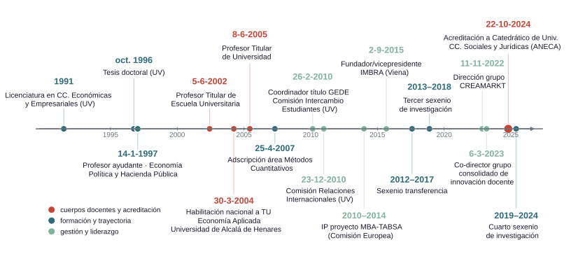
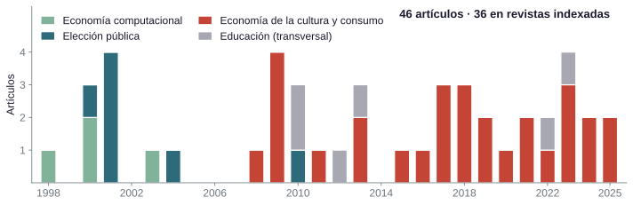
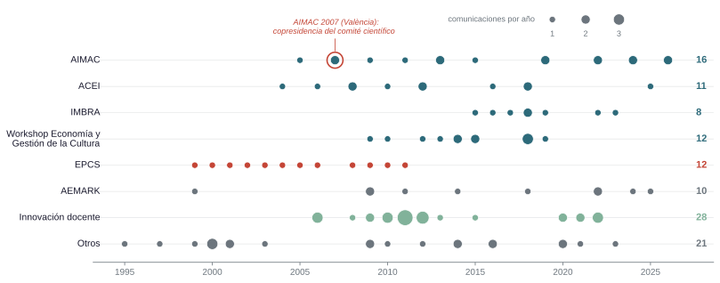
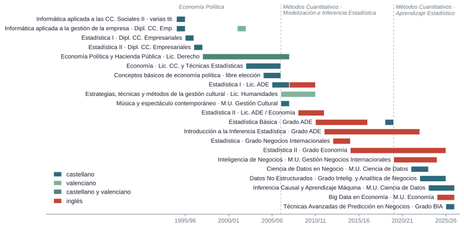
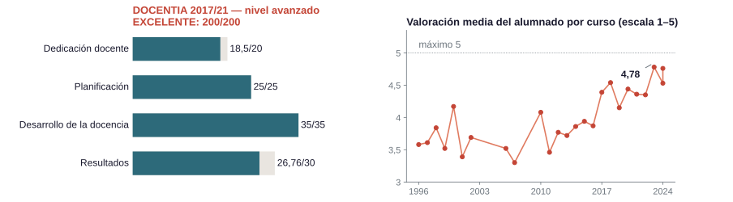
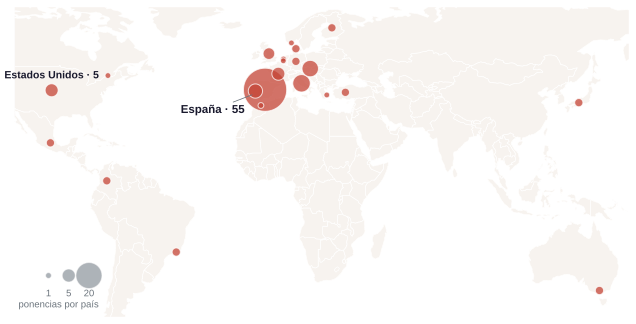

## Trayectoria académica: evolución

&nbsp;

{width="96%"}

::: {.notes}

| | |
|---|-----|
| **Doctor en Economía** | Universitat de València, 1996 |
| **Titular de Universidad** | desde 2005 |
| **Acreditación a CU** | ANECA, octubre de 2024 |
| **Áreas** | Economía Aplicada (1995) → Métodos Cuantitativos (curso 2006/07) |

**Investigación** --- 4 sexenios de investigación + 1 de transferencia · 46 artículos, 36 en revistas indexadas · más de 800 citas (Google Scholar, h = 14)

&nbsp;

**Docencia** --- 5 quinquenios · DOCENTIA **EXCELENTE, 200/200** · tres décadas de docencia en 13 titulaciones y 7 centros

&nbsp;

**Dirección y liderazgo** --- dirección del grupo de investigación CREAMARKT · 2 tesis doctorales *cum laude* · coordinación de titulación internacional

:::

::: {.content-hidden}

## Perfil académico en cifras {.shrink}

&nbsp;

:::: {.columns}

::: {.column width="30%"}
| | |
|---|-----|
| **Doctor en Economía** | Universitat de València, 1996 |
| **Titular de Universidad** | desde 2005 |
| **Acreditación a CU** | ANECA, octubre de 2024 |
| **Áreas** | Economía Aplicada (1995) → Métodos Cuantitativos (curso 2006/07) |

: {tbl-colwidths="[42,58]"}

:::
::: {.column width="5%"}
:::
::: {.column width="65%"}

**Investigación** --- 4 sexenios de investigación + 1 de transferencia · 46 artículos, 36 en revistas indexadas · más de 800 citas (Google Scholar, h = 14)

&nbsp;

**Docencia** --- 5 quinquenios · DOCENTIA **EXCELENTE, 200/200** · tres décadas de docencia en 13 titulaciones y 7 centros

&nbsp;

**Dirección y liderazgo** --- dirección del grupo de investigación CREAMARKT · 2 tesis doctorales *cum laude* · coordinación de titulación internacional

:::
::::

::: {.notes}
Presentación personal breve. La tabla-ficha no se lee: comentar solo las tres líneas de cifras de la derecha. Las cifras se desarrollan en los bloques siguientes.

Guion de la presentación: Tres bloques, en el orden del CV presentado: **investigación y transferencia**, **docencia** y **dirección y liderazgo**.

[Sources]
CV_final.qmd: títulos (l. 4205–4226), acreditación CU (l. 4231–4257), sexenios y quinquenios (l. 3511–3535), DOCENTIA (l. 2740–2752), artículos (§2.1), resumen (l. 63–137). Citas: snapshot data/metricas_perfiles.md (03-08-2026; GS 807).
:::

:::

# Investigación y transferencia {background-color="#2D6A7A"}

## Trayectoria investigadora {.shrink}

&nbsp;

| Etapa | Trabajos representativos | Principales coautores |
|-----|----------|-------|
| **Economía computacional** (1995–2003) | Capítulos en *Mathematics with Vision* (CMP, 1995) e *Innovations in Mathematics* (CMP, 1997) · Tesis doctoral "Simulación y Detección de Caos Macroeconómico" (1996) · *Journal of Macroeconomics* (1998) | José V. Paz |
| **Elección pública** (1998–2010) | Capítulos en *Methods and Moral in Constitutional Economics. Essays in Honour of James M. Buchanan* (Springer, 2001) y en *Constitutional Economics and Public Institutions* (Edward Elgar, 2013) · *CIRIEC-España* (2000) · *Constitutional Political Economy* (2001) · *Computational Economics* (2003)   | Miguel Puchades-Navarro · José Casas-Pardo |
| **Economía de la cultura y consumo cultural** (2008--) | Transición vía propiedad intelectual $\to$ participación cultural e industrias creativas y *big data* : *European Journal of Law and Economics* (2008) · *Journal of Cultural Economics* (2011, 2018) · *Poetics* (2020, 2025) · *Empirical Economics* (2023) | Manuel Cuadrado-García · María Caballer-Tarazona |

::: {.notes}
**Continuidad entre etapas**
De los métodos computacionales y la elección pública al análisis económico de las artes y la cultura: una línea **acumulativa**, no una sucesión de temas.

Mencionar oralmente el paralelismo con Bruno Frey y Tyler Cowen (public choice → cultural economics), que el propio Resumen del CV señala. Las estancias de esa etapa (George Mason 1998; CREED, Univ. van Amsterdam 2001) se citan oralmente si procede.

"JCEC" en la revisión = *Journal of Cultural Economics* (confirmado por el candidato el 04-08-2026; l. 258, 278).

Columna "Principales coautores" por indicación del candidato (04-08-2026); coherente con las autorías de §2.1–2.2: J. V. Paz (l. 222, 318, 320), M. Puchades-Navarro y J. Casas-Pardo (l. 230–236, 330), M. Cuadrado-García y M. Caballer-Tarazona (l. 242 en adelante).

[Sources]
CV_final.qmd, Resumen actividad investigadora (l. 114–120); capítulos: §2.2 (l. 318, 320, 330, 359); artículos: §2.1 (l. 224, 258, 278, 288, 300, 310).
:::

## Producción científica en cifras

&nbsp;

{width="88%"}

| Web of Science | Scopus | Google Scholar |
|:---:|:---:|:---:|
| 246 citas · h = 8 | 332 citas · h = 8 | 807 citas · h = 14 · i10 = 19 |

<!-- SDG: comprobado el 04-08-2026 con sesión UV — ni el perfil de autor ni la
búsqueda de documentos de Scopus exponen la vinculación a los ODS en esta
interfaz (sin faceta SDG). Si se quiere la línea, obtenerla vía SciVal o
etiquetas ODS de cada documento. -->

::: {.notes}

35 revisiones por pares verificadas (percentil 91)
2 citas en documentos de política pública 
más del 90% de las citas WoS son externas
59% de las citas de Google Scholar recibidas desde 2021

La distribución temporal muestra continuidad (sin huecos largos) y una concentración creciente en economía de la cultura. La serie de citas es ascendente: la mayoría se ha recibido en los últimos cinco años.

Scopus verificado en vivo el 04-08-2026 (sesión UV): 332 citas de 311 documentos · h = 8 · 33 documentos · FWCI 1,048 (2016–2025).

[Sources]
Figura: scripts/fig_articulos_etapas.py, datos de CV_final.qmd §2.1 (l. 222–312). Métricas: data/metricas_perfiles.md (WoS 03-08-2026; Scopus y GS en vivo 04-08-2026); indicadores del CV (l. 139–187).
:::

## Publicaciones seleccionadas {.shrink}

&nbsp;

| Trabajo | Revista, año | Indicios | Citas (WoS · Scopus · GS) |
|------------|-------|--|:----:|
| **Live and prerecorded popular music consumption** (con Manuel Cuadrado-García) | *J. of Cultural Economics*, 2011 | JCR **Q2** | 44 · 54 · 124 |
| **Religiosity and cultural consumption** (con Manuel Cuadrado-García) | *Int. J. of Consumer Studies*, 2018 | JCR **Q1** (Business) | 23 · 27 · 40 |
| **From pirates to subscribers: 20 years of music consumption research** (con María Caballer-Tarazona y Manuel Cuadrado-García) | *Int. J. of Consumer Studies*, 2021 | JCR **Q1** (Business) | 20 · 25 · 37 |
| **Analyzing online search patterns of music festival tourists** (con Manuel Cuadrado-García) | *Tourism Economics*, 2021 | JCR **Q1** | 7 · 8 · 12 |
| **Music festivals as mediators and their influence on consumer awareness** (con Manuel Cuadrado-García) | *Poetics*, 2020 | JCR **Q1** (Sociology) | 4 · 6 · 20 |
| **"Let's make lots of money": performance in the recorded music sector** (con Manuel Cuadrado-García) | *J. of Cultural Economics*, 2018 | JCR **Q2**  | 6 · 7 · 15 |
| **Assessing complementarities between live performances and YouTube video streaming** (con María Caballer-Tarazona y Manuel Cuadrado-García) | *Empirical Economics*, 2023 | JCR **Q2** | 2 · 3 · 8 |
| **Arts and cultural consumption and diversity research: a bibliometric analysis** (con Manuel Cuadrado-García) | *Poetics*, 2025 | JCR **Q1** (Sociology) | -- · 1 · 3 |

::: {.notes}
La tabla no se lee fila a fila: comentar solo JCE 2011 (la más citada del área), Poetics 2020/2025 (Q1) e IJCS 2021 (review de 20 años); el resto, señalar. Coautores entre paréntesis según las autorías de §2.1 (en Poetics 2025 el primer autor es M. Cuadrado-García). "--" = sin citas aún. Citas: WoS a 03-08-2026; Scopus y GS a 04-08-2026 (perfiles en vivo). Cuartiles: los documentados en el expediente (Poetics Q1 Sociología; IJCS Q2 Business, 42/154); el Q1 de *Tourism Economics* es indicación del candidato (referencia completa facilitada el 04-08-2026) — ojo: el candidato y el CV citan pp. 276–300, pero Scopus registra 27(6), pp. 1276–1300. Si se pregunta por la publicación más citada del perfil: es la derivada del piloto docente con la LSE (Procedia 2010, 223 citas GS y 118 Scopus; se presenta en el bloque de docencia) — esta tabla selecciona solo investigación del área.

[Sources]
CV_final.qmd §2.1 (l. 258, 282, 288, 290, 292, 278, 300, 310); data/metricas_perfiles.md (03/04-08-2026).
:::

## Capítulos de libro {.shrink}

&nbsp;

| Capítulo | Obra · editorial, año |
|--------|------|
| **Evolution and learning in collective decision-making** (con José Casas-Pardo y Miguel Puchades-Navarro) | Homenaje a J. M. Buchanan (*Methods and Moral in Constitutional Economics*) · **Springer**, 2001 |
| **Empirical insights into recorded music consumer behavior and copyright infringement** (con Manuel Cuadrado-García) | *Music and Law* · **Emerald**, 2013 |
| **Regulator preferences and lobbying efforts in rent-seeking contest**  | *Constitutional Economics and Public Institutions* · **Edward Elgar**, 2013 |
| **Copyright infringement and cultural participation** (con Manuel Cuadrado-García y Miguel Puchades-Navarro) | *Digital Piracy: A Global, Multidisciplinary Account* · **Routledge**, 2018 |
| **Breaking the gender gap in Rap/Hip-Hop consumption** (con María Luisa Palma-Martos y Manuel Cuadrado-García) | *Music as Intangible Cultural Heritage* · **Springer**, 2021 |
| **Digital participation and audience enlargement in classical and popular music** (con Manuel Cuadrado-García) | *Digital Transformation in the Cultural and Creative Industries* · **Routledge**, 2021 |
| **Measuring customer multi-sensory experience in live music** (con Manuel Cuadrado-García y C. E. Goyes-Yepez) | *The Oxford Handbook of Arts and Cultural Management* · **Oxford University Press**, 2022 |

Selección por editorial académica internacional · **29 capítulos y libros** en total · 4 casos docentes en el manual *Marketing Culture and the Arts* (HEC Montréal) y sus ediciones francesas.

::: {.notes}
Destacar oralmente solo el Oxford Handbook (2022) como cierre de la serie. Los 4 casos del manual de HEC Montréal conectan con la transferencia (Cabanyal Íntim, FIB). Coautores entre paréntesis según las autorías de §2.2; el capítulo de Edward Elgar 2013 es de autoría única (l. 359).

Cautelas: el ISBN que el CV asigna al capítulo de *Digital Transformation…* (978-3-030-…) tiene prefijo Springer, no Routledge — verificar antes de la defensa. La mención del autoinforme a "Managing the Cultural Business (Routledge, 2020)" (l. 136) no tiene entrada en §2.2 y se ha retirado del deck.

[Sources]
CV_final.qmd §2.2 (l. 316–376; en particular l. 330, 357, 359, 369, 371, 373, 376).
:::

## Comunicaciones en congresos

&nbsp;

{width="100%"}

Un total de 125 ponencias presentadas a congresos de los cuales 96 son  internacionales

::: {.notes}
Señalar tres cosas: la recurrencia en las series de referencia (AIMAC desde 2005 sin interrupción, ACEI, IMBRA desde su fundación), el relevo temático que replica la trayectoria investigadora (EPCS 1999–2011 → series del área cultural desde 2004) y la vigencia (AIMAC 2026). El alcance geográfico se comenta oralmente: cinco continentes, de Kyoto a Melbourne, Bogotá y Río de Janeiro (mapa disponible en la reserva R4).

"125 ponencias, 96 internacionales" es la cifra del Resumen (l. 126); §2.5 lista 118 ítems (92 internacionales) — defender la cifra del Resumen si se pregunta; la figura usa el recuento literal de §2.5. Partición de las 118 por series (verificada el 04-08-2026 sobre la entidad organizadora de cada ítem): AIMAC 16 (las dos de 2026, "The 18th International Conference", son AIMAC Río) · EPCS 12 · Workshop en Economía y Gestión de la Cultura 12 (incluye sus ediciones como "Workshop on Cultural Economics and Management", Oporto 2015 y Meknés 2019) · ACEI 11 · IMBRA 8 · congresos de marketing 10 · innovación docente 28 · otros 21.

[Sources]
CV_final.qmd §2.5 (l. 697–1890). Figura: scripts/fig_congresos_series.py, datos data/ponencias_series.csv (agregado serie-año, 04-08-2026).
:::

## Proyectos de investigación

&nbsp;

| Proyecto | Convocatoria | Años | Participación |
|----------|------|:--:|:--:|
| Teoría del caos: evolución, predicción y control de sistemas | Generalitat Valenciana (AE98-08) | 1998 | equipo |
| Deficiencias en el funcionamiento de las instituciones democráticas | CICYT (SEC99-0592) | 1999–2003 | equipo |
| Teoría del caos: autoorganización y control de sistemas complejos | MCyT (PGC2000-2390-E) | 2001–2002 | equipo |
| Protección del cliente y eficiencia en el sistema financiero (Ley 44/2002) | MCyT (SEC2003-05232) | 2003–2006 | equipo |
| **MBA-TABSA · Transatlantic Business School Alliance** | **Comisión Europea (EACEA)** | **2010–2014** | **IP** |
| La regulación de la economía colaborativa | Plan Estatal (DER2015-67613-R) | 2016–2019 | equipo |

&nbsp;

Continuidad en la participación en proyectos (1998--2019)

::: {.notes}

No leer la tabla: señalar la continuidad (1998–2019) y detenerse solo en MBA-TABSA (movilidad transatlántica; gestión compartida con la Hochschule Bremen).

"Seis proyectos" es la cifra del Resumen (l. 122): los cinco de §2.3 + MBA-TABSA, que el CV lista en §4.3/§3.4 como proyecto europeo de innovación — explicar el criterio si se pregunta.

[Sources]
CV_final.qmd §2.3 (l. 379–455), MBA-TABSA §4.3 (l. 3238–3246), Resumen (l. 122).
:::

## Contratos y convenios de transferencia {.shrink}

&nbsp;

| Entidad | Objeto   | Años |
|--------|--------------|:-:|
| AVETID | Estudio de públicos del Festival Tercera Setmana | 2017–18 |
| **Francachela Teatro** | **Plan de patrocinio y premios del festival (IP)** | 2018–19 |
| AVETID | Estudio de públicos Tercera Setmana, 2ª edición | 2018–19 |
| EXTREMUS Danza | Evaluación de proyecto artístico de inclusión social  | 2019–20 |
| **Francachela Teatro** | **Plan de patrocinio y premios del festival (IP)** | 2020–21 |
| **Olympia Metropolitana** | **Estudio de públicos en contexto teatral (IP)** | 2021–22 |
| **A más Soluciones Culturales** | **Distribución en artes escénicas (IP)** | 2021–22 |
| **Generalitat Valenciana** | **Perfil y experiencia del visitante del CCCC (IP)** | 2022–23 |
| **ICOM International** | **SENTOMUS, museums visitors research (IP)** | 2023–24 |
| BIOPARC València | Estudio de público | 2023–24 |

&nbsp;

16 contratos/convenios (art. 83 LOU / 60 LOSU) con el tejido cultural desde 2012 · IP en 6 · Actividad reconocida con el **sexenio de transferencia** (2012–2017)

::: {.notes}

**La transferencia no es actividad aparte: los convenios generan datos y preguntas que acaban en publicaciones indexadas.**  Resultados de vuelta al ámbito académico: caso "Cabanyal Íntim" en *Marketing Culture and the Arts* (2018) · artículo en *Journal of Homosexuality* (2022, JCR Q2) con origen convenio con Francachela.

Subrayar relación estable con el sector y los 6 como IP. La tabla muestra los 10 contratos más recientes (desde AVETID · Tercera Setmana 2017–18); los 6 anteriores (Cadena SER 2012–13 → Francachela 2017–18, todos como equipo) están en la reserva de transferencia.

La línea "dirección de M. Cuadrado-García con co-dirección del candidato" es indicación del candidato (04-08-2026) y se refiere al conjunto de los contratos; el CV (§2.4) marca al candidato como IP en 6 de ellos — si el tribunal pregunta, aclarar que "IP" es la responsabilidad formal del contrato art. 83 y la co-dirección describe el reparto real del trabajo en el equipo. La columna Participación se eliminó el 04-08-2026 (decisión del usuario): el papel va ahora entre paréntesis en la primera columna.
:::

## Estancias de investigación

&nbsp;

| Estancia | Financiación | Periodo |
|---------------|---------|:-:|
| Center for Study of Public Choice / J. Buchanan Center, George Mason Univ. (EE. UU.) | Generalitat Valenciana | 1998 · 6 m |
| HEC, Université de Montréal (Canadá) | Universitat de València | 1999 · 1 m |
| CREED, Universiteit van Amsterdam (Países Bajos) | Generalitat Valenciana | 2001 · 4 m |
| HEC, Université de Montréal (Canadá) | Generalitat Valenciana | 2007 · 2 m |
| London School of Economics (Reino Unido) | Universitat de València | 2007 · 2 m |
| Institut für Kulturmanagement, Univ. für Musik und Darstellende Kunst Wien (Austria) | Universitat de València | 2013 · 3 m |

&nbsp;

6 estancias oficiales · 5 países · ≈18 meses acumulados · todas con financiación competitiva (Generalitat Valenciana / Universitat de València)

::: {.notes}
**Las estancias dibujan el mismo arco que la trayectoria investigadora**: public choice (Center for Study of Public Choice, el centro de Buchanan, 1998) → economía experimental (CREED, 2001) → economía de la cultura y gestión cultural (Viena, 2013). Las dos estancias en HEC Montréal conectan con la vertiente de marketing de las artes.

Duraciones redondeadas a meses desde las fechas exactas del CV (GMU 04/03–25/08/1998; HEC 09/07–03/08/1999; CREED 01/05–31/08/2001; HEC 24/07–11/09/2007; LSE 29/10–22/12/2007; Viena 09/04–07/06/2013).

[Sources]
CV_final.qmd §2.6 (l. 1892–1950).
:::

## Dirección de tesis doctorales

&nbsp;

| Título | Autor | Afiliación | Año | Observaciones |
|---------------|---------|------------|---|:------------:|
| *Segmentación y exhibición cinematográfica: un análisis del mercado español basado en clases latentes* | Desamparados Lluch Tormos | CEU | 2017 | Sobresaliente *cum laude* · Tesis doctoral con mención internacional · **Premio Fundación SGAE de Investigación 2018** |
| *Analyzing the effect of the expanded servicescape on visitors' satisfaction and loyalty in museums* | Piergiacomo Mion Dalle Carbonare | Università Bocconi | 2022 | Sobresaliente *cum laude* · Tesis doctoral con mención internacional  |
| *Estudio de los determinantes, percepción y valoración del consumidor de música clásica: una aproximación multidisciplinar* | Ariadna Martin Alfaro | Conservatorio Profesional de Música de Las Palmas de Gran Canaria | en curso | — |
| *Consumer engagement and market structuring in the contemporary art ecosystem: visitor behavior and responses to citywide interventions* | Giuliano Picchi | MIT | en curso | — |

::: {.notes}
Ambas tesis en el programa de doctorado en Marketing (mención de calidad). El doctorando en curso G. Picchi coautoriza una de las ponencias aceptadas en AIMAC 2026 — señal de que la línea sigue produciendo.

Las universidades entre paréntesis son la afiliación de cada doctorando, indicada por el candidato (04-08-2026); no constan en el CV, que registra las cuatro tesis en la Facultat d'Economia de la Universitat de València. Pendiente de confirmar la afiliación de A. Martin Alfaro (el candidato no la recordaba).

[Sources]
CV_final.qmd §4.4 (l. 3293–3335), §4.2, Resumen (l. 89); IP en contratos: §2.4 (6 marcados).
:::

# Docencia {background-color="#2D6A7A"}

## Trayectoria docente

&nbsp;

| **Etapa** | **Asignaturas**  | **Observaciones** |
| --- | --- | --- |
| **Economía Política (1997)** | Economía Política y Hacienda Pública (castellano y valenciano) · Economía (Lic. en CC. y Técnicas Estadísticas) · Estadística e Informática (CC. Empresariales) | Docencia impartida en Castellano y Valenciano |
| **Métodos Cuantitativos · Modelización e Inferencia Estadística (2006/07)** | Estadística I y II, Estadística Básica, Introducción a la Inferencia Estadística | Integración de troncales en el grupo internacional (ARA) con docencia impartida en inglés |
| **Métodos Cuantitativos · Aprendizaje Estadístico (2019)** | Grado BIA: Datos No Estructurados, Técnicas Avanzadas de Predicción · Máster CD: Inferencia Causal y Aprendizaje Máquina, Ciencia de Datos en Negocio · Máster iMBA: Inteligencia de Negocios · Máster Economía: Big Data en Economía | Aumento de la participación como docente en programas de máster |

&nbsp;

Docencia en: 7 centros  ·   13 titulaciones · 18 asignaturas distintas (32 con formación no reglada) · docencia en castellano, inglés (C2) y valenciano (C1) · 
50% de la docencia total es en inglés 

::: {.notes}
Línea secundaria estable en gestión cultural: Licenciatura en Humanidades (en valenciano) y Máster Interuniversitario en Gestión Cultural (Música y Espectáculo Contemporáneo).

Nombres exactos de asignaturas según §3.2: "Big Data en Economía" (no *Big Data in Economics*; se imparte en inglés), "Ciencia de Datos en Negocio" (§3.2; el Resumen dice "en Negocios"), "Inteligencia de Negocios" (M.U. en Gestión de Negocios Internacionales).

[Sources]
CV_final.qmd, Resumen actividad docente (l. 91–95), §3.1 (l. 1958–2040), §3.2 (l. 2042–2329; Economía en CC. y Técnicas Estadísticas: l. 2111–2138; másteres: l. 2271–2327).
:::

## Docencia reglada

&nbsp;

{width="100%"}

::: {.notes}
La figura se lee como el espejo docente de la trayectoria investigadora: los rótulos superiores reproducen los tres bloques de la slide anterior y las guías marcan las dos transiciones (2006/07 y 2019/20). Subrayar la superposición: nunca se abandona una etapa del todo (Estadística II de Economía sigue hasta 2024/25).

[Sources]
Figura: scripts/fig_docencia_diversidad.py, datos de CV_final.qmd §3.2 (l. 2042–2329).
:::

## Internacionalización docente

&nbsp;

| Mérito | Descripción |
| --- | ------ |
| **Docencia en centros internacionales** | State University of New York at Albany · London School of Economics · University of Hertfordshire · University of North Florida · University of North Carolina at Wilmington · Universidad de Buenos Aires · Hochschule Bremen e International Graduate Center |
| **Gestión de la internacionalización** en la Facultat d'Economia: programas académicos, dobles titulaciones e intercambios  | Coordinador del título Graduado Europeo en Dirección de Empresas (2010–2014) · Comisión de Intercambio de la Facultat d'Economia (2010–2014) |
| **Gestión de la internacionalización** en la Facultat d'Economia: redes y convenios | Representante de la Facultat d'Economia en la red *TransAtlantic Business Schools Alliance* (TABSA) · Obtención y gestión de la ayuda EU-US ATLANTIS · Responsable del convenio con Hofstra University (Nueva York) |
| **Gestión de la internacionalización** en la Universitat de València | Miembro de las comisiones de la Universitat: Comisión de Intercambio de Estudiantes de la UV (2010–2012) y Comisión de Relaciones Internacionales de la UV (2012–2014) · Coordinador de  intercambios de dobles titulaciones ADE-GEDE y grado en International Business (2010--14)   |

&nbsp;

**Grupo ARA** ~2 décadas de docencia en inglés · **Estancias docentes**: 8 estancias oficiales · Docencia en **programas** grado y posgrado 

::: {.notes}
Invitación al panel "Double Degrees — An Emerging Trend in Business Education Globally" (International Business Conference, Univ. of North Florida, 2013).

Fechas de GEDE unificadas en 2010–2014 (cargo unipersonal desde 26/02/2010, l. 3103; la prosa del Resumen dice "2009" — divergencia anotada). Comisiones: Intercambio de Estudiantes UV 14/01/2010–22/12/2012 (l. 3055); Relaciones Internacionales UV 23/12/2010–25/09/2014 (l. 3128); intercambio de la Facultat 14/01/2010–31/08/2014 (l. 3062, duplicada en l. 3089).

[Sources]
CV_final.qmd, Resumen (l. 85), §3.3.2, §3.7, §4.1 (l. 3046–3131).
:::

## Evaluación de la docencia

&nbsp;

{width="92%"}

**5 quinquenios** (29 cursos con evaluación positiva) · serie de valoraciones ascendente, estable por encima de **4,3** desde 2017 (máximo 4,78 en 2023-24).

::: {.notes}
Los 5 quinquenios cubren 29 cursos evaluados. DOCENTIA 2017/21: nivel básico 100/100; nivel avanzado 100/100 (dedicación 18,5/20 · planificación 25/25 · desarrollo 35/35 · resultados 26,76/30).

[Sources]
CV_final.qmd §3.5.1–3.5.2 (l. 2740–2788), §4.6 (l. 3527–3538).
:::

## Innovación docente {.shrink}

&nbsp;

| Tipo de Actividad | Descripción |
| --- | ------------ |
| **Grupo de innovación** | Grupo "Multi-aprendizaje, transversalidad y creatividad" — co-responsable · Mención de grupo consolidado en 2023 (renovada en 2026) · Continuidad del grupo "Innova multidisciplinar" (2009–2012). |
| **Proyectos dirigidos** | Proyectos dirigidos como IP:  MBA-TABSA (2010–2014) · "Jornada docente transversal y solidaria" (2021/22) · "Investigación b-smart y aprendizaje basado en un proyecto en un centro cultural" (2022/23) · "Danza, salud e investigación" (2024/25). |
| **Comunicaciones** | Comunicaciones (28): series recurrentes CIDUI (2006–2012) · Trobades/Jornades d'Innovació Educativa UV (2010–2022) · Xarxes--REDES-INNOVAESTIC (2009–2021) · WCES (2010, 2012) · Congreso Internacional de Innovación Docente (2022). |
| **Publicaciones** | Publicaciones: Procedia --- Social and Behavioral Sciences (2010 --- derivada del piloto en línea con la LSE y la más citada del perfil, 223 citas GS --- y 2012) · Rev. Iberoamericana de Educación (2010) · World J. on Educational Technology (2013) · RIEJS (2022) · capítulo en  Experiencias de Innovación Docente en Estadística (2011). |

&nbsp;

14 **proyectos**  (4 como IP) · Co-director de **grupo consolidado** (mención 2023, renovada 2026) · 28 **comunicaciones** en congresos y jornadas  · **Publicaciones**:  5 artículos + 1 capítulo 

::: {.notes}
Código del grupo consolidado: GCID23-2575334 (mención 06/03/2023, renovada 02/02/2026). El piloto con la LSE (2009/10) fue financiado por el MICINN.

Las 28 comunicaciones salen del recuento verificado de §2.5 (04-08-2026), con criterio explícito: comunicaciones presentadas en congresos y jornadas de educación e innovación docente (CIDUI 2006 ×3 y 2008 y 2012; Trobades/Jornades d'Innovació Educativa UV 2010, 2011, 2013, 2020, 2021, 2022; Xarxes/Redes 2009, 2011, 2015; REDES-INNOVAESTIC 2020, 2021; WCES 2010, 2012; Jornada Nacional d'Estudis Universitaris 2009, 2011; FECIES 2011; UNIVEST 2011; Jornadas de Innovación Educativa en Estadística 2010; Unitat d'Innovació Educativa UV 2011; Regent's College 2012 ×2; Congreso Internacional de Innovación Docente 2022 ×2). La cifra "18" de la v2 no era trazable y se ha sustituido.

Publicaciones de innovación docente: Procedia SBS 2010 (l. 252) y 2012 (l. 260), Rev. Iberoamericana de Educación 2010 (l. 254), World J. on Educational Technology 2013 (l. 264), RIEJS 2022 (l. 294), capítulo en Experiencias de Innovación Docente en Estadística 2011 (l. 353). El Resumen menciona *Revista de Educación* (l. 88) pero no hay entrada en §2.1 — no citarla.

Cautela: el CV no documenta ningún rol como evaluador DOCENTIA ni en paneles de evaluación docente — no atribuirse esa función. Fechas del proyecto 2021/22 divergen entre §3.4 (l. 2701) y §4.3 (l. 3254).

Los trabajos dirigidos (TFG/TFM) se trasladaron a la slide "Otras actividades de liderazgo y participación en la vida universitaria" (decisión del usuario, 04-08-2026).

[Sources]
CV_final.qmd §3.4 (l. 2551–2735), §4.3 (l. 3232–3286; IP y co-IP verificados 04-08-2026), grupo consolidado (l. 3571–3583), comunicaciones de innovación §2.5, publicaciones §2.1 (l. 252–264, 294) y §2.2 (l. 353), trabajos §4.7.6 (l. 3996–4035); citas del proyecto LSE: data/metricas_perfiles.md (Procedia 2010).
:::

# Dirección y liderazgo {background-color="#2D6A7A"}

## Gestión académica

&nbsp;

| **Cargo** | Periodo| **Ámbito** |
|--------|--|---------|
| **Coordinador de título** Graduado Europeo en Dirección de Empresas | 2010--14 | Facultat d'Economia: titulación internacional  |
| **Representante** en la Transatlantic Bussines School Alliance | 2010--14 | Facultat d'Economia: redes internacionales |
| **Coordinador de intercambios** del grado ADE-GEDE | 2010--14 | Vicerrectorado de Relaciones Internacionales y Cooperación, Universitat de València: dobles titulaciones |
| **Coordinador de intercambios** del grado en Negocios Internacionales/International Business | 2011--14 | Vicerrectorado de Relaciones Internacionales y Cooperación, Universitat de València: dobles titulaciones |
| **Miembro de la Comisión de Intecambio de Estudiantes**  | 2010--12 | Vicerrectorado de Relaciones Internacionales y Cooperación, Universitat de València: política de internacionalización |
| **Miembro de la Comisión de Relaciones Internacionales**  | 2012--14 | Vicerrectorado de Relaciones Internacionales y Cooperación, Universitat de València: política de internacionalización |
| **Miembro de la CCA** del Máster en Ciencia de Datos |2021-- |  Escola Tècnica Superior d'Enginyeria:  posgrado en datos |

&nbsp;

De un total de **17 cargos y tareas de gestión** la gestión se ha concentrado mayoritariamente en el área de **internacionalización**.

::: {.notes}
Slide breve (~45 segundos): no leer la tabla; subrayar solo la frase de los dos ejes.

§4.1 lista 18 ítems pero dos son el mismo cargo duplicado (comisión de intercambio de la Facultat, l. 3064 y 3091): el recuento real es 17.

[Sources]
CV_final.qmd §4.1 (l. 2986–3153).
:::

## Liderazgo investigador

&nbsp;

| | |
|----|--------|
| **Grupo de investigación** | **Dirección de CREAMARKT** (GIUV2020-47) desde 2022 · Grupo reconocido desde 2020 · colaboraciones con HEC Montréal y el Institut für Kulturmanagement (Viena) · Sucesor del grupo OTRI **Arts Management and Marketing** (2010)|
| **Asociaciones** | Fundador, miembro de la junta y **vicepresidente de IMBRA** (International Music Business Research Association, Viena) · **Miembro de ACEI** · **Miembro de AIMAC** |
| **Edición científica** | **Editor invitado** del número especial "Arts Consumption, Diversity and Inclusion", *Int. J. of Arts Management* 25(3), 2023 (JCR/SSCI) |
| **Comités científicos** | **Copresidencia del comité científico AIMAC 2007** (València) · Presidencia de la sesión plenaria de apertura de AIMAC 2007 · Participación paneles de evaluación en 11 ediciones de AIMAC (2005–2026) ·  Miembro en **I y II Workshop en Economía y Gestión de la Cultura** (Sevilla 2009 · València 2010) y **8th International Congress on Public and Nonprofit Marketing** (IAPNM 2009, València) |
| **Evaluación científica** | **35 revisiones verificadas** para 15 revistas (percentil 91) · reconocimiento de *Poetics* (Q1) a la actividad evaluadora (2026) |

: {tbl-colwidths="[22,78]"}

::: {.notes}
CREAMARKT: cuatro líneas (big data e industrias creativas, microeconometría de la participación cultural, consumidor 2.0, diversidad en mercados culturales); dirección desde el 11/11/2022. IMBRA: vicepresidente 2015–2019, junta ejecutiva 2019–2023.

Comités científicos según §4.5.2: AIMAC 2007 (copresidencia del comité y presidencia de la sesión plenaria de apertura), I Workshop en Economía y Gestión de la Cultura (Sevilla, 25/11/2009), II Workshop (València, 4-5/11/2010) y 8th International Congress of the International Association on Public and Nonprofit Marketing (IAPNM 2009, València, 17-19/06/2009) — el CV no recoge más comités científicos.

[Sources]
CV_final.qmd §4.7.1 (l. 3597–3615), §4.5 (l. 3345–3415), §4.7.3 (l. 3756–3812), reconocimiento Poetics (l. 3563).
:::

## Liderazgo docente e internacionalización

&nbsp;

| | |
|----|--------|
| **Proyectos docentes** | **IP de 4 proyectos docentes y de innovación** |
| **Coordinación de titulación** | **Graduado Europeo en Dirección de Empresas** (2010–2014), cargo académico unipersonal |
| **Internacionalización** | Obtención y gestión de las ayudas **EU-US ATLANTIS** (2011–2014) · Coordinador responsable del convenio con la Zarb School of Business, **Hofstra University** (Nueva York, 2014–2019) · Coordinación de los intercambios de dobles titulaciones (ADE-GEDE e International Business)|
| **Coordinación docente** | Unidad Docente de Estadística del área de Métodos Cuantitativos (2020/21) · Comisión delegada para la reforma de la Estadística introductoria (2016/17) · Coordinador docente del programa MOTIVEM (2021) · Coordinación de guías docentes de grado y posgrado |
| **Grupo de innovación** | Co-responsable del grupo consolidado **GCID23-2575334** (mención 2023, renovada 2026) |

: {tbl-colwidths="[22,78]"}

::: {.notes}
Este slide agrupa el liderazgo de perfil docente en el mismo formato de tabla que el investigador (slide anterior). Evitar repetir el detalle de GEDE/ATLANTIS si ya se ha comentado en internacionalización docente: aquí se enuncia como responsabilidad de dirección.

[Sources]
CV_final.qmd §4.3 (l. 3232–3286), §4.1 (l. 3100–3128), §4.7.7 (l. 4063–4084), §4.7.5 (l. 3884–3993), grupo consolidado (l. 3571–3583).
:::

## Otras actividades de liderazgo y participación en la vida universitaria {.shrink}

&nbsp;

| | |
|----|--------|
| **Premios** | **Premio Fundación SGAE de Investigación 2018** (tesis presentada por Desamparados Lluch) · finalista a mejor ponencia, AIMAC 2013 (Universidad de los Andes, Bogotá) |
| **Reconocimientos** | Reconocimiento de ***Poetics*** (JCR Q1) a la actividad evaluadora (2026) · Mención de **grupo consolidado** de innovación docente (2023, renovada 2026) |
| **Conferencias y seminarios por invitación** | Seminario en **CREED**, Universiteit van Amsterdam (2001) · London School of Economics (2007) · Institut für Kulturmanagement, Universität für Musik Wien (2013) · panel "Double Degrees" (University of North Florida, 2013) · Universidad de Buenos Aires y Museo Nacional de Bellas Artes (2013) · BIME Pro (2018) · Universidad de Oviedo (2026) · Curso de verano UCLM-Almagro (2026)  |
| **Evaluación externa** | Proyectos de tesis en **Télécom ParisTech** (2013), **University of Applied Sciences Berlin** (2015) y **Stockholm University** (2020) · TFM en **Hannover University of Music, Drama and Media** (2013) · Tesis en la **Universitat de Girona** (2022) |
| **Tribunales y comisiones** | 3 tribunales de tesis doctorales · 3 comisiones de plazas de profesorado (UPV/EHU 2011, U. de Valladolid 2013, CEU 2019) |
| **Jornadas académico-profesionales** | Organización de **5 jornadas** con el sector cultural: "Nuevas Fórmulas de Gestión en Artes Escénicas: los festivales" (2015) · "Marketing y Festivales de Artes Escénicas en Valencia" (2016) · "Diversidad, Artes Escénicas y Gestión" (2019) · "El show de Liz Dust: Diversidad y mucho más" (2020) · "Identidad, Creación y Gestión" (2021) |
| **Divulgación** | Observatorio Social de "la Caixa" (2019) · EconomistsTalkArt (2018, 2025) |

: {tbl-colwidths="[22,78]"}

::: {.notes}
Slide de recapitulación (~1 min): no leer la tabla; premios y reconocimientos ya presentados no se desarrollan. De "otras actividades", subrayar la selección orientada a la comisión: internacionalización (invitaciones y evaluación externa), servicio al sistema (tribunales, comisiones de plazas) y proyección social (jornadas y divulgación). Las invitaciones de 2026 (Oviedo: métodos de aprendizaje automático; Almagro: mesa redonda) muestran vigencia en las dos líneas del perfil.

Seminario CREED: ponencia invitada "On rent-seeking correlated equilibria", CREED Seminars, Universiteit van Amsterdam, 01/06/2001 (§4.7.2, l. 3629–3633). Jornadas: nombres literales de §4.7.8 (l. 4102–4108). La fila "Trabajos dirigidos" se traslada aquí desde la slide de innovación docente (decisión del usuario, 04-08-2026; §4.7.6, l. 3996–4035).

[Sources]
CV_final.qmd §4.6 (l. 3505–3587), §4.7.2 (l. 3629–3740), §4.7.4 (l. 3824–3874), §4.5.2–4.5.3 (l. 3454–3499), §4.7.6 (l. 3996–4035), §4.7.8 (l. 4094–4142).
:::

<!-- ============ RESERVAS (ocultas en ambos formatos) ============ -->

::: {.content-hidden}

## {background-color="#2D6A7A" .center}

&nbsp;

::: {style="color:#fafafa; font-size:1.05em; font-weight:600;"}
Una trayectoria que integra:
:::

::: {style="color:#fafafa; font-size:1.25em; font-weight:700; line-height:1.75;"}
Investigación consolidada, con estructura estable e internacional (CREAMARKT, IMBRA)

Liderazgo editorial y asociativo en el área

Docencia excelente, internacional, orientada a la ciencia de datos

Transferencia sostenida al sector cultural
:::

&nbsp;

::: {style="color:#fafafa; font-size:1.1em;"}
Acreditación a Catedrático de Universidad --- ANECA, 2024.
:::

::: {.notes}
Cierre: las cuatro fortalezas del Resumen del historial académico, tal como constan en el CV presentado.

[Sources]
CV_final.qmd, Resumen (l. 134), §6.3.1.
:::

## Reserva · Otras publicaciones indexadas {.compact}

&nbsp;

| Trabajo | Revista, año |
|--------|------|
| Analyzing online search patterns of music festival tourists | *Tourism Economics*, 2021 |
| Measuring music-genre preferences: direct and indirect methods | *Psychology of Music*, 2023 |
| Music studies as cultural capital accumulation | *Int. J. of Music Education*, 2023 |
| LGB's arts affinity: theater audiences based on motivations | *J. of Homosexuality*, 2022 |
| Unveiling latent demand in the cultural industries | *Int. J. of Arts Management*, 2016 |
| Consumption habits and content-access devices in recorded music | *Int. J. of Arts Management*, 2017 |
| Legal origin and intellectual property rights | *Eur. J. of Law and Economics*, 2008 |
| Dance consumption and mood changes | *Arts and the Market*, 2024 |
| Participación y diversidad funcional en centros culturales | *Ekonomiaz*, 2025 |

::: {.notes}
[Sources]
CV_final.qmd §2.1.
:::

## Reserva · Transferencia: entidades y papel {.compact}

&nbsp;

- **Asociación Cultural Francachela Teatro** — festival Cabanyal Íntim (caso publicado en *Marketing Culture and the Arts*).
- **AVETID** — asociación empresarial de artes escénicas del País Valenciano.
- **Olympia Metropolitana** — gestión de espacios escénicos.
- **FECEMAC-CV** — centros de música autorizados y conservatorios.
- **Centre del Carme Cultura Contemporània.**
- **ICOM** (International Council of Museums) — proyecto "Museum 23", IP para España.

13 contratos y convenios art. 83 en total; investigador principal en varios de ellos.

::: {.notes}
[Sources]
CV_final.qmd, Resumen (l. 132), §2.4, §4.2.
:::

## Reserva · Quinquenios y DOCENTIA: detalle {.compact}

&nbsp;

| Quinquenio | Período | Observación |
|:---:|:---:|------|
| 1 | 1996–2001 | |
| 2 | 2002–2006 | |
| 3 | 2007–2011 | |
| 4 | 2012–2016 | |
| 5 | 2017–2021 | coincide con DOCENTIA EXCELENTE 200/200 |
| (6) | 2021–2025 | cursos ya evaluados, media > 4,3 |

DOCENTIA 2017/21 — nivel básico 100/100; nivel avanzado 100/100 (dedicación 18,5/20 · planificación 25/25 · desarrollo 35/35 · resultados 26,76/30).

::: {.notes}
[Sources]
CV_final.qmd §3.5 (l. 2740–2788), §4.6 (l. 3521–3529).
:::

## Reserva · Alcance geográfico de los congresos

&nbsp;

{width="78%"}

**118 comunicaciones** (92 internacionales) · **22 países** · 1995–2026 --- cinco continentes: de Kyoto a Melbourne, Bogotá y Río de Janeiro (AIMAC 2026).

::: {.notes}
Reserva por si el tribunal pregunta por el alcance geográfico de los congresos (la slide principal muestra la recurrencia por series).

[Sources]
CV_final.qmd §2.5 (l. 697–1890). Figura: scripts/fig_mapa_congresos.py, datos data/ponencias_geo.csv (agregado por país, 03-08-2026).
:::

:::

<!-- Generado por scripts/sync_partes.py desde presentacion_cv.qmd — NO EDITAR;
     editar el deck fuente y re-sincronizar. -->
