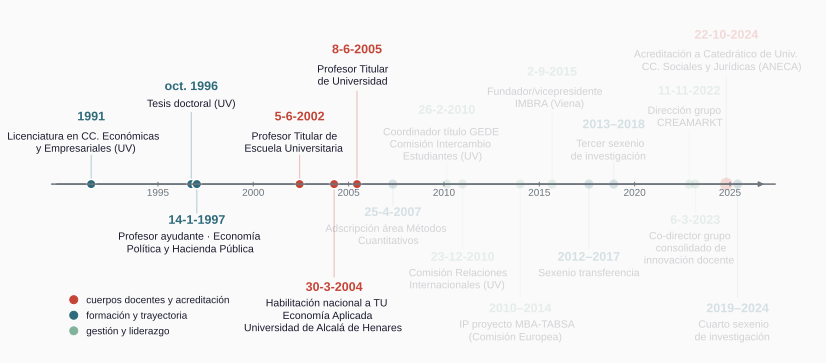
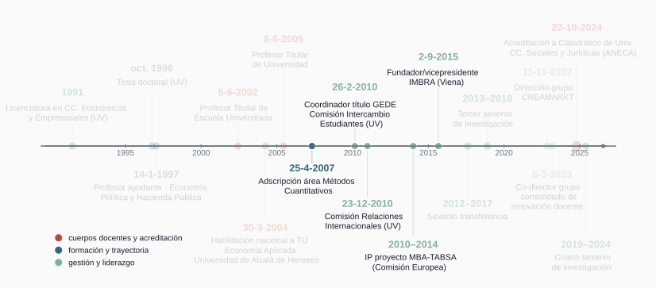
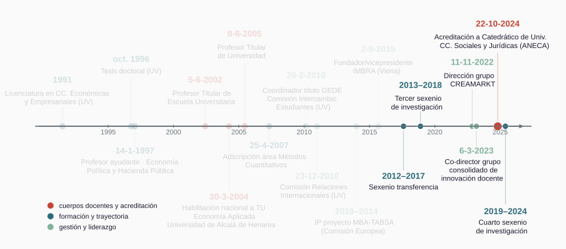

## Trayectoria académica: evolución

&nbsp;

::: {.content-visible when-format="revealjs"}

<!-- Tres etapas que se resaltan al avanzar: formación (hasta 2005),
     internacionalización (2007–15) y consolidación (desde 2016). Las
     variantes _e1/_e2/_e3 llevan fondo sólido para taparse en el r-stack. -->

<!-- Ancho en px, no en %: dentro del r-stack cada imagen vive en un 

     con margin:auto (fit-content), y el % se resuelve contra ese ancho
     encogido, no contra la slide (1920×1080 px lógicos). 1700 px, tras el
     max-width:95% del tema, rinde ≈1615 px ≈ 84% del ancho de slide. -->

::: {.r-stack}
{width="1700"}

{.fragment width="1700"}

{.fragment width="1700"}
:::

:::

::: {.content-visible when-format="beamer"}

{width="96%"}

:::

::: {.notes}
La línea temporal resume mi trayectoria en la Universitat de València, desde la finalización de la licenciatura en Ciencias Económicas y Empresariales en 1991 hasta la acreditación a catedrático de universidad por la ANECA en octubre de 2024. 

En la primera etapa (de formación y estabilización) defiendo la tesis doctoral en 1996, obtengo la plaza de ayudante en 1997 en el área de Economía Aplicada, la titularidad de escuela en 2002, y la habilitación nacional a titular de universidad en el concurso celebrado en la universidad de Alcalá de Henares en 2004 con la que accedo a la plaza en 2005. 

La segunda etapa (de orientación internacional) comienza con la adscripción al área de Métodos Cuantitativos en 2007 concentrando la coordinación del título de ADE/GEDE, el proyecto ATLANTIS de la UE y la fundación y vicepresidencia de IMBRA. 

En la tercera, desde 2016, de consolidación y liderazgo, obtengo  la evaluación positiva del tercer y cuarto sexenio de investigación, dirijo el grupo de investigación CREAMARKT y el grupo consolidado de innovación docente MULTIATC.

:::

# Investigación y transferencia {background-color="#2D6A7A"}

:::{.notes}
La exposición sigue el orden del currículum: investigación y transferencia, docencia, y finalmente, gestión, dirección de equipos y liderazgo. 

Empiezo por la investigación.
:::

## Trayectoria investigadora {.shrink}

&nbsp;

| Etapa | Trabajos representativos | Principales coautores |
|-----|----------|-------|
| **Economía computacional**   (1995–2003) | Tesis doctoral "Simulación y Detección de Caos Macroeconómico" (1996) · Capítulos en *Mathematics with Vision* (CMP, 1995) e *Innovations in Mathematics* (CMP, 1997) · *Journal of Macroeconomics* (1998) | José V. Paz-García |
| **Elección pública**   (1998–2010) | Capítulos en *Methods and Moral in Constitutional Economics. Essays in Honour of James M. Buchanan* (Springer, 2001) y en *Constitutional Economics and Public Institutions* (Edward Elgar, 2013) · *CIRIEC-España* (2000) · *Constitutional Political Economy* (2001) · *Computational Economics* (2003)   | Miguel Puchades-Navarro   José Casas-Pardo |
| **Economía de la cultura y consumo cultural**   (2008--) | Transición vía propiedad intelectual $\to$ participación cultural e industrias creativas y *big data* : *European Journal of Law and Economics* (2008) · *Journal of Cultural Economics* (2011, 2018) · *Poetics* (2020, 2025) · *Empirical Economics* (2023) | Manuel Cuadrado-García   María Caballer-Tarazona   María Luisa Palma-Martos |

::: {.notes}
La tabla ordena la trayectoria investigadora en tres etapas, con los trabajos representativos y los principales coautores. 

La primera, de 1995 a 2003, centrada en economía computacional, se articula en torno a la elaboración de la tesis doctoral sobre simulación y detección de caos macroeconómico, dirigida por el profesor José Vicente Paz, que obtuvo la calificación de sobresaliente cum laude y que da lugar a dos capítulos en la editorial Computational Mechanics Publications y un artículo en el Journal of Macroeconomics (revista JCR). 

La segunda, de 1998 a 2010, incorpora la teoría de la elección pública con diversos trabajos junto a los profesores Miguel Puchades-Navarro y José Casas-Pardo: artículos publicados en CIRIEC-España, Constitutional Political Economy, Computational Economics y  capítulos en el homenaje al nobel James Buchanan en Springer o en el libro **Constitutional Economics and Public Institutions** en  Edward Elgar. 

La tercera etapa, desde 2008, se orienta a la economía de la cultura y el consumo cultural. La transición entre estas dos últimas viene de la investigación sobre propiedad intelectual, con resultados como artículo de 2008 en el European Journal of Law and Economics. Los trabajos de esta línea se realizan junto al profesor Manuel Cuadrado-García, y más recientemente las profesoras  María Caballer-Tarazona y María Luisa Palma-Martos, y en ellos se exploran diversos aspectos de la participación cultural, las industrias creativas y el big data, cuyos resultados se publican en revistas como el Journal of Cultural Economics, Poetics o Empirical Economics.
:::

## Producción científica en cifras

&nbsp;

{width="88%"}

| Web of Science | Scopus | Google Scholar |
|:---:|:---:|:---:|
| 246 citas · h = 8 | 332 citas · h = 8 | 807 citas · h = 14 · i10 = 19 |

<!-- SDG: comprobado el 04-08-2026 con sesión UV — ni el perfil de autor ni la
búsqueda de documentos de Scopus exponen la vinculación a los ODS en esta
interfaz (sin faceta SDG). Si se quiere la línea, obtenerla vía SciVal o
etiquetas ODS de cada documento. -->

::: {.notes}
La diapositiva  cuantifica la producción científica agrupada por año y categoría junto con un resumen de los índices bibliométricos. Un análisis de estos muestra una investigación con una serie ascendente de citas (cerca del sesenta por ciento de las citas se ha recibido desde 2021) mayoritariamente externas (más del noventa por ciento) que más allá de la academia ha tenido impacto en documentos de política pública. 

De ese conjunto selecciono ocho publicaciones por su relevancia.
:::

## Publicaciones seleccionadas {.shrink}

&nbsp;

| Trabajo | Revista, año | Indicios | Citas (WoS · Scopus · GS) |
|----------|-------|----|:----:|
| **Live and prerecorded popular music consumption**  | *J. of Cultural Economics*, 2011 | JCR **Q2** (Economics) | 44 · 54 · 124 |
| **Religiosity and cultural consumption**  | *Int. J. of Consumer Studies*, 2018 | JCR **Q1** (Business) | 23 · 27 · 40 |
| **From pirates to subscribers: 20 years of music consumption research**  | *Int. J. of Consumer Studies*, 2021 | JCR **Q1** (Business) | 20 · 25 · 37 |
| **Analyzing online search patterns of music festival tourists**  | *Tourism Economics*, 2021 | JCR **Q1** (Economics) | 7 · 8 · 12 |
| **Music festivals as mediators and their influence on consumer awareness** | *Poetics*, 2020 | JCR **Q1** (Sociology) | 4 · 6 · 20 |
| **"Let's make lots of money": performance in the recorded music sector**  | *J. of Cultural Economics*, 2018 | JCR **Q2** (Economics) | 6 · 7 · 15 |
| **Assessing complementarities between live performances and YouTube video streaming**  | *Empirical Economics*, 2023 | JCR **Q2** (Economics) | 2 · 3 · 8 |
| **Arts and cultural consumption and diversity research: a bibliometric analysis**  | *Poetics*, 2025 | JCR **Q1** (Sociology) | -- · 1 · 3 |

::: {.notes}
Destaco el artículo de 2011 en el Journal of Cultural Economics al tratarse del más citado del área en mi perfil, que versa sobre la complementariedad del consumo de música grabada y vivo. 

Un segundo bloque lo constituyen los artículos publicados en Poetics, primer cuartil de sociología y referencia en sociología de la cultura: en 2020 (festivales de música como *gatekeepers*) y 2025 (análisis de la literatura sobre consumo cultural y diversidad). 

Finalmente, la publicación en 2021 en el International Journal of Consumer Studies (primer cuartil de business) que revisa y sistematiza veinte años de estudios sobre consumo de música y define la agenda futura de investigación.
:::

## Capítulos de libro {.shrink}

&nbsp;

| Capítulo | Obra · editorial, año |
|--------|------|
| **Evolution and learning in collective decision-making** | Homenaje a J. M. Buchanan (*Methods and Moral in Constitutional Economics*) · **Springer**, 2001 |
| **Empirical insights into recorded music consumer behavior and copyright infringement**  | *Music and Law* · **Emerald**, 2013 |
| **Regulator preferences and lobbying efforts in rent-seeking contest**  | *Constitutional Economics and Public Institutions* · **Edward Elgar**, 2013 |
| **Copyright infringement and cultural participation**  | *Digital Piracy: A Global, Multidisciplinary Account* · **Routledge**, 2018 |
| **Breaking the gender gap in Rap/Hip-Hop consumption**  | *Music as Intangible Cultural Heritage* · **Springer**, 2021 |
| **Digital participation and audience enlargement in classical and popular music**  | *Digital Transformation in the Cultural and Creative Industries* · **Routledge**, 2021 |
| **Measuring customer multi-sensory experience in live music**  | *The Oxford Handbook of Arts and Cultural Management* · **Oxford University Press**, 2022 |

Selección por editorial académica internacional · **29 capítulos y libros** en total · 4 casos docentes en el manual *Marketing Culture and the Arts* (HEC Montréal) y sus ediciones francesas.

::: {.notes}
Junto a los artículos, la segunda vía de publicación de resultados han sido los capítulos de libro.

La tabla recoge siete capítulos seleccionados por la relevancia de la editorial (todas en las primeras posiciones del índice SPI) entre 2001 y 2022, de los veintinueve capítulos y libros que constan en el currículum. La serie acompaña a la trayectoria investigadora desde un capítulo eminentemente computacional en 2001 sobre evolución y aprendizaje en modelos de decisión colectiva hasta trabajos sobre infracción de derechos de autor y participación cultural, pasando por un modelo teórico de búsqueda de rentas.

Previa a su materialización como publicación, esta producción académica se ha presentado y discutido de forma continuada en congresos.
:::

## Comunicaciones en congresos

&nbsp;

{width="100%"}

Total: 118 ponencias · 92 de carácter internacional

::: {.notes}
La figura ordena las comunicaciones a congresos, la mayor parte internacionales, por organización y año. 

En ella se observa una recurrencia y vigencia de la participación  en las conferencias de las principales asociaciones científicas del ámbito de economía de la cultura y gestión cultural (como AIMAC, ACEI o  IMBRA). 

:::

## Proyectos de I+D+i en convocatoria pública

&nbsp;

| Proyecto | Convocatoria | Años | Participación |
|----------|------|:--:|:--:|
| Teoría del caos: evolución, predicción y control de sistemas | Generalitat Valenciana (AE98-08) | 1998 | equipo |
| Deficiencias en el funcionamiento de las instituciones democráticas | CICYT (SEC99-0592) | 1999--2003 | equipo |
| Teoría del caos: autoorganización y control de sistemas complejos | MCyT (PGC2000-2390-E) | 2001–2002 | equipo |
| Protección del cliente y eficiencia en el sistema financiero (Ley 44/2002) | MCyT (SEC2003-05232) | 2003--2006 | equipo |
| Proyecto de colaboración interdisciplinar, bilingüe y virtual entre universidades de la Unión Europea para la dinamización del proceso de aprendizaje | Ministerio de Ciencia e Innovación | 2008--2009 | equipo |
| MBA-TABSA · Transatlantic Business School Alliance | Comisión Europea (EACEA) | 2010--2014 | IP |
| La regulación de la economía colaborativa | Plan Estatal (DER2015-67613-R) | 2016--2019 | equipo |

&nbsp;

::: {.notes}
Toda la actividad investigadora se ha apoyado en dos pilares para su financiación: el primero los proyectos financiados.

La tabla lista los proyectos en convocatoria pública, con la entidad financiadora, los años y mi participación. Cabe subrayar la continuidad que muestran y los tres niveles de convocatoria: autonómica, nacional y europea. Me detengo en el proyecto ATLANTIS MBA-TABSA financiado por la Comisión Europea entre 2010 y 2014 donde, en colaboración con universidades europeas y norteamericanas, se analiza el impacto académico  de la movilidad del alumnado entre instituciones y se diseñan mecanismos para la creación de vinculos de investigación entre académicos.
:::

## Contratos y convenios de transferencia (art. 83 LOU / 60 LOSU) {.shrink}

&nbsp;

| Entidad | Objeto   | Años | Participación |
|--------|--------------|:-:|---|
| AVETID | Estudio de públicos del Festival Tercera Setmana | 2017–18 | equipo | 
| Francachela Teatro | Plan de patrocinio y premios del festival | 2018–19 | IP |
| AVETID | Estudio de públicos Tercera Setmana, 2ª edición | 2018–19 | equipo | 
| EXTREMUS Danza | Evaluación de proyecto artístico de inclusión social  | 2019–20 | equipo | 
| Francachela Teatro | Plan de patrocinio y premios del festival | 2020–21 | IP | 
| Olympia Metropolitana | Estudio de públicos en contexto teatral  | 2021–22 | IP | 
| A más Soluciones Culturales | Distribución en artes escénicas | 2021–22 | IP | 
| Generalitat Valenciana | Perfil y experiencia del visitante del CCCC  | 2022–23 | IP | 
| ICOM International | SENTOMUS, museums visitors research | 2023–24 | IP | 
| BIOPARC València | Estudio de visitantes | 2023–24 | equipo | 

&nbsp;

Total: 16 contratos/convenios  con el tejido cultural desde 2012 · IP en 6 · Actividad reconocida con el **sexenio de transferencia** (2012–2017)

::: {.notes}
El segundo pilar para la financiación de la actividad investigadora ha venido de la transferencia con el sector cultural.

La tabla muestra los diez contratos y convenios más recientes con el tejido cultural. En total son dieciséis desde 2012, seis de ellos como investigador principal, una actividad que está reconocida con el sexenio de transferencia del periodo 2012–2017.

Es importante señalar que la transferencia forma parte de la investigación: estos convenios generan datos y preguntas que acaban en publicaciones, como es el caso del artículo de 2022 en el Journal of Homosexuality, segundo cuartil JCR, cuyo origen es el convenio con Francachela Teatro.
:::

## Estancias de investigación

&nbsp;

| Estancia | Financiación | Periodo |
|---------------|---------|:-:|
| Center for Study of Public Choice / J. Buchanan Center, George Mason Univ. (EE. UU.) | Generalitat Valenciana | 1998 · 6 m |
| HEC, Université de Montréal (Canadá) | Universitat de València | 1999 · 1 m |
| CREED, Universiteit van Amsterdam (Países Bajos) | Generalitat Valenciana | 2001 · 4 m |
| HEC, Université de Montréal (Canadá) | Generalitat Valenciana | 2007 · 2 m |
| London School of Economics (Reino Unido) | Universitat de València | 2007 · 2 m |
| Institut für Kulturmanagement, Univ. für Musik und Darstellende Kunst Wien (Austria) | Universitat de València | 2013 · 3 m |

&nbsp;

6 estancias oficiales · 5 países · ≈18 meses acumulados · Todas con financiación competitiva (Generalitat Valenciana / Universitat de València)

::: {.notes}
Un aspecto adicional de la dimensión investigadora son las estancias.
En total he realizado seis estancias oficiales de investigación, que muestro en la tabla junto con el origen de la financiación y el periodo: las estancias en cinco centros distintos, acumulan unos dieciocho meses todas con financiación competitiva.
:::

## Dirección de tesis doctorales

&nbsp;

| Título | Autor | Afiliación | Año | Observaciones |
|---------------|---------|------------|---|:------------:|
| *Segmentación y exhibición cinematográfica: un análisis del mercado español basado en clases latentes* | Desamparados Lluch Tormos | CEU San Pablo (Madrid) | 2017 | Sobresaliente *cum laude* · Tesis doctoral con mención internacional · **Premio Fundación SGAE de Investigación 2018** |
| *Analyzing the effect of the expanded servicescape on visitors' satisfaction and loyalty in museums* | Piergiacomo Mion Dalle Carbonare | Università Bocconi  (Milán) | 2022 | Sobresaliente *cum laude* · Tesis doctoral con mención internacional  |
| *Estudio de los determinantes, percepción y valoración del consumidor de música clásica: una aproximación multidisciplinar* | Ariadna Martin  | Conservatorio Profesional de Música (Las Palmas de Gran Canaria) | en curso | JCR en revisión |
| *Consumer engagement and market structuring in the contemporary art ecosystem: visitor behavior and responses to citywide interventions* | Giuliano Picchi | MIT (Cambridge, MA) | en curso | Ponencia AIMAC2026 |

::: {.notes}
Cierro este bloque con la dirección de tesis doctorales que recoge la tabla, con dos tesis leídas y dos en curso. Todas ellas dentro del programa de doctorado en Marketing, con mención de calidad.

Las dos tesis leídas obtuvieron sobresaliente cum laude y mención internacional. La de Desamparados Lluch, de 2017, sobre segmentación y exhibición cinematográfica en el mercado español recibió además el Premio Fundación SGAE de Investigación de 2018. 

Las tesis en curso siguen la misma línea de investigación sobre mercados e industrias culturales: Ariadna Martin Alfaro, sobre el consumo de música clásica (con un artículo JCR en revisión), y Giuliano Picchi, en el MIT, sobre el comportamiento del visitante y las intervenciones urbanas en el arte contemporáneo (con trabajo presentado en coautoría en el último congreso AIMAC2026). 

Con esto cierro investigación y transferencia y paso al bloque de docencia.

:::

# Docencia {background-color="#2D6A7A"}

:::{.notes}

:::

## Trayectoria docente

&nbsp;

| **Etapa** | **Asignaturas**  | **Observaciones** |
| --- | --- | --- |
| **Economía Política (1997)** | Economía Política y Hacienda Pública · Economía (Lic. en CC. y Técnicas Estadísticas) · Estadística e Informática (CC. Empresariales) | Docencia impartida en castellano y valenciano |
| **Métodos Cuantitativos · Modelización e Inferencia Estadística (2006/07)** | Estadística I y II, Estadística Básica, Introducción a la Inferencia Estadística | Integración de troncales en el grupo internacional (ARA) con docencia impartida en inglés |
| **Métodos Cuantitativos · Aprendizaje Estadístico (2019)** | Grado BIA: Datos No Estructurados, Técnicas Avanzadas de Predicción · Máster CD: Inferencia Causal y Aprendizaje Máquina, Ciencia de Datos en Negocio · Máster iMBA: Inteligencia de Negocios · Máster Economía: Big Data en Economía | Aumento de la participación como docente en programas de máster |

&nbsp;

Docencia en: 7 centros  ·   13 titulaciones · 18 asignaturas distintas (32 con formación no reglada) · docencia en castellano, inglés (C2) y valenciano (C1) · 
50% de la docencia total es en inglés 

::: {.notes}
La tabla organiza treinta años de docencia en tres etapas, por área, con las asignaturas. En términos agregados la docencia se distribuye en siete centros, trece titulaciones, dieciocho asignaturas distintas y docencia en castellano,  valenciano (acredito un nivel C1) e inglés (C2).

La primera etapa, desde 1997, en Economía Política (Facultad de Derecho) se cierra con el cambio de área (a Métodos Cuantitativos) en el curso 2006-2007. En esta segunda etapa imparto las materias de  estadística introductoria e inferencia en inglés. 

La tercera, desde 2019, amplia el ámbito al incorporar el aprendizaje estadístico a la docencia. Imparto en esta etapa Datos No Estructurados y Técnicas Avanzadas de Predicción en el grado en Inteligencia y Analítica de Negocios y cuatro asignaturas de máster, entre ellas Inferencia Causal y Aprendizaje Máquina en el máster en Ciencia de Datos y Big Data en Economía en el máster en Economía. Una etapa en la que aumenta el peso de las materias de posgrado.
:::

## Docencia reglada

&nbsp;

{width="100%"}

::: {.notes}
La figura refleja la trayectoria temporal de mi experiencia docente, distribuida en cada uno de los tres bloques mencionados y codificada por idioma en el que se imparte la docencia.

Subrayar el peso de la docencia en inglés que supone el 50% de la  total,  desde mi integración en el año 2007 a la docencia en el grupo internacional. Es este grupo una apuesta por la internacionalización llevada a cabo en la Facultat d'Economia por el equipo directivo entonces dirijido por la profesora Trinidad Casasús Estellés.
:::

## Docencia internacional

&nbsp;

| Destino / centro | Asignatura | Año(s) |
| ------ | --------- | -- |
| State University of New York at Albany | The World Trade System and the Millenium Round · The Art of Managing Finance II (grado) | 2000 |
| London School of Economics and Political Science | Seminario "Economía y Música --- Análisis y Perspectivas de la Industria" | 2007 |
| University of Hertfordshire | Managing the Small Business in the Music Industry (grado) | 2011 |
| University of North Florida | Econometrics (grado) | 2013 |
| University of North Carolina at Wilmington | Statistics · International Marketing (grado) | 2013 |
| Universidad de Buenos Aires | Seminario "Información y toma de decisiones en gestión cultural" (maestría) | 2013 |
| Hochschule Bremen | Statistik I --- Quantitative Methoden (grado) | 2018 |
| International Graduate Center (Bremen) | Global Economics (MBA) | 2018 · 2019 |

: {tbl-colwidths="[32,52,16]"}

&nbsp;

**Estancias docentes**: 8 estancias oficiales · Docencia en **programas** grado y posgrado

::: {.notes}
Mi perfil docente se completa con la experiencia docente desarrollada en otras instituciones universitarias. Se recogen aquí siete estancias oficiales, con docencia en titulaciones de grado y posgrado, realizadas entre 2000 y 2019.
:::

## Evaluación de la docencia

&nbsp;

{width="92%"}

**5 quinquenios** (29 cursos con evaluación positiva) · serie de valoraciones ascendente, estable por encima de **4,3** desde 2017 (máximo 4,78 en 2023-24).

::: {.notes}
Pese a las limitaciones de los instrumentos utilizados, la evaluación docente resulta útil para revisar y mejorar nuestra actividad. Se recogen aquí dos evaluaciones externas: la del programa DOCENTIA para 2017–2021, con la calificación de excelente en el nivel avanzado y la máxima puntuación (200 puntos), y los informes anuales de evaluación de 1996 a 2024.

La serie temporal de la valoración media del alumnado muestra una tendencia ascendente, se mantiene por encima de cuatro desde 2017 y alcanza un máximo de 4,78 en el curso 2023–2024.
:::

## Innovación docente {.shrink}

&nbsp;

| Tipo de Actividad | Descripción |
| --- | ------------ |
| **Grupo de innovación** | Grupo "Multi-aprendizaje, transversalidad y creatividad (MULTI-ATC)" — co-director · Mención de grupo consolidado en 2023 (renovada en 2026) · Continuidad del grupo "Innova multidisciplinar" (2009–2012). |
| **Proyectos dirigidos** | Proyectos dirigidos como IP:  "Jornada docente transversal y solidaria" (2021/22) · "Investigación b-smart y aprendizaje basado en un proyecto en un centro cultural" (2022/23) · "Danza, salud e investigación" (2024/25). |
| **Comunicaciones** | Comunicaciones (28): series recurrentes CIDUI (2006–2012) · Trobades/Jornades d'Innovació Educativa UV (2010–2022) · Xarxes--REDES-INNOVAESTIC (2009–2021) · WCES (2010, 2012) · Congreso Internacional de Innovación Docente (2022). |
| **Publicaciones** | Publicaciones: Procedia --- Social and Behavioral Sciences (2010 --- derivada del piloto en línea con la LSE y la más citada del perfil, 223 citas GS --- y 2012) · Rev. Iberoamericana de Educación (2010) · World J. on Educational Technology (2013) · RIEJS (2022) · capítulo en  Experiencias de Innovación Docente en Estadística (2011). |

&nbsp;

14 **proyectos** (3 como IP) · Co-director del **grupo de innovación consolidado** (mención 2023, renovada 2026) · 28 **comunicaciones** en congresos y jornadas  · **Publicaciones**:  5 artículos + 1 capítulo 

::: {.notes}
Esa evolución de la evaluación de la docencia ha ido pareja a la actividad y los proyectos en innovación docente, que resumo en:

1. catorce proyectos (tres como investigador principal)  
2. la codirección de un grupo de innovación consolidado (reconocido en 2023 y renovado en 2026),  
3. veintiocho comunicaciones en encuentros de referencia, como CIDUI y Redes-INNOVAESTIC.
4. y cinco artículos más un capítulo de libro.  
:::

# Dirección y liderazgo {background-color="#2D6A7A"}

:::{.notes}
Paso finalmente a abordar las dimensiones de liderazgo y gestión.
:::

## Gestión universitaria

&nbsp;

| **Cargo** | **Periodo**| **Ámbito** |
|--------|--|---------|
| **Coordinador de título** Graduado Europeo en Dirección de Empresas | 2010--14 | Facultat d'Economia: titulación internacional  |
| **Representante** en la Transatlantic Bussines School Alliance | 2010--14 | Facultat d'Economia: redes internacionales |
| **Coordinador de intercambios** del grado ADE-GEDE | 2010--14 | Vicerrectorado de Relaciones Internacionales y Cooperación, Universitat de València: dobles titulaciones |
| **Coordinador de intercambios** del grado en Negocios Internacionales/International Business | 2011--14 | Vicerrectorado de Relaciones Internacionales y Cooperación, Universitat de València: dobles titulaciones |
| **Miembro de la Comisión de Intecambio de Estudiantes**  | 2010--12 | Vicerrectorado de Relaciones Internacionales y Cooperación, Universitat de València: política de internacionalización |
| **Miembro de la Comisión de Relaciones Internacionales**  | 2012--14 | Vicerrectorado de Relaciones Internacionales y Cooperación, Universitat de València: política de internacionalización |
| **Miembro Comisión de Intercambio de la Facultat d'Economia** | 2010–2014 | Vicedecanato de Relaciones Internacionales |
| **Miembro de la CCA** del Máster en Ciencia de Datos |2021-- |  Escola Tècnica Superior d'Enginyeria:  posgrado en datos |

&nbsp;

De un total de **17 cargos y tareas de gestión** la gestión se ha concentrado mayoritariamente en el área de **internacionalización** . 

::: {.notes}
Comienzo por los cargos de gestión desempeñados que, se constata, están concentrada en el área de internacionalización.

Entre 2010 y 2014 siendo coordinador de intercambios de las dobles titulaciones de ADE-GEDE y de International Business, fui representante de la Facultat d'Economia en la Transatlantic Business School Alliance y miembro de la Comisión de Intercambio de Estudiantes posteriormente reformada en la Comisión de Relaciones Internacionales de la Universitat (ambos cargos por delegación de la vicedecana de relaciones internacionales Delfina Soria) así como de la comisión de intercambio de la Facultat. Más recientemente, desde 2021, formo parte de la comisión de coordinación académica del máster en Ciencia de Datos (totulación perteneciente a la Escuela Técnica Superior de 
Ingeniería).
:::

## Liderazgo docente e internacionalización

&nbsp;

| | |
|----|--------|
| **Proyectos docentes** | **IP de 4 proyectos docentes y de innovación** |
| **Coordinación docente** | Unidad Docente de Estadística del área de Métodos Cuantitativos (2020/21) · Comisión delegada para la reforma de la Estadística introductoria (2016/17) · Coordinador docente del programa MOTIVEM (2021) · Coordinación de guías docentes de grado y posgrado |
| **Grupo de innovación** | Co-responsable del grupo consolidado **GCID23-2575334** (mención 2023, renovada 2026) |
| **Gestión de la Internacionalización** | Gestión Obtención y gestión de las ayudas **EU-US ATLANTIS** (2011–2014) · Coordinador responsable del convenio con la *Zarb School of Business*, **Hofstra University** (Nueva York, 2014–2019) · Coordinación de los intercambios de dobles titulaciones (ADE-GEDE e International Business) |

: {tbl-colwidths="[22,78]"}

::: {.notes}
El liderazgo docente se constata en la **dirección proyectos**, ya mencionados, la **coodinación del título propio** de la Universitat (GEDE) y (a nivel del departamento) de la unidad docente de Estadística. Otras tareas docentes son la coordinación de grupo de estudiantes en el **programa MOTIVEM**, así como la de **guías docentes de grado y posgrado**. Además, he sido el **responsable del convenio de colaboración con la Zarb School of Business** de Hofstra University, en Nueva York, de 2014 a 2019.
:::

## Liderazgo investigador

&nbsp;

| | |
|----|--------|
| **Grupo de investigación** | **Dirección de CREAMARKT** (GIUV2020-47) desde 2022 · Grupo reconocido desde 2020 · colaboraciones con HEC Montréal y el Institut für Kulturmanagement (Viena) · Sucesor del grupo OTRI **Arts Management and Marketing** (2010)|
| **Asociaciones** | Fundador, miembro de la junta y **vicepresidente de IMBRA** (International Music Business Research Association, Viena) · **Miembro de ACEI** · **Miembro de AIMAC** |
| **Edición científica** | **Editor invitado** del número especial "Arts Consumption, Diversity and Inclusion", *Int. J. of Arts Management* 25(3), 2023 (JCR/SSCI) |
| **Comités científicos** | **Copresidencia del comité científico AIMAC 2007** (València) · Presidencia de la sesión plenaria de apertura de AIMAC 2007 · Participación paneles de evaluación en 11 ediciones de AIMAC (2005–2026) ·  Miembro en **I y II Workshop en Economía y Gestión de la Cultura** (Sevilla 2009 · València 2010) y **8th International Congress on Public and Nonprofit Marketing** (IAPNM 2009, València) |
| **Evaluación científica** | **35 revisiones verificadas** para 15 revistas (percentil 91) · reconocimiento de *Poetics* (Q1) a la actividad evaluadora (2026) |

: {tbl-colwidths="[22,78]"}

::: {.notes}
En cuanto al liderazgo investigador, este se materializa en cinco vertientes. 

1. Dirección, desde 2022, del grupo inscrito en el Registro de Estructuras de Investigación de la Universitat de
València **Economía Creativa y Mercados Culturales** con miembros de diferentes departamentos de la facultad, así como colaboradores externos de otras universidades.

2. Participación activa en asociaciones científico-académicas; así, soy **miembro fundador de International Music Business Research Association** y  su vicepresidente entre 2015 y 2019, y miembro de la junta ejecutiva hasta 2023. 

3. Labor editorial, como co-editor invitado del número especial sobre consumo de las artes, diversidad e inclusión del International Journal of Arts Management (JCR) en 2023. 

4. **Participación en comités académicos**: copresidencia del comité científico de AIMAC 2007, miembro del comité científico del Workshop en Economía y Gestión de la Cultura y del congreso de Marketing Público y No Lucrativo. Además he participado en  paneles de evaluación de numerosa conferencias académicas.

5. Evaluación científica, que se materializa en al menos treinta y cinco revisiones verificadas para quince revistas, que me ubica en el percentil 91 de la distribución de revisores. Recientemente la revista Poetics (Q1 en sociología) reconoció esta actividad.
:::

## Otras actividades de liderazgo y participación en la vida universitaria {.shrink}

&nbsp;

| | |
|----|--------|
| **Reconocimientos** | Reconocimiento de ***Poetics*** (JCR Q1) a la actividad evaluadora (2026) · Mención de **grupo consolidado** de innovación docente (2023, renovada 2026) |
| **Premios** | Finalista a mejor ponencia, AIMAC 2013 (Universidad de los Andes, Bogotá) · **Premio Fundación SGAE de Investigación 2018** (tesis presentada por Desamparados Lluch)  |
| **Conferencias y seminarios por invitación** | Seminario en CREED, Universiteit van Amsterdam (2001) · London School of Economics (2007) · Institut für Kulturmanagement, Universität für Musik Wien (2013) · panel "Double Degrees" (University of North Florida, 2013) · Universidad de Buenos Aires y Museo Nacional de Bellas Artes (2013) · BIME Pro (2018) · Universidad de Oviedo (2026) · Curso de verano UCLM-Almagro (2026)  |
| **Evaluación externa** | Proyectos de tesis en Télécom ParisTech (2013), University of Applied Sciences Berlin (2015) y Stockholm University (2020) · TFM en Hannover University of Music, Drama and Media (2013) · Tesis en la Universitat de Girona (2022) |
| **Tribunales y comisiones** | 3 tribunales de tesis doctorales · 3 comisiones de plazas de profesorado (UPV/EHU 2011, U. de Valladolid 2013, CEU 2019) |
| **Jornadas académico-profesionales** | Organización de **5 jornadas** con el sector cultural: "Nuevas Fórmulas de Gestión en Artes Escénicas: los festivales" (2015) · "Marketing y Festivales de Artes Escénicas en Valencia" (2016) · "Diversidad, Artes Escénicas y Gestión" (2019) · "El show de Liz Dust: Diversidad y mucho más" (2020) · "Identidad, Creación y Gestión" (2021) |
| **Divulgación** | Observatorio Social de "la Caixa" (2019) · EconomistsTalkArt (2018, 2025) |

: {tbl-colwidths="[22,78]"}

::: {.notes}
Cierro la presentación del currículum con tres grupos de actividades no mencionadas previamente.

En primer lugar, la actividad académica internacional, reflejada en conferencias y seminarios por invitación y la evaluación externa de tesis doctorales y trabajos de fin de máster.

Además, el servicio al sistema universitario, a través de la participación en tribunales y comisiones de selección de profesorado.

Por último, el impacto social de la actividad, con la organización de jornadas académico-profesionales y la divulgación de resultados de investigación. Entre estas actividades destacan la colaboración con el Observatorio Social de la Fundación ”la Caixa”, por invitación de la profesora Victoria Ateca Amestoy; las contribuciones al blog EconomistsTalkArt de la Association for Cultural Economics International (ACEI); y la reciente participación en el curso de verano de Almagro vinculado al Festival Internacional de Teatro Clásico.

:::

<!-- ============ RESERVAS (ocultas en ambos formatos) ============ -->

::: {.content-hidden}

## {background-color="#2D6A7A" .center}

&nbsp;

::: {style="color:#fafafa; font-size:1.05em; font-weight:600;"}
Una trayectoria que integra:
:::

::: {style="color:#fafafa; font-size:1.25em; font-weight:700; line-height:1.75;"}
Investigación consolidada, con estructura estable e internacional (CREAMARKT, IMBRA)

Liderazgo editorial y asociativo en el área

Docencia excelente, internacional, orientada a la ciencia de datos

Transferencia sostenida al sector cultural
:::

&nbsp;

::: {style="color:#fafafa; font-size:1.1em;"}
Acreditación a Catedrático de Universidad --- ANECA, 2024.
:::

::: {.notes}
Cierre: las cuatro fortalezas del Resumen del historial académico, tal como constan en el CV presentado.

[Sources]
CV_final.qmd, Resumen (l. 134), §6.3.1.
:::

## Reserva · Otras publicaciones indexadas {.compact}

&nbsp;

| Trabajo | Revista, año |
|--------|------|
| Analyzing online search patterns of music festival tourists | *Tourism Economics*, 2021 |
| Measuring music-genre preferences: direct and indirect methods | *Psychology of Music*, 2023 |
| Music studies as cultural capital accumulation | *Int. J. of Music Education*, 2023 |
| LGB's arts affinity: theater audiences based on motivations | *J. of Homosexuality*, 2022 |
| Unveiling latent demand in the cultural industries | *Int. J. of Arts Management*, 2016 |
| Consumption habits and content-access devices in recorded music | *Int. J. of Arts Management*, 2017 |
| Legal origin and intellectual property rights | *Eur. J. of Law and Economics*, 2008 |
| Dance consumption and mood changes | *Arts and the Market*, 2024 |
| Participación y diversidad funcional en centros culturales | *Ekonomiaz*, 2025 |

::: {.notes}
[Sources]
CV_final.qmd §2.1.
:::

## Reserva · Transferencia: entidades y papel {.compact}

&nbsp;

- **Asociación Cultural Francachela Teatro** — festival Cabanyal Íntim (caso publicado en *Marketing Culture and the Arts*).
- **AVETID** — asociación empresarial de artes escénicas del País Valenciano.
- **Olympia Metropolitana** — gestión de espacios escénicos.
- **FECEMAC-CV** — centros de música autorizados y conservatorios.
- **Centre del Carme Cultura Contemporània.**
- **ICOM** (International Council of Museums) — proyecto "Museum 23", IP para España.

13 contratos y convenios art. 83 en total; investigador principal en varios de ellos.

::: {.notes}
[Sources]
CV_final.qmd, Resumen (l. 132), §2.4, §4.2.
:::

## Reserva · Quinquenios y DOCENTIA: detalle {.compact}

&nbsp;

| Quinquenio | Período | Observación |
|:---:|:---:|------|
| 1 | 1996–2001 | |
| 2 | 2002–2006 | |
| 3 | 2007–2011 | |
| 4 | 2012–2016 | |
| 5 | 2017–2021 | coincide con DOCENTIA EXCELENTE 200/200 |
| (6) | 2021–2025 | cursos ya evaluados, media > 4,3 |

DOCENTIA 2017/21 — nivel básico 100/100; nivel avanzado 100/100 (dedicación 18,5/20 · planificación 25/25 · desarrollo 35/35 · resultados 26,76/30).

::: {.notes}
[Sources]
CV_final.qmd §3.5 (l. 2740–2788), §4.6 (l. 3521–3529).
:::

## Reserva · Alcance geográfico de los congresos

&nbsp;

{width="78%"}

**118 comunicaciones** (92 internacionales) · **22 países** · 1995–2026 --- cinco continentes: de Kyoto a Melbourne, Bogotá y Río de Janeiro (AIMAC 2026).

::: {.notes}
Reserva por si el tribunal pregunta por el alcance geográfico de los congresos (la slide principal muestra la recurrencia por series).

[Sources]
CV_final.qmd §2.5 (l. 697–1890). Figura: scripts/fig_mapa_congresos.py, datos data/ponencias_geo.csv (agregado por país, 03-08-2026).
:::

:::

<!-- Generado por scripts/sync_partes.py desde presentacion_cv.qmd — NO EDITAR;
     editar el deck fuente y re-sincronizar. -->
