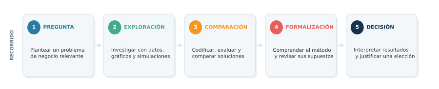
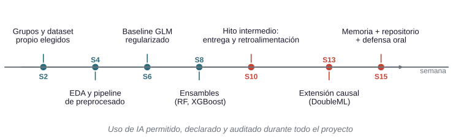
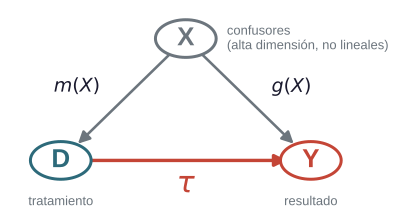
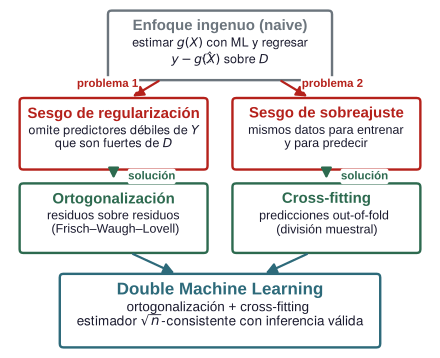
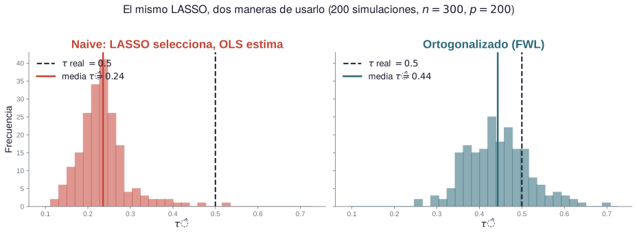
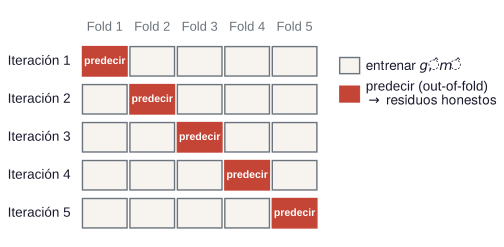
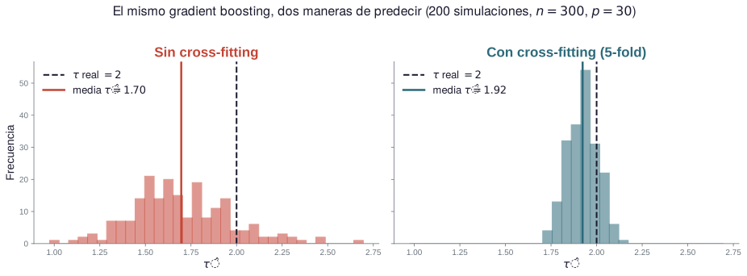

# Técnicas avanzadas de predicción en negocios {background-color="#2D6A7A"}

## Grado en inteligencia y analítica de negocios {.shrink}

&nbsp; 


:::: {.columns}

::: {.column width="30%"}
| | |
|---|-----|
| **Centro** | Facultat d'Economia |
| **Duración** | 4 cursos · 240 ECTS |
| **Acceso** | 50 plazas |
| **Modalidad** | Presencial |
| **Materias** | 30 |
| **Asignaturas** |  44  |
| **Campo de estudio** | Ciencias Económicas, Administración y Dirección de Empresas, Marketing, Comercio, Contabilidad y Turismo |


:::
::: {.column width="5%"}
:::
::: {.column width="65%"}

**Objetivo**: Formar profesionales en tecnologías de datos capaces de aplicarlas creativamente a las necesidades empresariales y a los retos de la economía digital.

Para ello integra tres ámbitos:

- **Empresa:** estrategia, finanzas, contabilidad y marketing;
- **Métodos cuantitativos:** matemáticas, estadística y aprendizaje estadístico, 
y  econometría;
- **Tecnología:** programación, gestión de datos y comunicación de resultados.


:::{.callout-note icon="false"}
# Herramientas y Técnicas del Análisis de Datos 
La asignatura **Técnicas Avanzadas de Predicción en Negocios**  (dentro de la materia **Herramientas y Técnicas del Análisis de Datos**) se apoya en los tres ámbitos: incorpora en el curriculum modelos predictivos avanzados en un entorno computacional junto con herramientas para valorar su utilidad en la toma de decisiones empresariales.

La asignatura busca formar profesionales con conocimientos de métodos computacionales y modelos predictivos aplicados a economía y negocios tanto para predecir como para  explicar, con práctica real y uso crítico de la IA.


:::
:::
::::

::: {.notes}
Paso a presentar la propuesta docente que abarca la asignatura Técnicas Avanzadas de Predicción en Negocios, obligatoria de tercer curso del grado en Inteligencia y Analítica de Negocios. La exposición tiene tres partes: la asignatura y su organización; el proyecto del cuatrimestre, que es el eje de la evaluación; y el desarrollo de un Tema, predicción y efectos causales, que muestra la manera de trabajar del curso.

En la diapositiva muestro  la ficha resumida del grado (Facultat d'Economia, cuatro cursos y doscientos cuarenta créditos, cincuenta plazas de nueva entrada), su principal objetivo que integra tres ámbitos (economía y empresa,  métodos cuantitativos y tecnología).

La asignatura, dentro de la materia Herramientas y Técnicas del Análisis de Datos se orienta al uso de métodos computacionales y modelos predictivos tanto para predecir como para explicar.
:::


## Herramientas y técnicas de análisis de datos {.shrink}

&nbsp;


| Asignatura | Curso (cuatr.) | Ámbito | Aportación principal |
|---------|:-:|----|---------|
| Minería de Datos en Negocios | 2 (1)| Exploración | Segmentación, reducción de dimensión, reglas de asociación y árboles |
| Muestreo y Encuestas | 3 (2) | Obtención de información | Diseño muestral, cuestionarios, sesgos, datos faltantes e imputación |
| Predicción con Datos Transversales | 2 (1) | Predicción | Regresión, GLM, no linealidad, validación, regularización y KNN |
| Predicción con Datos Temporales | 2 (2) | Predicción | Componentes, alisado, ARIMA y evaluación por horizonte |
| **Técnicas Avanzadas de Predicción en Negocios** | **3 (1)** |**Predicción** | **Ensambles, redes neuronales, SVM y efectos causales** |
| Datos Espaciales y Espacio-Temporales | 3 (2) | Modelización espacial | Exploración espacial, *kriging*, modelos espaciales y predicción con incertidumbre |
| Datos No Estructurados | 4 (1) | Analítica de datos no tabulares | Captura web y redes sociales, texto, imágenes, NLP y recomendación |

::: {.notes}
La tabla presenta las siete asignaturas de la materia, junto a su información básica.

Es en tercer curso cuando los estudiantes llegan a Técnicas Avanzadas de Predicción en Negocios (tras haber cursado en segundo curso Minería de Datos en Negocios y las dos asignaturas de predicción, con datos transversales y temporales). El curso cubre diversos estimadores (ensambles, máquinas de vectores de soporte, redes neuronales) y diferencia entre predicción y explicación con una introducción a efectos causales.

Señalar la ubicación de la asignatura que llega tras explorar datos y predecir con modelos sencillos, y aplia el catálogo predictivo con métodos más flexibles y su utilización para predecir y estimar parámetros estructurales.
:::


## Técnicas avanzadas de predicción en negocios {.shrink}

&nbsp;


:::: {.columns}

::: {.column width="30%"}
:::: {tbl-colwidths="[40,60]"}
| | |
|---|---|
| **Código** | 36520 |
| **Carácter** | obligatoria |
| **Curso** | 3.º · primer cuatrimestre |
| **Materia** | Herramientas y Técnicas de Análisis de Datos |
| **Carga** | 6 ECTS · 150 h |
| **Docencia** | 15 h teoría · 45 h aula informática |
| **Trabajo no presencial** | 90 h |
::::
:::

::: {.column width="5%"}
:::

::: {.column width="65%"}


**Conocimientos previos**

- Análisis exploratorio y minería de datos, inferencia,  y técnicas de predicción transversal y temporal
- Uso continuado de `R` en análisis estadístico, minería y predicción
- Fundamentos de programación y algoritmia con `Python`

**Objetivos**

- Implementar y comparar métodos avanzados de aprendizaje automático
- Selección de modelos; interpretación de resultados y límites
- Distinguir preguntas predictivas y explicativas

El **Tema 7** desarrolla el último objetivo mediante un caso de negocio.
:::

::::

::: {.notes}
La ficha de la asignatura concreta ese punto de partida, y muestra

1. Por un lado los datos formales: carácter, ubicación, y carga docente y de trabajo.

2.  Por otro lado lo que la signatura asume y lo que ofrece. 

Quizá es ese tercer objetivo lo que diferencia el enfoque de la asignatura: predecir bien no responde por sí solo a la pregunta del negocio, que muchas veces conlleva una afirmación de tipo  causal, y el estudiante tiene que saber reconocer cuándo lo es. El Tema 7 lo desarrolla con un caso de negocio, al final de la exposición.
:::


## Contenidos y planificación {.shrink}

&nbsp;

| **Semanas** | **Tema** | **Práctica / hito del proyecto** |
|:-:|--------|-----------|
| 1 | 1. Fundamentos | Entorno de trabajo reproducible |
| 2–3 | 2. Selección y evaluación | Validación cruzada e hiperparámetros · S2: grupos y dataset del proyecto |
<<<<<<< HEAD
| 4–5 | 3. Modelo lineal generalizado con regularización | Modelo base: GLM sobre conjunto de datos de referencia · S4: EDA · S6: modelo base del proyecto |
| 6–8 | 4. Ensambles: RF, XGBoost y *stacking* | Competición contra el modelo base · S8: ensambles del proyecto |
=======
| 4–5 | 3. Modelo lineal generalizado con regularización | Modelo base: GLM sobre conjunto de datos de referencia · S4: EDA  |
| 6–8 | 4. Ensambles: RF, XGBoost y *stacking* | Competición contra el modelo base · S6: modelo base del proyecto · S8: ensambles del proyecto |
>>>>>>> 232ccaa (Version preliminar para exponer)
| 9 | 5. Máquinas de vectores de soporte (SVM)  | Comparación transversal de modelos · S9: SVM |
| 10–12 | 6. Redes neuronales y aprendizaje profundo | Keras · S10: revisión y retroalimentación |
| **13–14** | **7. Predicción y efectos causales** | **Simulación de sesgos + workflow `DoubleML` · S13: extensión causal** |
| 15 | Evaluación | S15: defensa oral del proyecto |

::: {.callout-note icon="false"}
# El conjunto de datos de referencia
A lo largo de la asignatura utilizamos un mismo conjunto de datos como caso de estudio transversal, sobre el que aplicamos las diferentes técnicas. Esto permite comparar los modelos en un contexto común, analizar sus fortalezas y limitaciones, y comprender qué métodos resultan más adecuados según el objetivo empresarial y las características de los datos.
:::

::: {.notes}
La tabla muestra la distribución de los siete temas de la asignatura en las quince semanas del cuatrimestre; la tercera columna vincula cada tema con su práctica y con los hitos de un proyecto en equipos que los estudiantes desarrollan.

El recorrido va de lo simple a lo flexible: fundamentos y entorno de trabajo reproducible en la primera semana; selección y evaluación de modelos en la dos y la tres, cuando se forman los grupos del proyecto; el modelo lineal generalizado con regularización, que es el modelo base del curso y del proyecto; después los ensambles, las máquinas de vectores de soporte y las redes neuronales, con la revisión intermedia del proyecto; y las semanas trece y catorce son el Tema 7, con la simulación de los sesgos, el flujo de trabajo con DoubleML y una posible extensión causal en el proyecto, antes de la defensa oral en la quince.

Una decisión de diseño aplicable a toda la tabla: durante las prácticas, la asignatura usa un mismo conjunto de datos de referencia, sobre el que se aplican todas las técnicas. Eso permite comparar los modelos en un contexto común y ver qué método conviene según el objetivo del negocio.
:::

::: {.content-hidden}

## Metodología docente

&nbsp;

:::: {.columns}

::: {.column width="30%"}


**Carga de trabajo**

---

**Presencial: 4 horas/semana**

- **Teoría (1h):** presentación del problema, conceptos y discusión.
- **Práctica (3h):** notebook guiado, trabajo autónomo y entrega.

---

**No presencial: 90 horas (6 horas/semana)**

- Trabajos individuales/grupo: 35 h.
- Estudio y trabajo autónomo: 35 h.
- Resolución de casos: 15 h.
- Preparación de la evaluación: 5 h.

---

:::

::: {.column width="5%"}
:::

::: {.column width="65%"}

&nbsp;

**Secuencia de aprendizaje**: narrativa → visual → código → formal  

::: {style="margin-left: 1.4em;"}
1. Plantear una pregunta de negocio.  
2. Explorarla con datos, gráficos y simulación.  
3. Codificar y comparar soluciones.  
4. Formalizar el método y revisar sus supuestos.  
5. Interpretar el resultado y justificar una decisión.  
:::

Las sesiones prácticas desarrollan los contenidos de la teoría y producen evidencias de aprendizaje durante todo el cuatrimestre.
:::

::::

::: {.notes}
[Sources]
- Guía docente 36520, curso 2026-27: volumen de trabajo y metodología docente.
:::

:::

## Metodología docente: carga de trabajo

&nbsp;

| Modalidad | Actividad | Horas semanales | Horas totales |
|---|-----------|---:|---:|
| **Presencial** | Teoría: presentación del problema, conceptos y discusión | 1 h | 15 h |
| **Presencial** | Práctica: notebook guiado, trabajo autónomo y entregas | 3 h | 45 h  | 
| **No presencial** | Trabajos individuales/grupo | 2 h 20 min | 35 h |
| **No presencial** | Estudio y trabajo autónomo | 2 h 20 min | 35 h | 
| **No presencial** | Resolución de casos | 1 h | 15 h |
| **No presencial** | Preparación de la evaluación | 20 min | 5 h | 

&nbsp;

Carga total 150 h · 60 h presenciales · 90 h no presenciales

::: {.notes}
La tabla desglosa las ciento cincuenta horas del estudiante por actividades, con su carga semanal y total: sesenta horas presenciales y noventa no presenciales.

La semana tipo tiene cuatro horas presenciales: una de teoría, en la que se presenta el problema, los conceptos y la discusión, y tres de práctica en aula informática, con un notebook guiado, trabajo autónomo y entregas. 

La proporción refleja el carácter de la asignatura: tres cuartas partes del tiempo presencial transcurren implementado soluciones estadísticas a preguntas de negocios, y la teoría ocupa una hora para plantear el problema y discutir y comparar los estimadores. El notebook guiado es el punto de partida de cada sesión; lo que cuenta son las evidencias de aprendizaje que salen de esa práctica cada semana y alimentan las entregas y el proyecto. Dentro de cada tema, ese trabajo sigue siempre la misma secuencia.
:::


## Metodología docente: secuencia de aprendizaje

&nbsp; 

{width="64%" fig-alt="Estructura de evaluación: proyecto 35%, entregas 30%, participación 10%, examen 25% con mínimo 5/10; el 75% es evaluación continua"}


Las sesiones prácticas desarrollan los contenidos de la teoría y producen evidencias de aprendizaje durante todo el cuatrimestre.

::: {.notes}
La secuencia que sigue cada tema se puede reumir en cinco pasos: pregunta, exploración, comparación, formalización y decisión. Es un recorrido que va de la narrativa a lo visual, de lo visual al código y del código a lo formal.

Primero se plantea un problema de negocio; después se explora con datos, gráficos y simulaciones; en tercer lugar se codifican, evalúan y comparan soluciones; solo entonces se formaliza el método y se revisan sus supuestos; y al final se interpreta el resultado y se justifica una elección. El orden es deliberado: el formalismo llega cuando el estudiante ya ha visto el problema, ha manipulado los datos y ha comparado modelos, de modo que las fórmulas responden a preguntas que ya se ha hecho. 

Las sesiones prácticas desarrollan así los contenidos de la teoría y producen evidencias de aprendizaje durante todo el cuatrimestre.
:::

::: {.content-hidden}

## Recursos didácticos {.shrink}

&nbsp;


:::: {.columns}

::: {.column width="30%"}

---

 **¿Por qué `Python`?**  

- Librerías de referencia para métodos avanzados 
- Herramienta habitual en la industria de datos 
- Acceso a Colab  sin instalación local
- Permite transferir conocimientos acumulados en `R`: cambia la herramienta, no el concepto

---

**Entorno de trabajo** 

- Librerías `scikit-learn`, `Keras` y `DoubleML` 
- `Jupyter` en local o Google Colab 
- Entorno `conda` versionado 

---

:::

::: {.column width="5%"}
:::

::: {.column width="65%"}

&nbsp;

- Materiales didácticos digitales (notas, presentaciones, ejemplos de código).
- Herramientas de desarrollo (IDE).
- Repositorio de la asignatura.
- Notebooks guiados y ejercicios con datos reales;
- Otros recursos digitales (p.e. simulaciones para visualizar sesgo, incertidumbre y variabilidad);
- Cuestionarios breves de seguimiento y autoevaluación;
- Repositorios y plantillas reproducibles;
- Bibliografía
  - Básica: James et al., **ISLP** (2023), y Hastie et al., *ESL*;   
  - Específica por temas. (Tema 7: Ahrens et al. "An Introduction to Double/Debiased Machine Learning”  (JEL, 2026); documentación de la biblioteca `DoubleML`).
:::

::::

::: {.notes}
[Sources]
- Guía docente 36520, curso 2026-27, bibliografía.
- Fernández-Villaverde y Nuño (2023), Machine Learning for Economists, bloque 1.
:::
:::

## Recursos didácticos

&nbsp;

::: {.smaller}

| Tipo de recurso | Elementos | Uso |
|:--|:----|:----|
| **Software y bibliotecas** | `Python`, `scikit-learn`, `Keras` y `DoubleML` | Implementación y comparación de métodos |
| **Entornos de trabajo** | `Jupyter`, Google Colab, IDE y entorno `conda` versionado | Desarrollo, acceso y ejecución reproducible |
| **Materiales expositivos** | Notas, presentaciones y ejemplos de código | Introducción y explicación de los contenidos |
| **Materiales prácticos** | Notebooks guiados, ejercicios y datos reales | Aplicación progresiva de los métodos |
| **Recursos interactivos** | Simulaciones y visualizaciones | Exploración de concepts: p.e. sesgo, incertidumbre y variabilidad, o entrenamiento de redes neuronales |
| **Recursos para la evaluación** | Cuestionarios breves y actividades de autoevaluación | Seguimiento y retroalimentación |
| **Recursos para la reproducibilidad** | Repositorio de la asignatura y plantillas | Organización, documentación y reutilización |
| **Bibliografía** | James et al., **ISLP** (2023) + lecturas específicas y documentación de bibliotecas | Fundamentación y ampliación de contenidos |

:::

::: {.notes}
Los recursos didácticos se agrupan en ocho tipos: software y entornos de trabajo, materiales expositivos y prácticos, recursos interactivos, recursos para la evaluación y para la reproducibilidad, y bibliografía.

El software es Python con librerías scikit-learn, Keras y DoubleML. ¿Por qué Python si los alumnos llegan con conocimientos amplios de R?  Python ofrece  librerías de referencia para  métodos avanzados, es la herramienta habitual en la industria de datos, se puede usar en la nube a través de Colab sin instalación local y, sobre todo, permite transferir los conocimientos: cambia la herramienta, no el concepto. Los entornos, Jupyter, Colab y un entorno conda versionado, hacen que el trabajo sea reproducible desde el primer día.
:::

## Evaluación

&nbsp;

{width="50%" fig-align="center" fig-alt="Estructura de evaluación: proyecto 35%, entregas 30%, participación 10%, examen 25% con mínimo 5/10; el 75% es evaluación continua"}

- **Proyecto (35%)**: aplicación integrada de los contenidos y defensa oral.
- **Entregas (30%) y participación (10%)**: seguimiento del trabajo individual durante el curso.
- **Examen (25%)**: preguntas teóricas y aplicadas; se exige un mínimo de **5/10**.

Los pesos, las rúbricas y las condiciones de recuperación se publican al inicio del curso.


::: {.notes}
La práctica y la evluación continua tienen un peso sutantivo en la evaluación en una barra: un treinta y cinco por ciento corresponde al proyecto final con su defensa oral; un treinta por ciento las entregas individuales en aula y un diez por ciento la participación. El veinticinco por ciento restante corresponde al examen final escrito (exige un mínimo de coinco sobre diez). 

El diseño responde a la metodología: si el aprendizaje se produce mayoritariamente en la práctica semanal y a través del proyecto, la mayor parte de la nota tiene que salir de ahí. El examen conserva un peso suficiente para comprobar que cada estudiante domina individualmente los conceptos, y el mínimo evita que una buena nota de proyecto compense la falta de esa base.

El proyecto es la pieza central de esa evaluación y el segundo bloque de la exposición.
:::
# Proyecto final {background-color="#2D6A7A"}

## Proyecto del cuatrimestre

&nbsp;

{width="88%" fig-alt="Línea temporal del proyecto: grupos y dataset en la semana 2, EDA en la 4, baseline GLM en la 6, ensambles en la 8, hito intermedio con retroalimentación en la 10, extensión causal con DoubleML en la 13 y defensa oral en la 15"}

- Grupos de 3--4 alumnos, dataset y problema propios elegidos en la semana 2; cada hito utiliza el contenido desarrollado durante esas semanas
- El hito de la S13 permite formular una pregunta causal sobre los propios datos y responderla con `DoubleML` (o justificar por qué los supuestos no lo permiten, respuesta igual de valiosa)
- Entrega final: **repositorio reproducible + memoria + defensa oral** 

::: {.notes}
El desarrollo del proyecto se organiza a lo largo de una serie de entregas parciales o hitos durante el cuatrimestre. Los grupos, de tres o cuatro estudiantes, eligen en la semana dos su propio conjunto de datos y su propio problema; después entregan el análisis exploratorio y el pipeline de preprocesado, el modelo base, un GLM regularizado, y los ensambles; hacia la mitad del cuatrimestre hay una  entrega con retroalimentación; en la semana trece, como aspecto opcional, se puede formular una extensión causal al modelo predictivo; y en la quince, la memoria, el repositorio y la defensa oral. Cada hito usa el contenido desarrollado en las semanas anteriores, de manera que el proyecto avanza con el temario. Durante todo el recorrido el uso de inteligencia artificial está permitido, declarado y auditado. La entrega final, repositorio reproducible, memoria y defensa oral, se califica con una rúbrica.
:::

## Rúbrica del proyecto {.compact .shrink}

&nbsp;

| **Dimensión (peso)** | **Qué se evalúa** | **Excelente (9–10)** | **Apto (5–6)** | **No apto** |
|---|---|---|---|---|
| **Formulación y datos (10%)** | Pregunta relevantes, dataset, EDA | pregunta orientada a toma decisiones susceptible de respuesta empírica; limitaciones de los datos discutidas | Pregunta clara, EDA correcto | Dataset sin justificar; pregunta ambigua; EDA ausente |
| **Pipeline reproducible (20%)** | Repositorio, entorno, ejecución | reproduce todo desde datos crudos, entorno versionado | Reproducible con intervención menor documentada | No reproduce; preprocesado fuera del pipeline (fuga) |
| **Modelización (25%)** | Baseline → ensambles → SVM → DL; comparación | Comparación honesta en test común; selección justificada | $\geq$ 3 familias comparadas correctamente; métricas incompletas | Sin baseline; métricas elegidas a posteriori |
| **Interpretación y comunicación (15%)** | Memoria, figuras, lectura de resultados | Resultados traducidos a decisión de negocio; incorpora incertidumbre  | Interpretación correcta de métricas y efectos | Lectura mecánica o errónea de las salidas |
| **Defensa oral individual (30%)** | 10' grupo + preguntas individuales | Cada miembro explica y modifica en vivo cualquier parte del código | Cada miembro explica las partes que firmó | Un miembro no sabe explicar código propio |

::: {.notes}
Ésta tiene cinco dimensiones con su peso, lo que se observa en cada una y los descriptores de tres niveles: excelente, apto y no apto. Importante mencionar que la defensa oral individual pesa un treinta por ciento.

Más que los pesos, importa qué premia y qué penaliza. Premia una pregunta orientada a la toma de decisiones y susceptible de respuesta empírica, un repositorio que reproduce todo desde los datos crudos con un entorno versionado, la comparación de los modelos en un test común y la traducción de los resultados a una decisión de negocio que incorpore la incertidumbre. Y es explícita en los no aptos: una fuga de información, elegir las métricas a posteriori o que un miembro del grupo no sepa explicar su propio código. El nivel excelente de la defensa exige que cada miembro explique y modifique en vivo cualquier parte del código.

La última pieza del proyecto es la política de uso de inteligencia artificial.
:::


::: {.content-hidden}

## Calificación individual

&nbsp;


**Componentes**

- Nota de grupo = suma ponderada de las cuatro primeras dimensiones de la rúbrica (70%)
- Defensa oral individual = el 30% restante, evaluada con sus propios descriptores
- Factor individual corrige por contribución y autoría verificada ---multiplica  la parte de grupo. La defensa no se modifica (ya es individual) y mide *nivel*. Sin doble cómputo


:::{.callout-note icon="false"}
# Nota individual del proyecto
$$
\min (10\times 0.70 \times\text{grupo} \times f_i 
+0.30 \times \text{defensa}_i)
$$

$\qquad \qquad \qquad\qquad \qquad \qquad\qquad \qquad$ con $f_i \in [0.8,\, 1.2]$
:::

:::{.notes}
**Observaciones**

- **Retroalimentación a lo largo del curso:** hito intermedio (S10) con la rúbrica provisional aplicada sin nota; defensa final (S15) con la definitiva
- **Penalizaciones** (publicadas): entrega tardía -1 punto/día; fuga de información detectada → dimensión de modelización a no apto
- **Condición previa**:  compromiso con las entregas de acuerdo con planificación; caso contrario  la nota máxima del proyecto es 4/10

:::
:::

## Uso de inteligencia artificial {.shrink}

&nbsp;

:::: {.columns}

::: {.column width="30%"}

---

**Tres verificaciones (que la IA no suplanta)**

---

- **Defensa oral individual** con modificación de código en vivo
- **10% de participación en aula** (presencialidad verificada)
- **Examen presencial** (25%) con mínimo de 5/10

---

:::

::: {.column width="5%"}
:::

::: {.column width="65%"}

&nbsp;

**Política de IA: permitida, declarada, auditada**

- Uso libre de asistentes para código, depuración y redacción (favoreciendo uso crítico y responsable)
- **Obligatorio:** el registro completo de prompts se entrega como apéndice del proyecto y de las entregas relevantes
- Evaluado sobre los prompts: el registro se cruza con el código y la memoria buscando coherencia prompts $\leftrightarrow$ trabajo; se valora la transparencia. Alerta si resultado excede lo que el registro explica


:::

::::

::: {.notes}
La política de inteligencia artificial se resume en tres conceptos: la IA está permitida, debe ser declarada y es auditada. Los estudiantes pueden usar libremente asistentes para programar, depurar y redactar, con un uso crítico y responsable. A cambio hay una obligación: el registro completo de los prompts, no una selección, se entrega como apéndice del proyecto y de las entregas relevantes. Y ese registro se evalúa: se cruza con el código y con la memoria buscando coherencia entre lo que se preguntó y lo que se entregó. La transparencia se premia; un producto que excede con mucho lo que su registro explica es una señal de alerta.

Además, hay tres verificaciones que la inteligencia artificial no puede suplantar: la defensa oral individual, el diez por ciento de participación en el aula, que exige presencialidad, y el examen presencial, con su veinticinco por ciento y el mínimo de cinco. En lugar de prohibir una herramienta que muy probablemente van a usar en su trabajo, la asignatura permite usarla, exige declararla y comprueba en persona que el estudiante domina lo que entrega.
:::

# Tema 7. Predicción y efectos causales {.compact background-color="#2D6A7A"}

## Riesgo de abandono y estrategia de retención de clientes {.compact .shrink}

&nbsp;

:::: {.columns}
::: {.column width="30%"}

---

**Decisión de negocio**: estimación del riesgo de 
abandono (*churn*) y estrategia retención de clientes. 
Analizamos dos reglas de priorización

- **RISK:** actuar sobre quienes tienen mayor probabilidad de abandono.  
- **LIFT:** actuar sobre quienes la intervención produce una mayor reducción de la probabilidad de abandono (sensibilidad a la intervención).

---

La predicción del riesgo de abandono no responde por sí sola a la cuestión de gestión **qué clientes deberían ser objeto de una campaña**. Esta decisión requiere estimar el efecto causal de la intervención.

---

:::

::: {.column width="5%"}
:::

::: {.column width="65%"}

:::{.callout-note icon="false"}
# Experimentos aleatorios controlados: el patrón de referencia

Ascarza (2018). “Retention Futility: Targeting High-Risk Customers Might Be Ineffective”, *Journal of Marketing Research*, 55(1), 80–98. DOI: 10.1509/jmr.16.0163.

Un operador de telefonía móvil de prepago de Oriente Medio asignó al azar a 12.137 clientes que habían recargado entre una y cuatro semanas antes y no habían realizado llamadas durante la última semana. El grupo tratado recibió un SMS con crédito adicional si recargaba una cantidad determinada en los tres días siguientes. Se observó si la línea seguía activa 30 días después.

Con los resultados derivados de los datos experimentales se estima qué impacto tendría una campaña de retención sobre un subconjunto de los clientes (40%) usando reglas de priorización alternativas: RISK o LIFT.

:::

&nbsp;

| Criterio de selección | Pregunta que responde | Efecto  |
|---------|---------|:---:|
| Seleccionar el 40% de los clientes con mayor **riesgo** (problema predictivo) | ¿Quién es más probable que abandone? | **-1.9 puntos** |
| Seleccionar el 40% de los clientes con mayor **sensibilidad a la intervención** (problema inferencia causal) | ¿En quién reduce la campaña el abandono? | **-6,0 puntos** |

La diferencia entre ambos criterios fue de **4,1 puntos porcentuales**.

:::
:::

::: {.notes}
Finalizo la propuesta docente presntando brevemente el Tema 7, que empieza con una decisión de negocio: los alumnos están famliariazdos con el concepto de churn (o abandono) y su predicción (riesgo de abandono). En este tema comenzamos con una pregunta práctica: a quién dirigir una campaña de retención de clientes. 

Formulamos dos reglas de priorización: la regla RISK actúa sobre los clientes con mayor probabilidad de abandonar, un problema predictivo; la regla LIFT, sobre aquellos en los que la intervención produce una mayor reducción de esa probabilidad, un problema de inferencia causal.

El experimento de Ascarza, de 2018, permite compararlas: un operador de telefonía móvil de prepago asignó al azar a doce mil clientes inactivos un SMS con crédito adicional condicionado a una recarga, y observó si la línea seguía activa treinta días después. Se trata de un experimento aleatorio controlado.

Con los datos del mismo, la autora simula una campaña dirigida al cuarenta por ciento de los clientes con cada regla y observa el resultado en términos de disminución del abandono. Seleccionar por riesgo reduce el abandono en uno con nueve puntos; seleccionar por sensibilidad a la intervención lo reduce en seis: cuatro con uno puntos porcentuales de diferencia.

La lección: predecir el riesgo de abandono no responde por sí solo a la pregunta de gestión, a qué clientes nos dirigimos; para eso hay que estimar el efecto causal de la intervención. La pregunta que sigue es cómo estimar ese efecto sin experimento, con datos observacionales.
:::

::: {.content-hidden}

## Riesgo de abandono y estrategia de retención de clientes {.compact .shrink}

&nbsp;

Dos reglas a considerar  

:::: {.columns}
::: {.column width="30%"}
- **RISK:** actuar sobre quienes tienen mayor probabilidad de abandonar.  
:::

::: {.column width="5%"}
:::

::: {.column width="65%"}
- **LIFT:** actuar sobre quienes más reducen su probabilidad de abandono **por la intervención** (sensibilidad a la intervención).
:::
::::

:::: {.columns}
::: {.column width="30%"}
:::{.callout-note}
# Experimentos aleatorios controlados: el patrón de referencia
**Experimento 2**

Una organización norteamericana que ofrece a sus asociados servicios *online* y presenciales y descuentos para asistir a eventos asignó al azar a **2.100 clientes** próximos a renovar: carta de renovación sola o la misma carta con un **regalo de agradecimiento**, enviado antes de conocer la decisión de renovación. El artículo no especifica el objeto regalado.

:::
:::

::: {.column width="5%"}
:::

::: {.column width="65%"}
Con los resultados derivados de los datos experimentales se estima qué impacto tendría una campaña de retención sobre un subconjunto de los clientes (40%) usando reglas de priorización alternativas: RISK o LIFT.

| Criterio de selección | Pregunta que responde | Efecto de la campaña sobre el abandono |
|---------|---------|:---:|
| Mayor **riesgo** (*problema predictivo*) | ¿Quién es más probable que abandone? | **+4,4 puntos** |
| Mayor **sensibilidad a la intervención** (*problema inferencia causal*) | ¿En quién reduce la campaña el abandono? | **-4,3 puntos** |

La diferencia entre ambos criterios fue de **8,7 puntos porcentuales**.
:::
::::

::: {.takeaway}
La predicción del riesgo de abandono no responde por sí sola a la cuestión de gestión **qué clientes deberían ser objeto de una campaña**. Esta decisión requiere estimar el efecto causal de la intervención.
:::

:::

## Aprendizaje automático para la estimación de efectos causales {.shrink}

&nbsp;


:::: {.columns}
::: {.column width="30%"}

---

**Objetivo**: estimar el parámetro $\tau$ para la expresión:
$$y=\tau D+g(X)+\epsilon$$

---

Con **datos observacionales** $\to$ posible confusión en $X$:

$$D= m(X)+\eta$$

---

:::

::: {.column width="5%"}

:::
::: {.column width="65%"}
{width="72%" fig-alt="DAG del modelo parcialmente lineal: X confunde a D y a Y mediante m(X) y g(X); el efecto causal tau va de D a Y"}

**¿Por qué aprendizaje automático?**

- Elevada dimensionalidad de $X$.
- Datos no tabulares (p.e. texto o imágenes).
- Flexibilidad para aproximar $g$ y $m$.


:::

::::

::: {.notes}
Traducimos el contexto a un modelo: el objetivo es estimar el efecto de la intervención $D$ sobre la respuesta (parámetro $\tau$): la respuesta y además depende de un conjunto de variables
X; asumimos que esa dependencia puede ser compleja, de ahí proponer una forma funcional flexible $g$. Además, es importante incidir que con datos observacionales los controles pueden confundir la relación, si la elección del tratamiento se ve afectada $X$ necesitamos incorporar el proceso a través de la función $m$.

El grafo visualiza el mecanismo generador de datos.

**El objetivo del tema es incorporar técnicas de aprendizaje máquina para la estimación de tau** ¿Por qué? Tres razones: elevada dimensionalidad de X  (p.e. inclusión de datos no tabulares como texto o imágenes); posible complejidad de $g$ o $m$ que podemos aproximar a través de modelos flexibles sin que tengamos que especificarlos.
:::


:::{.content-hidden}

## Aplicación *naive* de métodos de aprendizaje automático

&nbsp;


:::: {.columns}

::: {.column width="30%"}

---

**Problema 1**

Los modelos de aprendizaje automático regularizan (de forma explícita o implícita) los predictores, introduciendo el denominado *sesgo de regularización*.

---


:::

::: {.column width="5%"}
:::

::: {.column width="65%"}
Aproximación ingenua para la estimación de $\tau$ en
$$y=\tau D+g(X)+\epsilon,$$

1. Ajustar un modelo LASSO de $y$ sobre $X$ (o cualquier modelo que implemente selección de predictores);
2. Dada una regularización óptima (por CV) determinar el subconjunto de predictores $X'$ no nulos;
3. Estimar la regresión de $y$ sobre $(D,X')$ mediante cualquier técnica paramétrica para recuperar $\tau$.

**Problema**: LASSO selecciona variables por su capacidad para **predecir $y$** pudiendo eliminar un control $x^*$ poco correlacionado con $y$ (y que sea muy relevante para explicar $D$). En este caso el modelo de segunda etapa atribuye parte de la relación de $x^*$ con $D$  a $\tau$: aparece **sesgo de variable omitida**.


:::

::::
:::


## Aplicación *naive* de métodos de aprendizaje automático

&nbsp;


:::: {.columns}

::: {.column width="30%"}

---

**Problema 1**

Los modelos de aprendizaje automático regularizan (de forma explícita o implícita) los predictores $\to$ *sesgo de regularización*.

---

**Problema 2**

Utilizar el mismo conjunto de datos para estimar una función y realizar predicciones $\to$ *sesgo por sobreajuste*.

---

:::

::: {.column width="5%"}
:::

::: {.column width="65%"}
Aproximación ingenua para la estimación de $\tau$ en
$$y=\tau D+g(X)+\epsilon,$$

1. Aprender de los datos un modelo flexible $\hat{g}$;
2. Obtener una versión residualizada de la respuesta 
$\tilde{y}=y-\hat{g}(X)$;
3. Recuperar el efecto $\tau$ por la regresión de $\tilde{y}$ sobre $D$.

**Sesgo de regularización**: la estimación $\hat{g}$   selecciona variables $X$ por su capacidad para **predecir $y$** pudiendo atenuar/eliminar un control $x^*$ poco correlacionado con $y$ (pero muy relevante para explicar $D$). En este caso el modelo de segunda etapa atribuirá parte de la relación de $x^*$ con $D$  a $\tau$  $\to$ **sesgo por variable omitida**.

**Sesgo por sobreajuste**: entrenamiento y predicción sobre las mismas observaciones atenúa parte del efecto causal (lo absorben los residuos de $y$) y aumenta la varianza resiual del tratamiento $\to$ la estimación de $\tau$ y su error estándar dejan de ser fiables.

:::

::::

::: {.notes}
El enfoque ingenuo tiene dos problemas, que son los que Double Machine Learning corrige. El procedimiento de la derecha parece razonable: aprender de los datos un modelo flexible para g, residualizar la respuesta restando esa predicción y recuperar tau con la regresión del residuo sobre el tratamiento.

El primer problema es el sesgo de regularización. Los modelos de aprendizaje automático regularizan los predictores, de forma explícita o implícita, y seleccionan las variables por su capacidad para predecir y. Un control poco correlacionado con y pero muy relevante para explicar el tratamiento puede quedar atenuado o fuera del modelo, y entonces la segunda etapa atribuye a tau parte de la relación de ese control con D: un sesgo de variable omitida. 

El segundo es el sesgo por sobreajuste: si entrenamos g y predecimos sobre las mismas observaciones, los residuos de y absorben parte del efecto causal y la varianza residual del tratamiento se distorsiona, de modo que la estimación de tau y su error estándar dejan de ser fiables.
:::

## Double (Debiased) Machine Learning {.shrink}

&nbsp;

:::{.columns}
:::{.column width="30%"}

---

Estimador de efecto causal en dos etapas

- Primera etapa
  1. Entrenar funciones $\hat{g}$ y $\hat{m}$ para respuesta y tratamiento. 
  2. Generar versiones residualizadas  
  $\tilde{y}=y-\hat{g}(X)$ y $\tilde{D}=D-\hat{m}(X)$ (separando entrenamiento/predicción)
- Segunda etapa: estimar la regresión $\tilde{y}=\tau \tilde{D}+\epsilon$

---

:::

:::{.column width="5%"}
:::

:::{.column width="65%"}
{width="80%" fig-alt="Esquema: el enfoque ingenuo genera dos problemas, sesgo de regularización y sesgo de sobreajuste; sus soluciones, ortogonalización y cross-fitting, combinadas dan Double ML, estimador raíz de n consistente con inferencia válida"}
:::
:::

::: {.notes}
Double Machine Learning es un estimador en dos etapas que permite corregir los sesgos de regularización y sobreajuste. 

En la primera etapa se entrenan dos funciones, g para la respuesta y m para el tratamiento, y se generan  versiones residualizadas de ambos (respuesta y tratamiento). El proceso separa las observaciones con las que se entrena de aquellas sobre las que se predice. 

En la segunda etapa se estima la regresión del residuo de y sobre el residuo de D: la pendiente es tau.

El esquema de la derecha ordena la lógica completa. De la aplicación
del enfoque ML ingenuo surgen dos problemas: el sesgo de regularización (omisión de predictores débiles de lam respuesta que son relevantes para el tratamiento) y el sesgo de sobreajuste (uso de los mismos datos para entrenar y para predecir). Cada uno tiene su solución: la ortogonalización o regresión de residuos sobre residuos o Frisch–Waugh–Lovell con modelos flexibles para el primero, y el cross-fitting, predicciones fuera de la muestra de entrenamiento, para el segundo. La combinación de ambas constituye Double Machine Learning: un estimador raíz de n consistente con inferencia válida.

Todo esto se pone en práctica con datos reales.
:::


:::{.content-hidden}
## Ortogonalización

&nbsp;


{width="72%" fig-alt="Distribución de tau estimado en 200 simulaciones: el enfoque naive con selección LASSO queda sesgado a la mitad del valor real 0,5; la ortogonalización FWL centra la distribución cerca del valor real"}

::: {.takeaway}
Con $\tau=0{,}5$, el enfoque directo obtiene una media de 0,24. Al residualizar $y$ y $D$ respecto de $X$, la media sube a 0,44:

$$y-\hat g(X)=\tau\,[D-\hat m(X)]+\epsilon$$
:::


## Sobreajuste y cross-fitting 

&nbsp;

::: {.columns}

::: {.column width="30%"}
{width="88%" fig-alt="Esquema de cross-fitting con 5 folds: en cada iteración se entrena en 4 folds y se predice en el fold restante"}

**Cross-fitting (K = 5):** cada residuo se calcula con modelos entrenados **sin esa observación** — predicciones *out-of-fold*, exactamente el gesto que el estudiante repite desde el Tema 2 en validación cruzada.
:::

::: {.column width="5%"}
:::

::: {.column width="65%"}
Si $\hat g$ y $\hat m$ se entrenan y predicen sobre las mismas observaciones:

- los residuos de $y$ pueden absorber parte del efecto causal;
- la varianza residual de $D$ puede quedar distorsionada;
- la estimación de $\tau$ y de su error estándar deja de ser fiable.

$$\text{Var}(\hat{\tau}) = \frac{\sigma^2_\eta}{\,n \cdot \text{Var}(\tilde{D})\,}$$

::: {.emphasis-box}
La ortogonalización reduce el sesgo de regularización. El *cross-fitting* separa entrenamiento y predicción.
:::
:::

:::


## Resultados del cross-fitting 

&nbsp;

{width="78%" fig-alt="Distribución de tau estimado en 200 simulaciones Monte Carlo: sin cross-fitting la media queda por debajo del valor real 2 (atenuación); con cross-fitting de 5 folds la distribución se centra en el valor real"}

::: {.takeaway}
Con $\tau=2$, la media pasa de 1,70 sin *cross-fitting* a 1,92 con predicciones *out-of-fold*. El RMSE baja de 0,41 a 0,11. La cobertura mejora, aunque sigue por debajo del 95% nominal con $n=300$.
:::

## Double (debiased) machine learning {.shrink}

&nbsp;


:::: {.columns}

::: {.column width="30%"}
{width="92%" fig-alt="Esquema: el enfoque ingenuo genera dos problemas, sesgo de regularización y sesgo de sobreajuste; sus soluciones, ortogonalización y cross-fitting, combinadas dan Double ML, estimador raíz de n consistente con inferencia válida"}
:::

::: {.column width="5%"}
:::

::: {.column width="65%"}
**Dos especificaciones**

| | PLM | IRM |
|---|---|---|
| **Supuesto** | efecto constante | efecto interactúa con $X$ |
| **Tratamiento** | continuo o binario | binario |
| **Nuisance** | 2 modelos | 3 modelos |
| **Cuándo** | muestra pequeña, ATE | muestra grande, efectos heterogéneos |

::: {.takeaway}
El IRM permite estimar efectos por segmento. Es la estructura necesaria para comparar riesgo de abandono y respuesta a la campaña en el caso de Ascarza.
:::

::: {.source-cite}
Contenidos desarrollados en materiales propios del curso (notebooks y slides, 2025-26).
:::
:::

::::

:::


## Práctica con datos reales {.shrink}

&nbsp;

:::: {.columns}

::: {.column width="30%"}
**Workflow con `DoubleML`**

```python
from doubleml import DoubleMLData, \
   DoubleMLPLR
from sklearn.ensemble import \
   RandomForestRegressor

datos = DoubleMLData(df, y_col="gasto",
                     d_cols="email",
                     x_cols=covariables)

regresor = RandomForestRegressor()

dml = DoubleMLPLR(datos,
                  ml_l=regresor,
                  ml_m=regresor,
                  n_folds=5)
dml.fit()
print(dml.summary)
dml.sensitivity_analysis()
```

:::

::: {.column width="5%"}
:::

::: {.column width="65%"}
**Decisión: ¿a quién enviar la campaña?**

- Los [datos públicos de Hillstrom](https://www.minethatdata.com/Kevin_Hillstrom_MineThatData_E-MailAnalytics_DataMiningChallenge_2008.03.20.csv) incluyen 64.000 clientes asignados al azar a tres grupos: email de productos de hombre, email de productos de mujer y control sin email. Durante dos semanas se observan visitas, compras y gasto.
- Se estima el efecto promedio de la intervención y se comparan dos reglas de priorización: selección por probabilidad de respuesta positiva o por efecto estimado de la campaña.
- En una etapa final se introduce selección observacional y valida `DoubleML` frente al resultado experimental.

**Salida del workflow:** los modelos de primera etapa se evalúan con validación cruzada; `dml` devuelve el efecto estimado, su intervalo de confianza y la sensibilidad a confusión residual.

:::

::::

::: {.notes}
La práctica del Tema 7 tiene un flujo de trabajo simple para los estudiantes ya familiarizados con Python+scikit-learn.

La práctica (a quién enviar una campaña de emailing) parte de datos públicos (Hillstrom): sesenta y cuatro mil clientes asignados al azar a un email de productos de hombre, un email de productos de mujer o un control sin email, con visitas, compras y gasto observados durante dos semanas. Los estudiantes estiman el efecto promedio de la intervención y comparan dos reglas de priorización, por probabilidad de respuesta positiva o por efecto estimado de la campaña, las reglas del caso de Ascarza con otros datos. En la etapa final introducimos selección observacional en la asignación y validamos DoubleML frente al resultado experimental, que aquí conocemos.

La salida es la que pide el objetivo del tema: los modelos de primera etapa se evalúan con validación cruzada, y dml devuelve el efecto estimado, su intervalo de confianza y la sensibilidad a confusión residual.
:::

## Nivel y alcance del Tema 7

&nbsp;

:::: {.columns}

::: {.column width="30%"}
**El límite**

No se evalúan demostraciones asintóticas ni el desarrollo formal de la ortogonalidad de Neyman.
:::

::: {.column width="5%"}
:::

::: {.column width="65%"}
**Lo que sí se evalúa**

- Distinguir predicción e intervención
- Reconocer los dos sesgos mediante simulación
- Aplicar ortogonalización y *cross-fitting*
- Estimar un efecto y leer su intervalo de confianza
- Discutir supuestos y límites
:::

::::

::: {.notes}
Cierro con el nivel y el alcance del Tema 7, porque conviene ser explícito sobre qué se pide a estudiantes de tercero de grado. El límite: no se evalúan demostraciones asintóticas ni el desarrollo formal de la ortogonalidad de Neyman. 

Lo que sí se evalúa: distinguir predicción e intervención; reconocer los dos sesgos mediante simulación; aplicar ortogonalización y cross-fitting; estimar un efecto y leer su intervalo de confianza; y discutir supuestos y límites.

Ese nivel es coherente con todo lo anterior: el de una asignatura forma profesionales capaces de usar métodos computacionales y modelos predictivos en economía y negocios tanto para predecir como para explicar, con práctica sobre datos reales, trabajo reproducible y un uso crítico de la inteligencia artificial.
:::

<!-- Generado por scripts/sync_partes.py desde propuesta_docente.qmd — NO EDITAR;
     editar el deck fuente y re-sincronizar. -->
