# Creative collaborations: Aesthetic Proximity and the Formation of Joint Production in Music {background-color="#2D6A7A"}

## Esquema 

&nbsp;

- **Introducción**: motivación, pregunta de investigación, marco conceptual y contribución.
- **Datos y análisis exploratorio**: fuentes, medición de la proximidad estética y la red de colaboración.
- **Núcleo empírico**: diseño de investigación, estrategia de estimación y resultados sobre la forma.
- **Análisis predictivo**: descomposición por bloques fuera de muestra.
- **Robustez**: seis familias de comprobaciones.
- **Conclusiones**: resultados, alcance, síntesis y líneas futuras.

::: {.notes}
Presento la propuesta de investigación *Creative Collaborations*, un trabajo conjunto con Manuel Cuadrado-García y María Luisa Palma-Martos que estudia la formación de colaboraciones entre artistas en la música grabada. La pregunta que organiza toda la exposición es fácil de formular: entre todas las parejas de artistas que podrían colaborar, ¿por qué unas llegan a hacerlo y otras no?

La exposición sigue seis bloques. Empiezo por la motivación, la pregunta, el marco conceptual y la contribución de este trabajo. Después presento los datos y, en particular, cómo medimos la proximidad estética entre dos artistas y cómo describimos la red de colaboraciones previa. El tercer bloque es el núcleo empírico: el diseño del conjunto de riesgo, la estrategia de estimación y el resultado sobre la forma de la relación entre similitud estética y colaboración. El cuarto pasa de la asociación dentro de muestra a la capacidad de ordenar colaboraciones en un año que el modelo no ha visto. El quinto resume las comprobaciones para calibrar la sensibilidad de los hallazgos y el último recoge resultados, límites y líneas futuras.
:::

# Introducción {background-color="#2D6A7A"}

## ¿Se ha convertido la música en un deporte de equipo?

&nbsp;

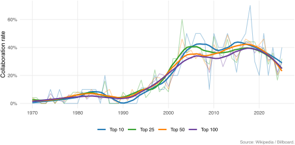{width="92%" fig-alt="Proporción de colaboraciones en el Billboard Hot 100 por año y tramo de la lista, 1970-2025, con ajuste local"}

::: {.notes}
A comienzos de los setenta, menos del 3% de las entradas anuales del Billboard Hot 100 correspondían a colaboraciones. Entre 2016 y 2020 esa misma tasa asciende al 40%: casi dos de cada cinco. La colaboración pasa de ser una anomalía entre los grandes éxitos a una práctica habitual en la producción cultural. Lo que se observa es un cambio de régimen que emerge en paralelo a la digitalización de la música y que se asienta en un nuevo equilibrio (elevada tasa de colaboración presente en los éxitos) con la implantación de un modelo de negocio en la industria basado en el acceso, no en la propiedad (el streaming).

El interés económico del fenómeno va más allá de la suma de créditos en una producción cultural: supone investigar los incentivos que llevan a combinar temporalmente competencias o recursos físico y simbólicos (identidades estéticas), reputación y acceso a públicos. Por limitaciones de tiempo, soslayaré el sustrato teórico que subyace al ejercicio 
empírico de esta propuesta.

No obstante introduzco un apunte: en la creación de equipos creativos, orientados a la producción cultural o en la academia (equipos científicos) existe una tensión entre similitud entre los participantes (que puede facilitar coordinación o compatibilidad) y la distancia (que puede aportar novedad y complementariedad). Y este es uno de los aspectos centrales que estudiamos en esta propuesta.
:::

## Colaboraciones: un emparejamiento multidimensional {.compact .shrink}

&nbsp;

**¿Qué distingue a los pares que llegan a colaborar por primera vez?** Tratamos la formación como un emparejamiento multidimensional entre artistas activos en las listas globales de Spotify:

- **Estética**: compatibilidad en un espacio de elevada 
dimensionalidad construido a partir de las percepciones de la audiencia .
- **Cultural, geográfica e institucional**: escena  común, coincidencia de país registrado e historia previa de sellos.
- **Actividad y trayectoria**: nivel de experiencia, simetría del par y tiempo de exposición a una oportunidad conjunta.
- **Topología relacional**: socios compartidos, centralidad, alcanzabilidad y distancia en la red previa de colaboraciones.

::: {.callout-note icon="false"}
# Proximidad estética: un aspecto recurrente en la literatura 

El trabajo propone dos hipótesis en competencia sobre la afinidad en mercados culturales:

- **Distancia óptima**: la compatibilidad facilita el trabajo conjunto y la diferencia aporta novedad; el perfil debería crecer y después disminuir.
- **Umbral de compatibilidad**: poca similitud constituye una barrera; alcanzado suficiente terreno común, el perfil debería crecer y aplanarse.
:::

::: {.notes}
Para hacer contrastable esa pregunta hay que fijar la unidad de análisis. Trabajamos con pares de artistas activos en un mismo año en las listas globales de Spotify, y el evento es su primera colaboración como artista principal y artista invitado (lead y feature). No preguntamos cuántas colaboraciones acumula un artista, sino qué distingue a las parejas que forman una por primera vez de las muchas que podrían haberlo hecho y no lo hicieron.

Entendemos esa formación como un emparejamiento en el que intervienen varias dimensiones a la vez. 

1. La primera es la estética: cuánto se parecen dos artistas en un espacio que generamos a partir de la percepción que la audiencia tiene de su producción anterior. 

2. La segunda agrupa la proximidad cultural, territorial e institucional: compartir escena lingüística, coincidir en el país registrado, haber pasado por los mismos sellos pueden ayudar a formar el emparejamiento.
 
3. La tercera recoge actividad y trayectoria profesional: el nivel de experiencia de los dos, lo simétrico que es el par y el tiempo que llevan expuestos a una oportunidad conjunta. 

4. La cuarta es la topología de la red previa de colaboraciones: socios compartidos, centralidad, alcanzabilidad y distancia entre ambos en esa red.

La estética es la dimensión focal porque sobre ella hay dos hipótesis en competencia con implicaciones observables distintas.  
- Por un lado la existencia de una distancia estética óptima (la compatibilidad facilita el trabajo conjunto y la diferencia aporta novedad) lleva a la propensión a colaborar a crecer con la similitud para disminuir después. 
- Si lo que opera es un umbral de compatibilidad, la distancia estética es una barrera que, alcanzado suficiente terreno común, se inactiva. La proximidad  
excesiva no se penaliza.

Las demás dimensiones entran simultáneamente en el modelo y condicionan la interpretación que hagamos de la compatibilidad estética. En todos los casos estimamos asociaciones condicionales, no mecanismos causales.

Este planteamiento obliga a separar dos preguntas que la literatura suele tratar por vías distintas: formación y beneficios de las colaboraciones.
:::

## Marco conceptual {.compact .shrink}

&nbsp;

| Pregunta | Qué encuentra la literatura | Referencias |
|---|---|---|
| ¿Beneficios de colaborar? | los *featurings* elevan la demanda de *streaming*; los duetos sobreviven más en las listas | McKenzie et al. (2021); Kaimann et al. (2021) |
| ¿Qué explica la formación de vínculos? | mecanismos asortativos, relacionales y de proximidad geográfica e institucional operan a la vez; los lazos previos generan información, visibilidad y oportunidades para nuevos vínculos | Rivera, Soderstrom y Uzzi (2010); Gulati y Gargiulo (1999); Powell et al. (2005) |
| ¿Parecidos o complementarios? | los recursos similares facilitan coordinación y aprendizaje; los distintos aportan novedad si emerge complementariedad; el óptimo interior es una hipótesis extendida en alianzas, innovación y equipos científicos | Mitsuhashi y Greve (2009); Jones (2009); Nooteboom et al. (2007); Uzzi et al. (2013); Smith et al. (2021) |
| ¿Cómo se traduce en la música? | la diferenciación óptima  favorece el éxito; la distancia entre géneros permite potencialmente ampliar la demanda; la evidencia es sobre los resultados de las colaboraciones; ¿formación? | Askin y Mauskapf (2017); Ordanini, Nunes y Nanni (2018) |

: {tbl-colwidths="[22,48,30]"}

::: {.notes}

La idea de colaboración conecta la economía de la cultura con la formación de equipos y redes. Aquí convergen dos literaturas. La primera estudia las consecuencias de colaborar, y en música la evidencia es clara: los *featurings* elevan la demanda de *streaming*, resultado central de McKenzie y coautores, y los duetos sobreviven más tiempo en las listas, como documentan Kaimann y coautores. 

La segunda estudia la formación del vínculo. Rivera, Soderstrom y Uzzi ordenan los mecanismos de formación de díadas en tres familias: asortativos, basados en la similitud; relacionales, basados en lazos previos, socios comunes y posición en la red; y de proximidad geográfica e institucional. Gulati y Gargiulo añaden que las redes se reproducen a sí mismas, porque los lazos previos generan la información y la confianza que hacen más probables los nuevos. Nuestros bloques de predictores son la traducción de esas tres familias.

La tensión entre parecidos y complementarios tiene también una larga tradición. Mitsuhashi y Greve distinguen compatibilidad (rasgos similares que facilitan el trabajo conjunto) de complementariedad (recursos distintos que crean valor al combinarse). La resolución habitual es un óptimo interior: Nooteboom y coautores lo formalizan como distancia cognitiva óptima; Uzzi y coautores muestran que la ciencia de mayor impacto combina una base convencional con elementos atípicos; y Smith y coautores lo estiman en la formación de equipos científicos, con una U invertida en el solapamiento temático.

En música, en cambio, la evidencia sobre distancia óptima es sobre resultados. Askin y Mauskapf muestran que la diferenciación óptima de una canción predice su éxito en listas, y Ordanini, Nunes y Nanni, que emparejar artistas de géneros distintos amplía la audiencia. Eso habla de qué funciona una vez existe la colaboración, no de qué parejas se seleccionan. Los pocos trabajos que estudian la formación en música se ciñen a una escena o un género, sin medida explícita de similitud y no estiman sobre la población completa de pares en riesgo. Esa es la brecha que cubre este trabajo: contrastar la forma de la relación estética sin presuponerla, integrada con las demás dimensiones de proximidad y con la topología de la red.
La contribución consiste en hacer esa integración operativa.
:::

## Afinidad estética y emparejamiento multidimensional

&nbsp;

La colaboración como un emparejamiento multidimensional, con una hipótesis contrastable sobre la afinidad estética.

- **Integración**: un único modelo combina homofilia estética, cultural-geográfica e institucional y por actividad  así como la  inercia de red.
- **Medición estética**: artistas en $t$ como vectores multidimensionales  de etiquetas de usuarios asociadas a lanzamientos anteriores a $t$ (colaboración predicha no entra mecánicamente como  predictor).
- **Contraste**: test de forma prespecificado (*spline* + reversión de signo) que analiza si máximo interior procede de los datos o de modelo paramétrica.
- **Diseño y validación**: primera colaboración principal–invitado, conjunto de riesgo completo, inferencia robusta a dependencia diádica y descomposición dentro y fuera de muestra.

::: {.notes}
La contribución se apoya en cuatro elementos. El primero es la integración: un único modelo combina la homofilia estética, cultural, territorial e institucional y por actividad y la estructura de la red previa, de modo que la forma de la relación estética se estima manteniendo constantes las demás proximidades y oportunidades.

El segundo es la medición. Representamos a cada artista con un vector de etiquetas generadas por los usuarios de dos redes sociales en música. Las etiquetas en $t$ se refieren a lanzamientos de un artista previos a $t$ lo que impide que la colaboración que queremos predecir entre mecánicamente como predictor a través de las etiquetas que ella misma genera. 

El tercero es el contraste para medir la proximidad estética. Combinamos especificaciones alternativas: además de la cuadrática se implementa un test de forma prespecificado, con *spline* y reversión de signo, que pregunta si el máximo interior que aparece en este diseño procede de los datos o de la función impuesta. 

El cuarto es el diseño y la validación: el evento es la primera colaboración principal–invitado, estimamos sobre el conjunto de riesgo completo sin muestrear negativos, la inferencia admite dependencia entre díadas que comparten artista y descomponemos la aportación de cada bloque dentro y fuera de muestra.

Para ello necesitamos combinar fuentes que midan tres cosas distintas: resultados, percepciones y relaciones.
:::

# Datos y análisis exploratorio {background-color="#2D6A7A"}

## Fuentes de datos

&nbsp;

:::: {.columns}

::: {.column width="30%"}
**Cifras básicas**

| | |
|---|---|
| Ventana de listas | 2013–2025 |
| Pistas × artista | 12.688 |
| Artistas en el ámbito | 2.878 |
| Con etiquetas fechadas | 2.402 (83,5%) |
| Filas de etiquetas | 794.309 |

: {tbl-colwidths="[58,42]"}
:::

::: {.column width="5%"}
:::

::: {.column width="65%"}
- **Listas globales semanales de Spotify** (septiembre 2013 – diciembre 2025), con metadatos de pista, álbum y artista de la Web API.
- **Etiquetas de usuarios** de Last.fm y MusicBrainz, fechadas por lanzamiento. Capturan géneros, subgéneros y estilos, pero también estados de ánimo (*moods*) y otras percepciones de la audiencia.
- **Metadatos de MusicBrainz**: tipo de entidad, país, género, año de primer lanzamiento e historial de sellos.

::: {.callout-note icon="false"}
# Por qué etiquetas y no géneros de plataforma
Los géneros de Spotify solo cubren 981 de 2.878 artistas (aprox. 34%); las etiquetas reflejan la percepción de la audiencia y cubren el 83,5%.
:::
:::

::::

::: {.notes}
Combinamos tres fuentes. La primera son las listas globales semanales de Spotify, de septiembre de 2013 a diciembre de 2025, con los metadatos de pista, álbum y artista del API Web de Spotify. Las listas nos dan el registro de colaboraciones con el detalle de créditos que necesitamos: quién es el artista principal (lead) y quién el invitado (feature) en cada pista. Tras limpiar y deduplicar nos quedamos con 12.688 combinaciones pista–artista y 2.878 artistas en el ámbito del estudio.

La segunda son las etiquetas que los usuarios asignan en Last.fm y MusicBrainz, fechadas por lanzamiento: 794.309 filas de etiquetas para 2.402 artistas, que cubre el 83,5% del ámbito. Aquí conviene justificar una elección. Spotify tiene su propia clasificación de géneros, pero solo cubre 981 de los 2.878 artistas, aproximadamente un tercio, y refleja categorías seleccionadas por la plataforma. Las etiquetas cubren más del doble y, sobre todo, recogen cómo describe la audiencia a cada artista: géneros y subgéneros, pero también estilos, estados de ánimo y otras percepciones. Para medir la posición estética desde el punto de vista del público es la fuente adecuada.

La tercera son los metadatos de MusicBrainz: tipo de entidad, país, género cuando el artista es una persona y año del primer lanzamiento. A ellos se añade el historial de sellos, construido con los créditos de álbum observados en las listas hasta el año anterior.

La cuestión decisiva es cómo convertir esas etiquetas en una medida de proximidad coherente en el tiempo.
:::

## Proximidad estética

&nbsp;

:::: {.columns}

::: {.column width="30%"}

***
- Cada artista es un vector de etiquetas
- La proximidad de una díada es la similitud coseno entre vectores
- Cobertura:  93% de pares con similitud observada en 2015; 67% en 2024 (pares sin medida permanecen en el modelo mediante indicadores)

***

:::
::: {.column width="5%"}
:::
::: {.column width="65%"}

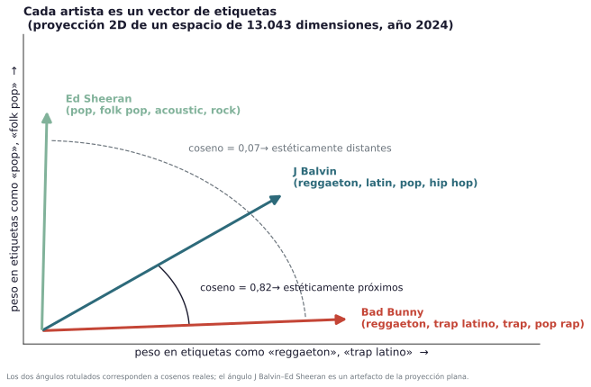{fig-align="center" fig-alt="Proyección 2-D del espacio de etiquetas: Bad Bunny, J Balvin y Ed Sheeran como vectores rotulados con sus etiquetas top; el ángulo Bad Bunny-J Balvin es pequeño (coseno 0,82) y el ángulo Bad Bunny-Ed Sheeran es grande (coseno 0,07)"}
:::
:::

::: {.notes}
Cada artista es un vector en el espacio de etiquetas. Su perfil en el año t acumula las etiquetas de todos sus lanzamientos fechados estrictamente antes de t, de modo que el perfil es acumulativo y está retardado por construcción. La proximidad de un par es la similitud coseno entre los dos vectores retardados: el ángulo entre los dos artistas en el espacio estético que define la audiencia.

La figura muerstra una proyección ilustrativa a dos dimensiones, si bien las medidas de similaridad son reales. Bad Bunny y J Balvin comparten buena parte del vocabulario con que se les describe y su coseno es 0,82; Bad Bunny y Ed Sheeran apenas comparten etiquetas y el coseno es 0,07.

Una observación sobre la cobertura: la proporción de pares con similitud observada cae del 93% en 2015 al 67% en 2024, porque los artistas que van entrando en las listas llegan con historiales de etiquetas más delgados. A este respecto, cuando un par carece de medida de proximidad estética  permanece en el modelo con un indicador de ausencia y el tramo cero. Posteriormente analizamos cuan robustos son los resultados a interpretaciones alternativas de las etiquetas. 

Junto a esta proximidad sustantiva hay otra distinta, que no se mide en etiquetas sino en la red: la cercanía heredada de las colaboraciones anteriores.
:::

::: {.content-hidden}

## La red previa amplía las oportunidades relacionales

&nbsp;

:::: {.columns}

::: {.column width="30%"}
**Densificación de la red**

---

- **Artistas activos**: 327 (2015) → 1.033 (2024).
- **Grado medio**: 1,63 → 6,22.
- **Aislados**: 33,3% → 16,1%.

---

Las cifras describen la red de cada año; la figura, la red **acumulada** (sin aislados). **Proximidad aquí significa cercanía relacional** en $G_{t-1}$, no distancia física.
:::

::: {.column width="5%"}
:::

::: {.column width="65%"}
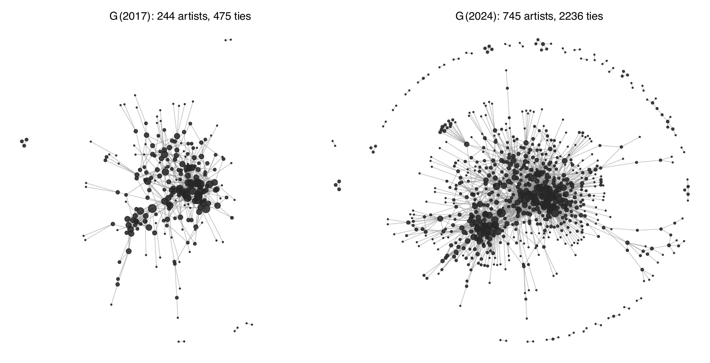{width="88%" fig-alt="Red de colaboración observada en 2017 y en 2024 con disposición fija de nodos"}
:::

::::

::: {.notes}
La red de colaboraciones cumulativa se densifica a lo largo de la década. Los artistas activos pasan de 327 en 2015 a 1.033 en 2024, el grado medio sube de 1,63 a 6,22 y la proporción de artistas sin ningún lazo previo cae del 33,3% al 16,1%. Las cifras describen la red de cada año; la figura muestra la red acumulada, sin aislados, con la misma disposición de nodos en los dos años para que se aprecie la consolidación.

El estado de la red en el año anterior no es solo un descriptivo: es el objeto sobre el que condicionamos. Para cada par de artistas en riesgo de colaborar en t calculamos, para la red acumulada hasta t-1, medidas de centralidad y posición en el grafo como número de socios comunes, si están conectados por algún camino, a qué distancia y qué posición ocupa cada artista. 

Con estas variables podemos preguntar si la historia estructural aporta información propia una vez observamos estética, cultura, instituciones y actividad. En este caso hablamos de oportunidad relacional observada, esto es, de que dos artistas cercanos en la red tienen mayor propensión a colaborar.
:::
:::

## Composición de la red

&nbsp;

:::: {.columns}

::: {.column width="30%"}

---

**El núcleo de la red**

- **Subgrafo de mayor grado** de la red acumulada a 2024 (5% superior).
- **Dos escenas** en  núcleo denso con un número reducido de artistas puente entre ambas.

La formación y segmentación de vínculos justifica separar las medidas de proximidad de la topologia de red.

---

:::

::: {.column width="5%"}
:::

::: {.column width="65%"}
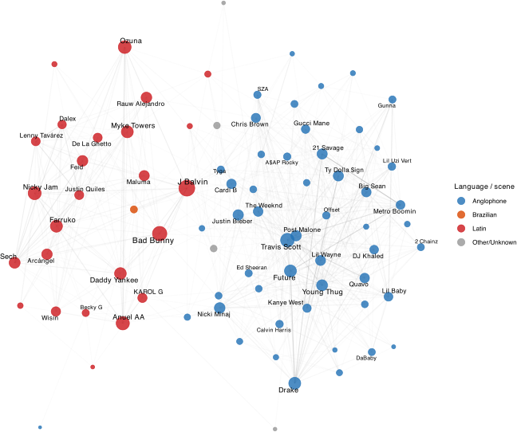{width="88%" fig-alt="Subgrafo de mayor grado de la red acumulada de colaboraciones a 2024, con nodos coloreados por escena: comunidades latina y anglófona con artistas puente"}
:::

::::

::: {.notes}

La naturaleza relacional de los datos aconseja su representación mediante un grafo para reflejar los vínculos de colaboración entre artistas. La red evoluciona entre 2015 y 2024, y la modelización captura si la posición  en la red explica la 
propensión a colaborar, una vez consideradas las afinidades estética, cultural-geográfica, institucional y de actividad.

La composición visual de la red ayuda a entender por qué la dimensión estética y la topología deben medirse por separado. La figura cumple una función ilustrativa: Es el subgrafo de mayor grado de la red acumulada hasta 2024, para el 5% superior de la distribución de la centralidad. Lo que se ve es que el núcleo denso lo ocupan dos escenas, la latina y la anglófona, con un número reducido de artistas puente entre ambas.

Encontramos pues que la estructura relacional muestra segmentación cultural donde la existencia de conexiones parece emerger tanto por proximidad (estética, cultural o geográfica) como por la ubicación en el grafo, p.e. el caso de conexiones que se cierran por vecinos compartidos o la existencia de intermediarios (o brokers) que actúan de puente entre escenas.
:::

## El modelo de formación

&nbsp;

- **Resultado sensible al rol**: el evento es la primera colaboración del par como artista **principal** y artista **invitado** (*lead–feature*) en una pista que entra en listas.
- **Formación**: exige inexistencia de lazos previos entre ambos; las repeticiones se estudian aparte (el resultado agregado suma 1.811 eventos frente a 1.064 de formación).
- **Pares invitado–invitado**: no cuentan como vínculo (pero se excluyen de negativos).
- **Un evento raro**: 26,9 formaciones por cada 100.000 pares-año (IC 95% [25,3; 28,5]).

::: {.callout-note icon="false"}
# Definición de la respuesta a modelizar
$y^F_{ij,t} = 1$ si el par $(i, j)$ aparece por primera vez como principal e invitado en el año $t$, sin lazo previo de ningún tipo entre ambos.
:::

::: {.notes}
Decidir qué cuenta como colaboración implica definir el estimando, una decisión que no es inocua. En nuestro caso tratamos de evitar mezclar dos cosas distintas: la formación de una conexión nueva y la repetición de un vínculo que ya existía. Modelizarlas juntas es modelizar procesos distintos como si fueran uno.

Además, en las colaboraciones de más de dos artistas, evitamos contabilizar como vínculos la asociación de aquellos que son invitados (featuring), aunque tampoco los contamos como negativos.

Nuestra defición de riesgo es sensible al rol: la respuesta es positiva si el par colabora en el año t cuando uno es el principal (lead) y el otro el invitado (featuring) en una pista que entra en listas. Si el evento es de formación se exige además que no hubiera ningún lazo previo entre ambos, de ningún tipo. Las repeticiones se estudian aparte. 

El resultado agregado, que suma primeras y repetidas, tiene 1.811 eventos frente a los 1.064 de formación.

Añadir que en cualquier caso estamos ante  un evento muy raro: en el caso de formación encontramos 26,9 por cada 100.000 pares-año, con intervalo del 95% entre 25,3 y 28,5. Esa rareza condiciona el diseño y la inferencia.

Con el evento definido, construimos el conjunto completo de oportunidades plausibles.
:::

# Núcleo empírico {background-color="#2D6A7A"}

## Diseño: conjunto de riesgo y resultado

&nbsp;

- **Conjunto de riesgo completo**: todos los pares no ordenados en riesgo en el año $t$ (sin muestreo de negativos).
- **Quién está en riesgo**: un par pertenece al conjunto de riesgo en $t$ solo si la colaboración es una posibilidad realista ---ambos artistas debutaron en listas antes de $t$ y cada uno ha publicado una pista en listas en los tres años previos 
- **Variantes de sensibilidad**: ventana de cinco años y regla sin salida, reportadas como sensibilidad de estimaciones.
- **Dimensión**: 3.756.411 díadas-año de estimación, 1.064 eventos de formación, 2.256 artistas (2015–2024).
- **Filtro de casos completos**: pierde el 4,2% de las filas y 2 de 1.066 eventos.

::: {.notes}
Estimamos sobre el conjunto de riesgo completo: todos los pares no ordenados en riesgo en cada año, sin muestrear negativos. La ventaja es interpretativa: los coeficientes describen cómo se distinguen las colaboraciones realizadas de la población de pares que podían haber colaborado y no lo hicieron, sin las correcciones que exige un diseño caso–control (selección de una muestra de casos y otra de controles en proporciones que no necesariamente representan su frecuencia real en la población).

Lo decisivo es quién está en riesgo. Un par pertenece al conjunto de riesgo en t si la colaboración era una posibilidad realista: los dos artistas debutaron en listas antes de t y cada uno publicó una pista que entró en listas en los tres años previos. La ventana de tres años excluye ceros poco plausibles.  No obstante usamos una ventana de cinco años y sin salida como análisis de sensibilidad.

El panel de estimación tiene 3.756.411 díadas-año, 1.064 eventos de formación y 2.256 artistas entre 2015 y 2024. El año 2025 queda fuera de la estimación porque, cuando recogimos los datos, las listas de finales de 2025 podían seguir acumulando apariciones.

Sobre este mismo diseño combinamos un modelo explicativo y una referencia predictiva flexible.
:::

## Estimación {.compact}

&nbsp;

| | **Explicativo: logit** | **Predictivo: XGBoost** |
|---|---|---|
| Objetivo | Forma e inferencia del perfil similitud–formación | Referencia flexible: cuánta señal capturan las mismas familias de factores sin imponer una forma funcional |
| Qué se modeliza |  Media condicional de formación, $\Pr(y^F_{ij,t}=1 \mid G_{t-1}, X_{ij,t-1})$ | $\Pr(y^F_{ij,t}=1 \mid G_{t-1}, X_{ij,t-1})$ |
| Cómo | Índice lineal paramétrico con efectos fijos de año con función de vínculo *logit* | Conjuntos de árboles: interacciones y no linealidades sin especificarlas, hiperparámetros fijados a priori |
| Muestra | Panel completo 2015–2024 (inferencia); reestimado en 2015–2023 para el ejercicio predictivo | Entrenamiento 2015–2023; evaluación 2024; 2025 como año de reserva |
| Inferencia | EE cluster-robustos diádicos (Aronow–Samii); contrastes de Wald | Bootstrap sobre métricas de evaluación |
| Evaluación fuera de muestra | Solo ordenación: AUC-ROC, AUC-PR, *lift* | Solo ordenación: AUC-ROC, AUC-PR, *lift* |
| Elecciones basadas en datos | Ninguna tras la especificación paramétrica |   Parada temprana con validación en 2023 |

: {tbl-colwidths="[20,40,40]"}

&nbsp;

:::{.callout-note icon="false"}
# ¿Por qué no un ERGM?

1. Escalabilidad: con 2.256 actores y millones de díadas la estimación es computacionalmente exigente.

2. Objeto probabilístico diferente: distribución conjunta de la red (ERGM) frente a probabilidad diádica condicional (logit).
:::

::: {.notes}
Usamos dos herramientas con roles distintos. El logit es el modelo explicativo: modeliza la probabilidad de formación condicionada a la red del año anterior y a las características retardadas del par, con un índice lineal y efectos fijos de año, y permite hacer inferencia sobre una forma que se declara explícitamente. 

XGBoost, un conjunto de árboles potenciados, nos sirve de referencia predictiva: captura interacciones y no linealidades sin necesidad de especificarlas y nos permite cuantificar la señal predictiva para bloque de variables  de factores cuando no imponemos forma funcional. Se trata de una referencia flexible.

En el caso del ejercicio predictivo los dos modelos se reestiman para el periodo 2015–2023 y se puntúan una sola vez en 2024. El logit no tiene ningún ajuste. En XGBoost los hiperparámetros se fijaron de antemano, y la única elección basada en datos, el número de rondas o árboles que se añaden al ensamble, que se decide con parada temprana entrenando hasta 2022 y validando en 2023.

La inferencia del logit usa los errores estándar diádicos de Aronow y Samii, que admiten dependencia arbitraria entre dos díadas que comparten un artista.

Un último apunte metodológico. A pesar de que los modelos exponenciales de grafos aleatorios podrían parecer una opción natural para modelizar datos relacionales, existen dos razones que justifican la elección de modelos de clasificación. 

La primera es de escala: con 2.256 actores y millones de díadas, la constante de normalización es intratable y la estimación tiende a degenerar. En la práctica la estimación no sería viable.

La segunda es el tipo de pregunta que responde: un ERGM modeliza la distribución conjunta de la red; el objetivo del trabajo que presento es modelizar la probabilidad condicional de cada díada dada la red previa.

Nuestra elección exige evaluar a posteriori si la hipótesis de independencia condicional entre las observaciones díadicas resulta razonable una vez considerados los predictores y el estado previo de la red.

:::

## Especificaciones: proximidades y modelos anidados

&nbsp;

| Bloque | Variables | Términos |
|---|---|---:|
| **Topología de red** | Vecinos comunes, índice de Jaccard, índice Adamic–Adar, conexión preferente, alcanzabilidad, proximidad geodésica y posición por grado | 8 |
| **Estética y posición** | Similitud del coseno (y cuadrado), posición respecto al centroide y entropía; vocabulario y ausencia como controles de cobertura | 10 |
| **Actividad y oportunidad** | Producción acumulada y carrera (nivel medio y diferencia del par); duración de la elegibilidad conjunta | 7 |
| **Otras proximidades y atributos** | Escena, tipo de artista, identidad de género (si individuo), país registrado e historia de sellos (retardada)  | 7 |

: {tbl-colwidths="[16,70,14]"}

&nbsp;

:::{.callout-note icon="false"}
**Tres modelos anidados**: Completo (los cuatro bloques) · Solo red (topología) · Sin red (estética, actividad y atributos). Las restricciones se contrastan con tests de Wald (errores estándar robustos).
:::

::: {.notes}
La comparación entre modelos exige asignar cada variable a una dimensión sustantiva concreta.

Estadísticamente trabajamos con cuatro bloques y 32 variables, además de los efectos de año; la tabla los resume. 

1. El bloque de red tiene ocho términos: vecinos comunes, índices de Jaccard y Adamic–Adar, conexión preferente, alcanzabilidad, proximidad geodésica y grado (en media y en diferencia). 

2. El bloque estético incorpora la proximidad estética (sim del coseno) y su cuadrado; la posición respecto al centroide anual y la entropía de etiquetas, que describen tipicidad y la amplitud (artista tiene similitudes relevantes con muchos, entropía alta, o pocos artistas) de su identidad estética; y el tamaño del vocabulario y los indicadores de ausencia, que controlan la cobertura. 

3. El bloque de actividad tiene siete: pistas acumuladas en listas y longitud de carrera, en media y diferencia, más la duración de la elegibilidad conjunta en tramos, que controla el tiempo de exposición. 

4. Finalmente el bloque de otras proximidades y atributos tiene otros siete: escena lingüística, país registrado, tipo de artista, género cuando ambos son personas y tres medidas retardadas de historial común de sellos.

Observación: las variables de nodo entran como media del par, que mide nivel, y como diferencia absoluta, que mide asimetría, de modo que el resultado no dependa del orden arbitrario de los artistas dentro del par.

Estimamos tres modelos anidados:  Completo, con los cuatro bloques; Solo red, con la topología; y Sin red, con estética, actividad y atributos.
:::

## Versiones de la proximidad estética

&nbsp;

:::{.callout-note icon="false"}
## ¿Optimo interior?
La especificación cuadrática de referencia  para la proximidad estética impone un máximo por construcción. Pero, ¿alcanza la propensión a colaborar un máximo interior de similitud estética, o crece y se satura?
:::

Tres alternativas:

- **Discretización**: tasas de formación observadas por tramo, e intervalos de confianza robustos, sin ajuste funcional alguno.
- **Curva flexible**: *Spline* prespecificado (cúbico natural, nudos fijados de antemano).
- **Contraste de reversión de signo**: se emplean dos submuestras independientes; en la primera se localiza el punto de ruptura y, en la segunda, se estiman las pendientes anterior y posterior. Se confirma la existencia de un óptimo interior si la pendiente anterior es positiva y la posterior es negativa.

::: {.notes}
La especificación cuadrática, que es  habitual en la literatura y  usamos en nuestras estimaciones, impone un máximo por construcción. Pero encontrar un máximo no acredita que exista una relación de U-invertida como la postulada.

Para reforzar la evidencia recurrimos a tres estrategias: 
1. La primera, consiste en discretizar la métrica de similitud estética y analizar las tasas de formación observadas por tramo (e intervalos), sin ningún ajuste funcional. 
2. La segunda es ajustar un *spline* cúbico que da la curva flexible del perfil. 
3. La tercera es un test confirmatorio de reversión de signo, basado en el enfoque de dos líneas de Simonsohn, con dos submuestras: en una se localiza el punto de ruptura como máximo del *spline*; en la otra se estima la pendiente posterior, con datos que no se usaron para localizarlo. Solo confirma un óptimo interior si la pendiente cambia de positiva a negativa.

Evaluamos las propiedades de este último  por simulación, con paneles calibrados al número de eventos y a la distribución de similitud de nuestra muestra. Para 200 replicas, cuando el perfil verdadero crece y se aplana, el test confirma falsamente un óptimo interior en el 0,5% de los casos; frente a un óptimo interior lo detecta en el 79% de las simulaciones.
:::

## Resultado base: especificación cuadrática {.tblfull .shrink}

**Logit de formación, tres modelos anidados; est. (EE diádicos Aronow–Samii)**

| Término | Completo | Solo red | Sin red |
|---|---|---|---|
| **Topología de red** | | | |
| Vecinos comunes | -0,134 (0,121) | 0,002 (0,122) | — |
| Jaccard de vecindarios | -1,839 (0,779)\* | -1,947 (0,879)\* | — |
| Adamic–Adar | 1,246 (0,335)\*\*\* | 1,228 (0,348)\*\*\* | — |
| *Preferential attachment* | -0,005 (0,001)\*\*\* | -0,004 (0,001)\*\*\* | — |
| Alcanzabilidad | -0,693 (0,188)\*\*\* | -1,127 (0,196)\*\*\* | — |
| Proximidad geodésica | 4,684 (0,596)\*\*\* | 6,955 (0,579)\*\*\* | — |
| Grado (media) | 0,207 (0,024)\*\*\* | 0,210 (0,024)\*\*\* | — |
| Grado (dif. abs.) | -0,057 (0,011)\*\*\* | -0,058 (0,009)\*\*\* | — |
| **Estética y posición** | | | |
| Similitud estética | 5,119 (0,589)\*\*\* | — | 6,428 (0,644)\*\*\* |
| Similitud estética² | -4,021 (0,712)\*\*\* | — | -4,941 (0,768)\*\*\* |
| Similitud al centroide (media) | -2,648 (0,606)\*\*\* | — | -3,526 (0,730)\*\*\* |
| Similitud al centroide (dif. abs.) | 1,522 (0,439)\*\*\* | — | 1,509 (0,463)\*\* |
| Entropía de etiquetas (media) | -0,192 (0,144) | — | -0,136 (0,161) |
| Entropía de etiquetas (dif. abs.) | -0,278 (0,080)\*\*\* | — | -0,221 (0,081)\*\* |
| Tamaño del vocabulario (media) | 0,014 (0,003)\*\*\* | — | 0,013 (0,003)\*\*\* |
| Tamaño del vocabulario (dif. abs.) | -0,006 (0,001)\*\*\* | — | -0,006 (0,001)\*\*\* |
| Sin etiquetas: un artista | -2,062 (0,918)\* | — | -1,966 (1,004) |
| Sin etiquetas: ambos | -1,414 (1,169) | — | -1,586 (1,242) |
| **Actividad y oportunidad** | | | |
| Pistas acumuladas (media) | 0,033 (0,011)\*\* | — | 0,051 (0,012)\*\*\* |
| Pistas acumuladas (dif. abs.) | -0,014 (0,005)\*\* | — | -0,013 (0,004)\*\* |
| Carrera (media) | -0,068 (0,016)\*\*\* | — | -0,053 (0,016)\*\* |
| Carrera (dif. abs.) | 0,000 (0,008) | — | -0,006 (0,008) |
| Elegibilidad conjunta 2–3 años | -0,554 (0,114)\*\*\* | — | -0,291 (0,110)\*\* |
| Elegibilidad conjunta 4–6 años | -0,936 (0,169)\*\*\* | — | -0,310 (0,197) |
| Elegibilidad conjunta 7+ años | -1,730 (0,292)\*\*\* | — | -1,586 (0,380)\*\*\* |
| **Otras proximidades y atributos** | | | |
| Misma escena | 1,043 (0,169)\*\*\* | — | 1,183 (0,193)\*\*\* |
| Mismo país | 0,055 (0,108) | — | 0,272 (0,133)\* |
| Mismo tipo de artista | 0,415 (0,141)\*\* | — | 0,576 (0,159)\*\*\* |
| Mismo género del artista | -0,010 (0,097) | — | 0,056 (0,107) |
| Jaccard de sellos (retardado) | 0,636 (0,368) | — | -0,997 (0,465)\* |
| Sellos compartidos (retardado) | -0,167 (0,112) | — | -0,015 (0,148) |
| Algún sello común (retardado) | 0,523 (0,184)\*\* | — | 1,435 (0,212)\*\*\* |
| Efectos fijos de año | sí | sí | sí |
| Díadas-año · eventos | 3.756.411 · 1.064 | ídem | ídem |

: {tbl-colwidths="[34,22,22,22]"}

::: {style="font-size:0.82em; color:#6c757d;"}
\* p<0,05; \*\* p<0,01; \*\*\* p<0,001.
:::

::: {.notes}
Comenzamos analizando los resultados de la estimación base. La tabla muestra los coeficientes estimados para las diferentes especificaciones.

:::

## Resultado base: lectura gráfica {.compact}

&nbsp;

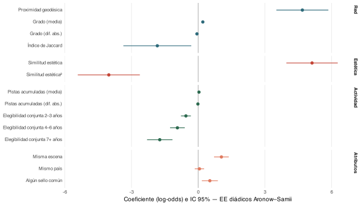{width="84%" fig-align="center" fig-alt="Gráfico de puntos e intervalos del 95% para coeficientes seleccionados del logit de formación, modelo Completo: bloques de red, estética, actividad y atributos, cada uno con su color"}

::: {style="font-size:0.8em; color:#6c757d;"}
Coeficientes seleccionados del modelo de formación. Escalas no comparables entre variables.
:::

:::{.notes}
El análisis gráfico de coeficientes con intervalos de confianza muestra que 
[Zoom: bloque de red.] El bloque de red es conjuntamente informativo (contraste conjunto del bloque rechaza el modelo restringido) y proximidad y centralidad se asocian a la formación de 
colaboraciones. La proximidad geodésica muestra como los pares que ya estaban cerca en la red previa tienen una propensión mucho mayor a conectar directamente. El grado medio también es positivo, en línea con un mecanismo de visibilidad si bien la asimetría en la centralidad se asocia a una menor probabilidad de vínculo. 

[Zoom: estética y escena.] La forma cuadrática en la proximidad estética reproduce el patrón conocido: término lineal positivo y cuadrático negativo que sitúan un máximo en una similitud de 0.637. No obstante, por ubicación,  en el percentil 94.8 del soporte,  la región cuenta con pocos pares y eventos: la estimación apunta a una relación no lineal y cóncava, pero no es concluyente respecto a una caída. 

[Zoom: actividad, país y sellos.] Compartir la escena  presenta una asociación positiva y precisa, y una actividad media mayor en listas se asocia positivamente con la formación y una mayor diferencia de actividad, negativamente, de modo que pares activos con niveles de actividad similares se asocian a una mayor propensión a colaborar. El solapamiento de carreras en listas (las variables elegibilidad conjunta) muestran coeficientes negativos y crecientes: los pares que llevan años coexistiendo sin colaborar tienen cada vez menos probabilidad de hacerlo.
:::

## Lectura crítica del óptimo interior {.compact}

&nbsp;

| Resultado | Riesgo | Similitud | Similitud² | Máximo [IC 95%] | Percentil del máximo | N | Eventos |
|---|---|---|---|---|------|---|---|
| Todos los pares | Sin salida | 5,106 | -3,698 | 0,690 [0,573; 0,807] | 96,9 | 12.726.387 | 1.503 |
| Sensible al rol | Sin salida | 5,283 | -4,161 | 0,635 [0,526; 0,743] | 95,4 | 12.726.037 | 1.153 |
| Todos los pares | Activos 3a | 4,891 | -3,509 | 0,697 [0,576; 0,818] | 96,6 | 3.756.740 | 1.393 |
| **Sensible al rol** | **Activos 3a** | **5,119** | **-4,021** | **0,637 [0,524; 0,749]** | **94,8** | **3.756.411** | **1.064** |

: {tbl-colwidths="[15,11,10,10,20,13,12,9]"}

::: {.notes}
Revisamos la supervivencia del óptimo interior a modificaciones de la muestra utilizada en su estimación. La pregunta que nos hacemos es si ese máximo es una rasgo del comportamiento de los agentes a la hora de formar vínculos o un artefacto de la especificación. 

Para responderla cruzamos dos decisiones del diseño: 
1. La definición de la respuesta, todos los pares o solo pares artista principal–artista invitado
2. El conjunto de riesgo: consideramos una ventana de tres años para determinar si un artista está activo (deforma que si no produce un hit en esos tres años, sale del conjunto de riesgo) o sin salida (una vez se alcanzan llega a listas, se permanece en el conjunto de riesgo).

La reestimación del modelo bajo estos cuatro supuestos proporciona un resultado: **la forma cuadrática sobrevive a los cambios de muestra**. El máximo implícito se queda entre 0,63 y 0,70 en las cuatro celdas, con cualquier conjunto de riesgo y cualquier proyección, aunque siempre en la cola alta de la distribución de similitud.
:::

## Proximidad estética y colaboraciones: especificación flexible

&nbsp;

:::: {.columns}

::: {.column width="30%"}

---

**Contraste de reversión**

- **Punto de ruptura**: $b = 0{,}676$  (signación sensible al orden; veredicto invariante).
- **Comportamiento antes de $b$**: pendiente 1,73 (IC 95% [1,08; 2,37]).
- **Comportamiento después de $b$**:  pendiente 2,50 (IC 95% [-5,21; 10,20]).

> Crecimiento y aplanamiento; sin reversión confirmada.

---

:::

::: {.column width="5%"}
:::

::: {.column width="65%"}
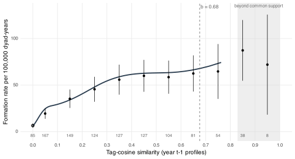{width="92%" fig-alt="Tasa de formación por tramo de similitud estética y spline g-computado con bandas de confianza; la curva sube y se aplana sin caer"}

::: {style="font-size:0.8em; color:#6c757d;"}
La curva es el *spline* prespecificado sobre el modelo completo; los puntos, las tasas de colaboración observadas por tramo prefijado.
:::
:::

::::

::: {.notes}
Ya que la ubicación del óptimo interior en la cola superior de la distribución es compatible no solo con una reversión del efecto en la proximidad estética, sino con una saturación del mismo analizamos la relación postulada con especificaciones flexibles (que no presuponen una forma determinada). 

La figura siguiente muestra directamente la forma que sí respaldan los datos. La curva es el *spline* prespecificado sobre el modelo Completo y los puntos son las tasas de colaboración observadas para la discretización de la variable similitud del coseno. Ambas apuntan en la misma dirección: la tasa de formación sube con fuerza desde similitudes bajas hasta aproximadamente 0,3 o 0,4 para aplanarse después. Ningún tramo dentro del soporte tiene una tasa inferior a los anteriores, el *spline* no se gira hacia abajo en ningún punto del rango respaldado y los dos tramos más altos, con pocas observaciones de comparación, quedan por encima de las tasas intermedias, no por debajo.

Además, un test confirmatorio utiliza la mitad de la muestra para detectar un punto de ruptura (un máximo para la tasa de colaboración) en la distribución de la variable de similitud y ajusta dos rectas, antes y después de éste con el otro 50% de la muestra. El test confirma la subida anterior está confirmada pero no una caída posterior. El remuestreo muestra valores positivos con intervalos que incluyen cero lo que apoya un crecimiento y aplanamiento, sin reversión confirmada.
:::

::: {.content-hidden}

## Heterogeneidad en la complementariedad estética {.compact}

&nbsp;

¿Cambia la curvatura descriptiva según atributos del par o sus oportunidades de encuentro? Se muestran dos moderadores contrastables de cuatro estratos prespecificados; el análisis es exploratorio:

&nbsp;

| Moderador | Fuente de la heterogeneidad | Contraste | Resultado |
|---|---|---|---|
| **Mismo país registrado** | coincidencia gruesa de país en MusicBrainz; no mide distancia ni geografía de audiencias | $\chi^2(2) = 8{,}88$; $p = 0{,}012$ | mayor concavidad de la cuadrática en pares **sin** país común (máximo implícito 0,557); con país común, el máximo queda en el borde del soporte (0,83) |
| Nivel de actividad del par | proxy de oportunidades contemporáneas; no identifica costes de búsqueda | $\chi^2(2) = 0{,}93$; $p = 0{,}629$ | sin evidencia de heterogeneidad |

: {tbl-colwidths="[18,30,22,30]"}

&nbsp;

::: {.callout-note icon="false"}
## Lectura
La coincidencia de país distingue la curvatura de la cuadrática; no identifica sustitución entre proximidades ni un mecanismo cultural o geográfico.
:::

::: {.notes}
¿Cambia la curvatura según el tipo de par? Lo examinamos de forma exploratoria con dos moderadores, tomados de cuatro estratos prespecificados, interactuando los términos cuadráticos con cada uno. La interacción con país registrado común alcanza significación convencional, chi cuadrado de 8,88 con dos grados de libertad y p de 0,012; la interacción con el nivel de actividad del par no, p de 0,63.

Conviene leer bien lo que significa. No convierte al país en un efecto simple: su coeficiente medio en el modelo Completo es impreciso. Lo que cambia descriptivamente es la curvatura del resumen cuadrático. La concavidad se concentra entre los pares sin país común, donde el máximo implícito está en 0,557; entre los pares con país común el perfil es prácticamente creciente hasta el borde del soporte, 0,83. Es un resultado exploratorio: no observamos distancia, residencia, públicos ni idioma individual, así que no identificamos un mecanismo cultural, geográfico ni de expansión de audiencias, y el ejercicio no se corrige por multiplicidad.

Pasamos ahora de la asociación dentro de muestra a cuánto ordenan los bloques en un año que el modelo no ha visto.
:::

:::

# Análisis predictivo {background-color="#2D6A7A"}

## Capacidad predictiva por bloques {.compact}

&nbsp;

| Modelo | AUC-ROC | AUC-PR (‰) | Precisión@10K (%) | Recall@10K (%) | Lift@10K | Lift@500 |
|---------|---:|---:|-----:|---:|---:|---:|
| Logit — Solo red | 0,821 | 1,238 | 0,200 | 31,25 | 15,31 | 0,00 |
| Logit — Sin red | 0,875 | 2,090 | 0,230 | 35,94 | 17,61 | 30,62 |
| Logit — Completo | 0,892 | 2,299 | 0,270 | 42,19 | 20,67 | 15,31 |
| XGBoost — Solo red | 0,745 | 0,679 | 0,140 | 21,88 | 11,51 | 0,00 |
| XGBoost — Sin red | 0,912 | 1,386 | 0,180 | 28,13 | 14,80 | 0,00 |
| XGBoost — Completo | 0,917 | 1,729 | 0,200 | 31,25 | 16,45 | 16,45 |
: {tbl-colwidths="[19,13,14,15,13,13,13]"}

&nbsp;

::: {.notes}
El ejercicio predictivo utiliza un protocolo estricto. Los dos modelos (logit y xgbm) se reestiman con datos 2015–2023 y se puntúan una sola vez en 2024, de modo que el modelo evaluado nunca ha visto el año de evaluación; XGBoost elige su número de árboles entrenando hasta 2022 y validando en 2023. En 2024 hay 64 eventos de formación de 490.000 (logit) o 526.000 díadas (xgbm) puntuadas según el modelo, una tasa base de 0,12 a 0,13 por mil. La diferencia es que el logit se entrena para el conjunto de casos completos y XGBoost para todos los pares, gracias al tratamiento nativo de los valores ausentes.

El AUC-PR del mejor modelo multiplica la tasa base por unas 18 veces en el logit y unas 14 en XGBoost. El *lift* en los 500 primeros mira el extremo del ranking y es inestable con tan pocos positivos, por eso añadimos las métricas a 10.000 primeros, donde el Completo recupera el 42% de los eventos con logit y el 31% con XGBoost. Conviene no comparar el  *lift* entre modelos por la  diferencia en la muestra de entrenamiento.

Un análisis de la capacidad explicativa dentro de la muestra de entrenamiento para los diferentes grupos de variables (test de wald sobre para modelo restringido en la especificación logit) es concluyente y apoya el modelo no restringindo. Fuera de muestra sin embargo la aportación del bloque de predictores de red es limitada. Por el contrario, quitar el bloque no-red tiene mayor coste, lo que sugiere que los bloques estética, actividad, cultura, instituciones y demás atributos contienen la mayor parte de la señal predictiva observable; la red es informativa dentro de muestra, pero al horizonte anual añade poco.
:::

## Constraste no paramétrico de la forma funcional

&nbsp;

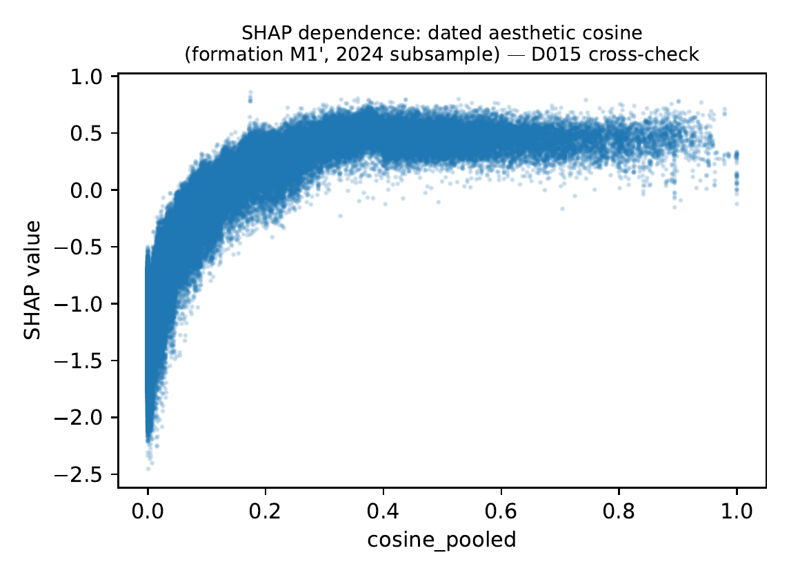{width="90%" fig-align="center" fig-alt="Gráfico de dependencia SHAP para la similitud coseno en el modelo XGBoost completo"}

::: {style="font-size:0.72em; color:#6c757d;"}
Rótulos internos: `formation M1′` = **Completo** · `cosine_pooled` = **similitud estética** · D015 = contraste de especificación.
:::

::: {.notes}
Una utilidad adicional de XGBoost es que nos permite comprobar la forma del perfil estético sin imponer ninguna forma funcional.

Para ello recurrimos a la atribución de las predicciones locales a los distintos predictores del modelo que porprociona los valores de shapley. El gráfico de dependencia muestra para cada par-año cuánto aporta la similitud estética a la puntuación (contribuciones al *score*, en escala de log-odds, no probabilidades parciales). Los valores se muestran para la el conjunto de dartos de prueba (2024).

El patrón reafirma el hallazgo del ejercicio de discretización y el *spline*: la contribución sube con fuerza por debajo de una similitud de 0,3, se aplana desde aproximadamente 0,4 y no muestra un declive claro en la parte alta. 

Es importante señalar que este resultado se obtiene de un modelo que no impone ninguna forma funcional.
:::

# Sensibilidad de los resultados {background-color="#2D6A7A"}

## Comprobaciones de los resultados {.compact}

&nbsp;

| Tipo | Ejercicios | Resultado (similitud y demás bloques) |
|---|---|---|
| **Inferencia** | *Bootstrap* de nodos | El *bootstrap* aumenta los EE (ratio mediano 1,60): términos estéticos, distancia geodésica,  grado, escena y tipo se mantienen; el historial común de sello deja de distinguirse de cero |
| **Definición del resultado** | Solo pistas de dos artistas (609 eventos)  Ponderación por tamaño de equipo   Inclusión *feat-feat* | El perfil queda esencialmente igual   Coeficientes estables para bloques de red, actividad y atributos   |
| **Ventana del conjunto de riesgo** | Ventanas de 0, 3 y 5 años | Máximos implícitos 0,635 / 0,637 / 0,630: la ventana decide qué ceros son oportunidades (no determina la forma)   Estabilidad de coeficientes en la ventana a 5 años (a excepción de elegibilidad)|
| **Medición de etiquetas** | Solo MB   Vectores binarios   Vocabularios mínimos ($k \geq 3$, $k \geq 5$)   Submuestra bien medida   Terciles de cobertura | El perfil sobrevive en todas;  bloques de red, actividad y atributos estbles; interacciones con cobertura conjuntamente no significativas ($p = 0{,}082$) |

: {tbl-colwidths="[15,32,53]"}

::: {style="font-size:0.78em; color:#6c757d;"}
**Diagnóstico de adecuación**: las simulaciones *in-sample* ajustan el volumen, pero no la concentración de nuevos vínculos; se cuantifica en «Alcance y límites».
:::

::: {.notes}
Esta tabla resume muestra distintas  comprobaciones. Todas son análisis descriptivos o de sensibilidad. Las presento brevemente.

La primera familia es la inferencia. El *bootstrap* de nodos, que remuestrea artistas y arrastra también la composición del conjunto de riesgo, es más conservador: aumenta los errores estándar con una ratio mediana de 1,60. Bajo ese criterio los términos estéticos, la geodésica, el grado, la escena y el tipo se mantienen; el historial común de sello deja de distinguirse de cero, y por eso lo leemos como positivo pero impreciso. 

La segunda es la definición del resultado. Restringir los eventos a pistas de exactamente dos artistas (elección bilateral), deja 609 eventos y un perfil esencialmente igual; ponderar por tamaño de equipo o devolver los pares invitado–invitado como clase negativa tampoco lo cambia, y los bloques de red, actividad y atributos se mueven como máximo 0,37, 0,13 y 0,05 en cada variante. 

La tercera es la ventana del conjunto de riesgo: con cero, tres y cinco años los máximos implícitos son 0,635, 0,637 y 0,630.

La cuarta es la medición de etiquetas: solo MusicBrainz, vectores binarios, vocabularios mínimos de tres y de cinco etiquetas, submuestra bien medida y terciles de cobertura. El perfil sobrevive en todas, los demás bloques se mueven como máximo 0,26 y las interacciones con la cobertura no son conjuntamente significativas, p de 0,082.

La corrección de Firth, el enlace cloglog y la inclusión de efectos de artista con un logit condicional se discuten a continuación.
:::

## Corrección de sesgo de Firth {.tblfull .shrink}

| Término | Logit | Firth | Δ Firth-logit | Cloglog |
|---|---|---|---|---|
| **Topología de red** | | | | |
| Vecinos comunes | -0,134 | -0,142 | -0,008 | -0,131 |
| Jaccard de vecindarios | -1,839 | -1,663 | 0,176 | -1,835 |
| Adamic–Adar | 1,246 | 1,261 | 0,015 | 1,225 |
| *Preferential attachment* | -0,005 | -0,005 | 0,000 | -0,005 |
| Alcanzabilidad | -0,693 | -0,685 | 0,008 | -0,694 |
| Proximidad geodésica | 4,684 | 4,649 | -0,035 | 4,697 |
| Grado (media) | 0,207 | 0,207 | -0,001 | 0,206 |
| Grado (dif. abs.) | -0,057 | -0,057 | 0,000 | -0,057 |
| **Estética y posición** | | | | |
| Similitud estética | 5,119 | 5,108 | -0,012 | 5,083 |
| Similitud estética² | -4,021 | -4,007 | 0,014 | -3,985 |
| Similitud al centroide (media) | -2,648 | -2,637 | 0,012 | -2,626 |
| Similitud al centroide (dif. abs.) | 1,522 | 1,521 | -0,001 | 1,515 |
| Entropía de etiquetas (media) | -0,192 | -0,198 | -0,006 | -0,191 |
| Entropía de etiquetas (dif. abs.) | -0,278 | -0,276 | 0,002 | -0,279 |
| Tamaño del vocabulario (media) | 0,014 | 0,014 | 0,000 | 0,014 |
| Tamaño del vocabulario (dif. abs.) | -0,006 | -0,006 | 0,000 | -0,006 |
| Sin etiquetas: un artista | -2,062 | -2,092 | -0,030 | -2,056 |
| Sin etiquetas: ambos | -1,414 | -1,339 | 0,074 | -1,408 |
| **Actividad y oportunidad** | | | | |
| Pistas acumuladas (media) | 0,033 | 0,033 | 0,000 | 0,032 |
| Pistas acumuladas (dif. abs.) | -0,014 | -0,014 | 0,000 | -0,014 |
| Carrera (media) | -0,068 | -0,067 | 0,000 | -0,067 |
| Carrera (dif. abs.) | 0,000 | 0,000 | 0,000 | 0,000 |
| Elegibilidad conjunta 2–3 años | -0,554 | -0,554 | 0,000 | -0,552 |
| Elegibilidad conjunta 4–6 años | -0,936 | -0,934 | 0,002 | -0,926 |
| Elegibilidad conjunta 7+ años | -1,730 | -1,719 | 0,011 | -1,711 |
| **Otras proximidades y atributos** | | | | |
| Misma escena | 1,043 | 1,042 | -0,001 | 1,044 |
| Mismo país | 0,055 | 0,054 | -0,001 | 0,053 |
| Mismo tipo de artista | 0,415 | 0,414 | -0,001 | 0,413 |
| Mismo género del artista | -0,010 | -0,011 | -0,001 | -0,008 |
| Jaccard de sellos (retardado) | 0,636 | 0,667 | 0,031 | 0,634 |
| Sellos compartidos (retardado) | -0,167 | -0,162 | 0,006 | -0,167 |
| Algún sello común (retardado) | 0,523 | 0,513 | -0,009 | 0,521 |
| Efectos fijos de año | sí | sí | | sí |

: {tbl-colwidths="[36,16,16,16,16]"}

::: {.notes}
Dada la baja frecuencia del evento analizado, estimamos dos modelos alternativos. En primer lugar, empleamos la corrección de Firth, basada en una verosimilitud penalizada, para reducir el sesgo de las estimaciones y mitigar posibles problemas de separación. En segundo lugar, estimamos un modelo con enlace log-log complementario (cloglog), cuya forma asimétrica resulta apropiada cuando la respuesta registra la ocurrencia de un evento generado por un proceso en tiempo continuo.

La tabla muestra los parámetros reestimados.
:::

## Firth y cloglog: distancia entre estimaciones {.compact}

&nbsp;

{width="78%" fig-align="center" fig-alt="Distancias entre estimaciones puntuales, Firth menos logit y cloglog menos logit, para los coeficientes seleccionados del modelo base, coloreadas por bloque de variables; ningún coeficiente cambia de signo"}

::: {style="font-size:0.8em; color:#6c757d;"}
Colores por bloque de variables. Un rombo hueco marcaría un coeficiente que cambia de signo respecto al logit base: **ninguno lo hace**.
:::

::: {.notes}
Visualizando gráficamente, los dos términos focales de similitud cambian como máximo 0,014. El mayor desplazamiento de toda la tabla es 0,176, en el índice de Jaccard para vecindarios, que equivale a aproximadamente 0,23 de su error estándar. Los coeficientes culturales e institucionales son igual de estables. El cloglog conserva el mismo patrón de signos, aunque está en otra escala de enlace y sus magnitudes no se comparan directamente con las del logit. Tampoco hay señales de separación: la estimación converge y ninguna observación tiene una probabilidad ajustada superior a un medio.

El alcance es el que es: una auditoría de coeficientes. Queda pendiente recalcular errores estándar  así que el ejercicio  muestra que las estimaciones puntuales no dependen del estimador.
:::

## Logit condicional  {.tblfull .shrink}

| Término | Estimación | EE |
|---|---|---|
| **Estética y posición** | | |
| Similitud estética | 5,561\*\*\* | 0,485 |
| Similitud estética² | -4,414\*\*\* | 0,587 |
| Similitud al centroide (media) | -2,920\*\*\* | 0,425 |
| Similitud al centroide (dif. abs.) | 1,350\*\*\* | 0,273 |
| Entropía de etiquetas (media) | -0,075 | 0,074 |
| Entropía de etiquetas (dif. abs.) | -0,345\*\*\* | 0,077 |
| Tamaño del vocabulario (media) | 0,012\*\*\* | 0,002 |
| Tamaño del vocabulario (dif. abs.) | -0,005\*\*\* | 0,001 |
| Sin etiquetas: un artista | -1,917\*\*\* | 0,507 |
| Sin etiquetas: ambos | -2,345\*\* | 0,763 |
| **Actividad y oportunidad** | | |
| Pistas acumuladas (media) | 0,051\*\*\* | 0,005 |
| Pistas acumuladas (dif. abs.) | -0,010\*\*\* | 0,002 |
| Carrera (media) | -0,065\*\*\* | 0,013 |
| Carrera (dif. abs.) | -0,007 | 0,007 |
| Elegibilidad conjunta 2–3 años | -0,262\*\* | 0,094 |
| Elegibilidad conjunta 4–6 años | -0,336\* | 0,134 |
| Elegibilidad conjunta 7+ años | -1,525\*\*\* | 0,260 |
| **Otras proximidades y atributos** | | |
| Misma escena | 1,788\*\*\* | 0,102 |
| Mismo país | 0,599\*\*\* | 0,084 |
| Mismo tipo de artista | 0,659\*\*\* | 0,112 |
| Mismo género del artista | -0,030 | 0,081 |
| Jaccard de sellos (retardado) | -0,240 | 0,414 |
| Sellos compartidos (retardado) | 0,084 | 0,094 |
| Algún sello común (retardado) | 0,828\*\*\* | 0,147 |
| Estratos principal $\times$ año | absorbidos | |
| Pares-año · eventos · estratos | 545.149 · 1.064 · 641 | |

: {tbl-colwidths="[44,34,22]"}

::: {.notes}
Los modelos anteriores solo controlan las diferencias entre artistas mediante variables observadas. Para absorber las características no observables de los artistas principales, aplicamos un diseño de elección emparejada: para cada artista principal con al menos una colaboración en un año, comparamos los colaboradores elegidos con todos los candidatos elegibles. El estrato artista-año absorbe toda característica constante del artista ese año, como su calidad latente, visibilidad o actividad.

El análisis comprende 641 estratos, 545.149 pares-año y 1.064 eventos. Las variables de red no se incluyen porque la posición del artista principal es fija dentro de cada estrato. Aunque es el control más fuerte frente a la heterogeneidad no observada, solo incluye artistas con alguna colaboración; por ello, los coeficientes se interpretan por su dirección, no por su magnitud respecto a los modelos anteriores.

:::

## Logit condicional: distancia frente al modelo base {.compact}

&nbsp;

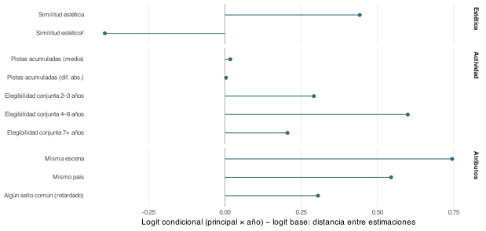{width="78%" fig-align="center" fig-alt="Distancias entre las estimaciones del logit condicional principal por año y el logit base para los coeficientes seleccionados no de red, coloreadas por bloque de variables; ningún coeficiente cambia de signo"}

::: {style="font-size:0.8em; color:#6c757d;"}
Mismos coeficientes que en el modelo base, sin el bloque de red (fijo dentro del estrato). El estimando cambia: lectura de dirección y estabilidad, no de magnitud. Colores por bloque de variables; un rombo hueco marcaría un coeficiente que cambia de signo respecto al logit base: **ninguno lo hace**.
:::

:::{.notes}
La dirección y la curvatura estéticas se mantienen cerca de los valores base. Las proximidades cultural e institucional aparecen incluso mayores. Parte de esa diferencia tiene explicación: dentro del conjunto de oportunidades de un principal, el país y el sello ya no compiten con la posición del propio principal en la red, que en el modelo base absorbía parte de la asociación geográfica.

Lo que este ejercicio nos dice es que los resultados de proximidad no son un artefacto de la heterogeneidad no observada de artistas principales: dentro de cada principal, los socios más cercanos estética, cultural e institucionalmente son elegidos con más frecuencia.

Con la evidencia principal y sus comprobaciones, sintetizo principales resultados.
:::

# Conclusiones {background-color="#2D6A7A"}

## La formación es multidimensional {.compact}

&nbsp;

- **Compatibilidad estética**: dentro del soporte común, la proximidad estética presenta una asociación positiva que se aplana; los datos no apoyan la exxistencia de un óptimo interior.
- **Compatibilidad en otras dimensiones**: escena  común  y alguna historia previa de sello muestran asociaciones positivas; la coincidencia de país registrado no tiene un efecto medio preciso. Mayor actividad media y menor diferencia de actividad también se asocian con formación.
- **Topología**: el bloque de red es conjuntamente informativo dentro de muestra; en 2024 añade poca mejora marginal de ranking a las características no-red, con intervalos que incluyen cero.
- **Resultado metodológico**: en este diseño, el máximo interior aparece al imponer una forma cuadrática que no se reproduce con las formas flexibles.

::: {.notes}
Cuatro resultados. El primero es la hipótesis focal: dentro del soporte común, la proximidad estética tiene una asociación positiva que se aplana. Es importante señalar que la partición prespecificada localiza el cambio alrededor de 0.68, la subida está confirmada y la caída no: no hay evidencia de declive en ningún punto del soporte observado. Eso es coherente con un umbral de compatibilidad: la poca similitud es una barrera para trabajar juntos pero los datos no respaldan una penalización por compatibilidad excesiva entre los pares que observamos.

El segundo son la relevancia de otras medidas de proximidad. La cultural importa, pero en forma de escena compartida más que de país. La institucional, el historial común de sello, es positiva pero menos robusta. Y en actividad, los pares más activos y más equilibrados colaboran más, mientras que la proximidad de carrera no da un resultado claro.

El tercero es la topología. El bloque de red es claramente informativo dentro de muestra, pero en el ejercicio predictivo (para el año de prueba) añade poca mejora marginal a las características no-red, con intervalos que incluyen cero. Este hallazgo sugiere que los estadísticos son el resultado de un proceso de preferencias y oportunidades que las características observables ya capturan y no variables explicativas originales.

El cuarto es metodológico: en este diseño, el máximo interior aparece al imponer una cuadrática y no se reproduce con las formas flexibles. Formación y éxito son preguntas distintas, y la forma debe contrastarse sin imponerla.

En conjunto, la colaboración emerge de varias proximidades y oportunidades que operan juntas: la estética funciona como condición de compatibilidad dentro del soporte observado; cultura, instituciones, actividad y red estructuran qué emparejamientos llegan a materializarse. 

Este balance exige declarar también dónde no alcanza la evidencia.
:::

## Limitaciones y extensiones {.compact}

&nbsp;

**Limitaciones**

- **Asociaciones condicionales**: las estimaciones lo son condicionadas a la red retardada; no permiten extraer conclusiones
causales.
- **Medidas parciales**: las etiquetas y la escena incorporan ruido en su construcción; el historial de sellos no agota los canales institucionales.
- **Cola alta poco poblada**: 8 eventos por encima de similitud 0,90; no se descarta una penalización para la similitud extrema.
- **Población y resultado condicionados**: artistas activos en listas globales con metadatos; llegar a las listas no se modeliza y la colaboración fuera de listas se incorpora parcialmente.

**Extensiones**

- **Metodológica**: Almquist y Butts(2014) proponen evaluar la adecuación del modelo *logit* para el grafo. Simulaciones dinámicas del modelo estimado reproducen el volumen de nuevos vínculos pero muestran capacidad limitada para capturar la concentración en determinados nodos (dependencia residual no capturada). Refinar esa estrategia de simulación para evaluar la incertidumbre del modelo y la adecuación de la independencia condicional entre díadas.
- **Sobre los resultados**: ampliar el horizonte temporal  y/o densificar vocabularios de etiquetas para aumentra observaciones en cola superior.

::: {.notes}
Las limitaciones son de diferentes tipos. Primera, las estimaciones son asociaciones condicionales a la red retardada, no efectos causales. Segunda, las medidas son parciales: las etiquetas o la escena incorporan ruido en su construcción y el historial de sellos no agota los canales institucionales. Tercera, la cola alta está poco poblada: hay ocho eventos por encima de una similitud de 0,90, así que no es posible descartar una penalización por falta de coplementariedad para la similitud extrema. Cuarta, población y resultado están condicionados: estudiamos artistas activos en listas globales con metadatos, no se modeliza el llegar las listas no se modela y la colaboración fuera de listas se incorpora parcialmente. 

En lo que respecta a extensiones existe un diagnóstico de adecuación para evaluar la adecuación de la hipótesis de independencia condicional de los pares.  Para ello se construyen simulaciones de la red a partir del modelo estimado. El objeto es determinar si la simulaciones reproducen la topografía de la red (particularmente volumen de nuevos vínculos y concentración de los mismos). Las simulaciones muestran limitaciones para capturar la concentración de vínculos en determinados nodos lo que revela dependencia residual no capturada. No demuestra sesgo en los coeficientes, ni señala un mecanismo concreto, ni dice que otro modelo de red la resolvería. Pero sí marca la dirección: la primera extensión consiste en refinar esa estrategia de simulación para evaluar la incertidumbre que rodea al modelo y la adecuación del supuesto de independencia condicional entre díadas.

Las demás extensiones siguen de los resultados obtenidos. En concreto señalo dos: poblar la cola de alta similitud, con horizontes más largos, o mejorar las etiquetas con vocabularios más densos. La infraestructura construida, listas, etiquetas fechadas y panel diádico versionados y documentados, permite desarrollar esas extensiones dentro de la línea de industrias creativas del grupo de investigación CREAMARKT.

Muchas gracias. Quedo a disposición de la comisión.
:::

::: {.content-hidden}

## Tres líneas extienden el programa de investigación {background-color="#2D6A7A"}

&nbsp;

::: {style="color:#fafafa; font-size:1.15em; line-height:1.45;"}
**Las colaboraciones se forman en un entorno multidimensional. Dentro de él, la baja similitud estética se asocia con menor formación y el perfil crece y se aplana, sin caída respaldada en el soporte común.** En este diseño, el máximo interior de la cuadrática refleja la forma funcional; dirimirlo exigía escala completa, medición fechada y un test prespecificado.
:::

&nbsp;

::: {style="color:#fafafa; font-size:0.92em; line-height:1.5;"}
El programa continúa en tres direcciones. Primera, poblar la cola de alta similitud — horizontes más largos, resultados fechados fuera de las listas y vocabularios más densos — para poder pronunciarse más allá del soporte común. Segunda, modelar conjuntamente formación y éxito: qué configuraciones, además de formarse, funcionan comercial y creativamente. Tercera, estudiar la formación dirigida — quién recluta a quién — y su interacción con la estrategia de los sellos.

La agenda conecta economía cultural, formación de equipos y redes, y se integra en la línea de *big data* aplicado a las industrias creativas de CREAMARKT. El soporte de datos — listas, etiquetas fechadas y panel diádico — queda versionado y documentado para réplica y extensión por terceros y doctorandos.
:::

&nbsp;

::: {style="color:#fafafa; font-size:1.05em;"}
Gracias.
:::

::: {.notes}
La formación combina proximidades y oportunidades. Dentro de ese entorno, la asociación estética crece y se aplana sin caída respaldada en el soporte observado. La lección transportable es metodológica: formación y éxito son preguntas distintas y la forma debe contrastarse sin imponerla. El programa amplía la cola de similitud, une formación y rendimiento y estudia quién recluta a quién. La infraestructura versionada permite desarrollar estas extensiones en CREAMARKT. Gracias; quedo a disposición de la comisión.

[Sources] paper §Conclusions (further research); paquete de réplica: 2026_jcr/output/empirical_walkthrough_v2/; líneas del grupo CREAMARKT: web UV (grups-investigacio/creamarkt), línea "big data aplicado a las industrias creativas" verificada 2026-08-15.
:::

<!-- Archivo de posibles reservas. Se excluye deliberadamente de Reveal y PDF;
     la exposición no promete estas slides y sus respuestas breves se trasladan
     a las notas de las slides principales relacionadas. -->

## Reserva · Calibración de los modelos predictivos

&nbsp;

:::: {.columns}

::: {.column width="47.5%"}
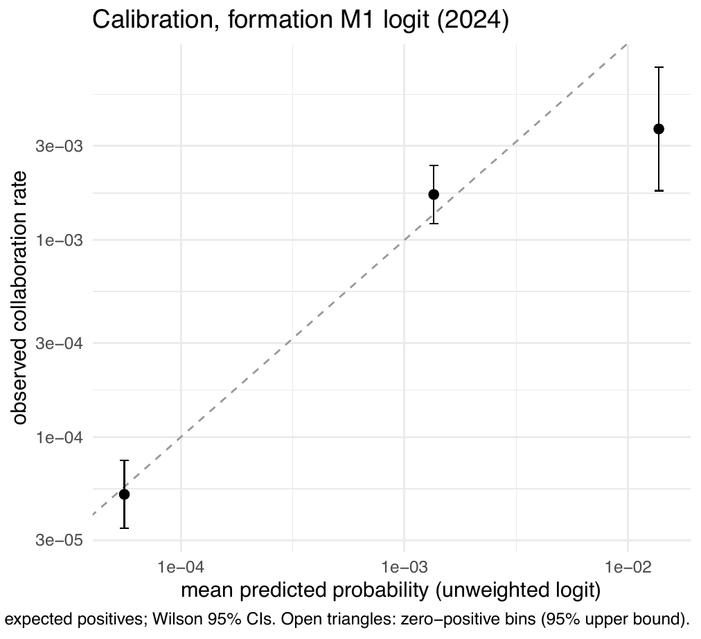{width="100%" fig-alt="Diagrama de fiabilidad del logit completo en 2024"}
:::

::: {.column width="5%"}
:::

::: {.column width="47.5%"}
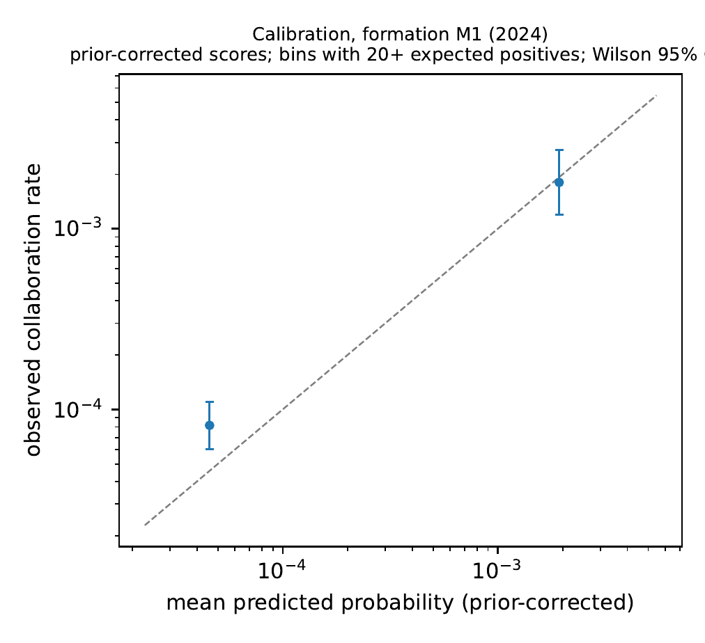{width="100%" fig-alt="Diagrama de fiabilidad del XGBoost completo en 2024"}
:::

::::

- **Uso declarado**: las puntuaciones ordenan; no se emplean como probabilidades calibradas. Los diagramas son descriptivos.

::: {.notes}
Las puntuaciones se emplean para ordenar, no como probabilidades. Los diagramas muestran desviaciones descriptivas de calibración y no modifican la lectura predictiva principal.

[Sources] output/fig_calibration_logit.pdf y fig_calibration_xgb.pdf (códigos 25_logit_predict.R, 20_fit_xgboost.py).
:::

## Reserva · Aciertos en el top-k (2024)

&nbsp;

- **Con 64 eventos y $\approx$490.000–526.000 díadas puntuadas**, el mejor modelo captura **2 eventos** en el top-500 (logit Sin red); los modelos Completos logit y XGBoost capturan 1 (IC bootstrap [0; 6]).
- **Lectura**: la ordenación es informativa (AUC alto) pero la utilidad operativa de una lista corta es limitada con eventos tan raros; se declara como tal en el artículo.

::: {.notes}
Con eventos tan raros, un AUC alto no garantiza una lista corta operativamente útil: el top-500 contiene entre cero y dos eventos según el modelo.

[Sources] output/pred_topk_ci.csv; denominadores output/tbl_pred_comparison.csv (489.912 logit; 526.319 XGBoost).
:::

## Reserva · Estabilidad temporal del perfil

&nbsp;

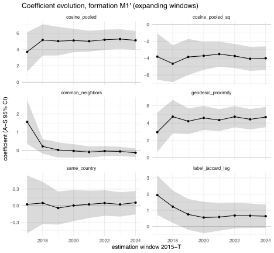{width="70%" fig-alt="Evolución de los coeficientes lineal y cuadrático del coseno al restringir la muestra por año inicial"}

- **Restricción a 2017–2024**: coseno 5,131 (EE 0,615) y coseno² -4,045 (EE 0,745), prácticamente idénticos a la base.

::: {.notes}
Restringir el inicio a 2017 apenas cambia los términos estéticos; es una comprobación descriptiva de estabilidad temporal de la cuadrática, no del punto flexible.

[Sources] output/fig_coef_evolution_fullscale.pdf (código 43_coef_evolution.R); cifras 2017+: paper §Results (fig-evolution).
:::

## Reserva · Detalle del test de forma

&nbsp;

- **Partición**: 50/50 estratificada por resultado con semilla fija; el punto de ruptura se localiza como argmax del spline g-computado en la mitad de exploración.
- **Bootstrap de nodos** (200 réplicas re-localizando $b$): media de la pendiente posterior 2,50 (IC normal [-5,21; 10,20]); dispersión del punto de ruptura SD 0,12, percentiles [0,37; 0,76]: ningún pico interior estable.
- **Reproducibilidad declarada**: la partición depende del orden de las filas; los estadísticos dependientes de la partición se reproducen en distribución y los veredictos son invariantes (nota al pie en el artículo, decisión D024).

::: {.notes}
La semilla está fijada, pero la asignación depende del orden de las filas. El punto y las pendientes se reproducen en distribución y el veredicto permanece invariante.

[Sources] output/shape_hinge_bootstrap_summary.csv; DECISIONS.md D024; paper §sec-shapetest (nota).
:::

## Reserva · Cobertura de etiquetas por año

&nbsp;

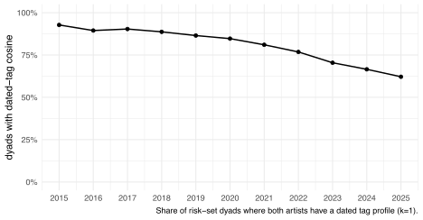{width="70%" fig-alt="Fracción de díadas con similitud coseno observada por año, 2015-2024"}

- **De 0,93 (2015) a 0,67 (2024)**: la caída refleja la entrada de artistas nuevos aún sin etiquetas fechadas; las filas imputadas se excluyen del análisis de forma y la medición tiene familia propia de robustez.

::: {.notes}
La cobertura cae al entrar artistas nuevos sin suficientes lanzamientos etiquetados previos; por eso la medición se audita por separado y el *spline* excluye los pares sin coseno observado.

[Sources] output/fig_coverage_per_year.pdf; output/tbl_panel_composition.csv (columna coverage).
:::

## Reserva · Importancia de variables (SHAP)

&nbsp;

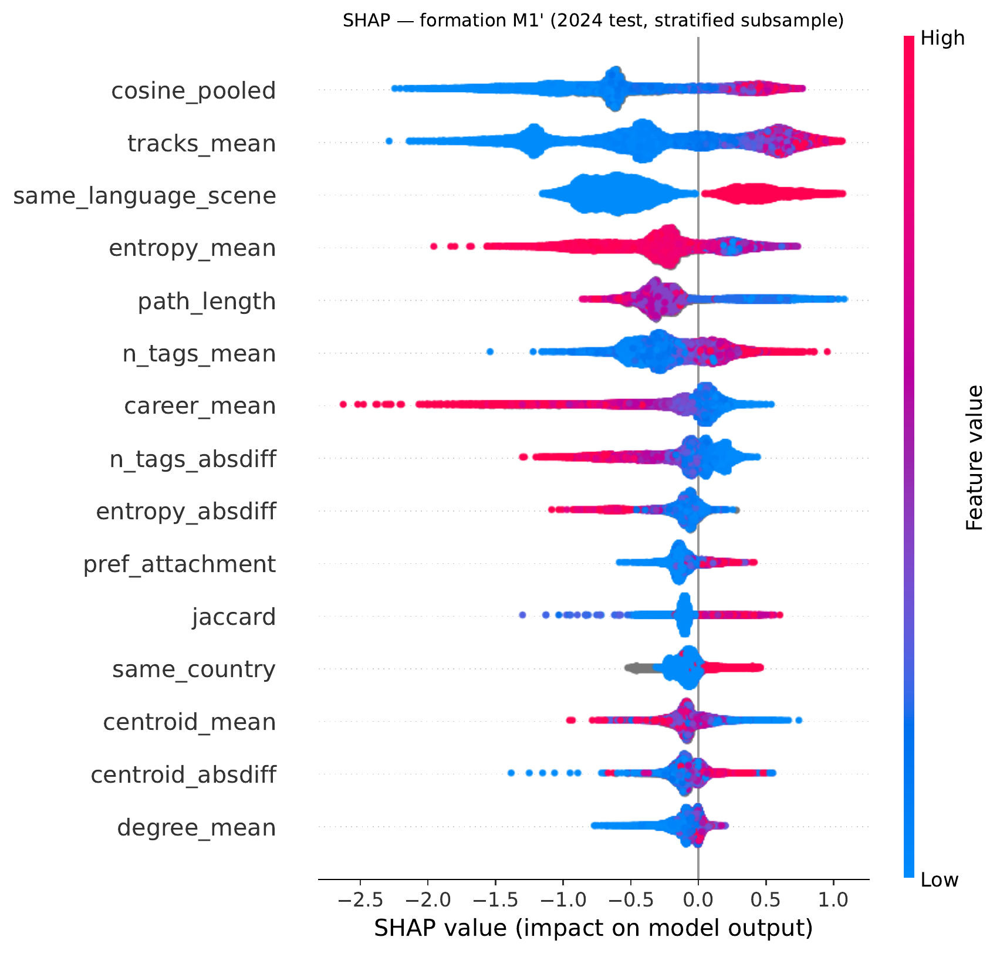{width="63%" fig-alt="Beeswarm SHAP del modelo XGBoost Completo: contribuciones por variable"}

- **Encabezan la ordenación** las variables estéticas y de actividad junto a la proximidad geodésica, en línea con la descomposición por bloques.

::: {.notes}
El beeswarm sitúa estética, actividad y proximidad geodésica entre las variables con mayor contribución al *score*; no permite comparar efectos causales ni sustituye los contrastes por bloques.

[Sources] output/fig_shap_beeswarm_m1.pdf (código 20_fit_xgboost.py); lectura: paper §Results (fig-shap-bees).
:::

:::

<!-- Generado por scripts/sync_partes.py desde propuesta_investigacion.qmd — NO EDITAR;
     editar el deck fuente y re-sincronizar. -->
