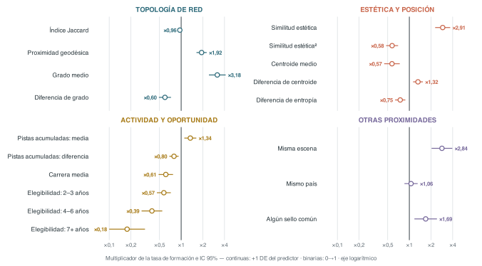
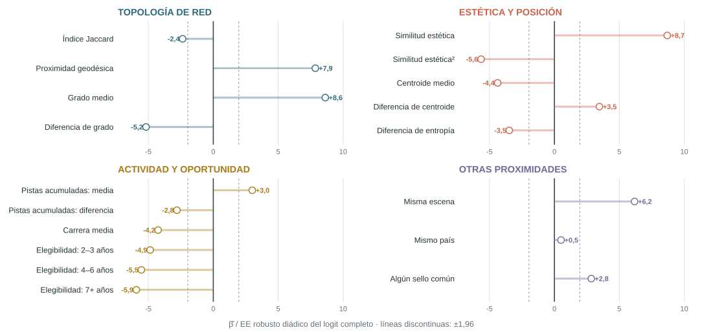
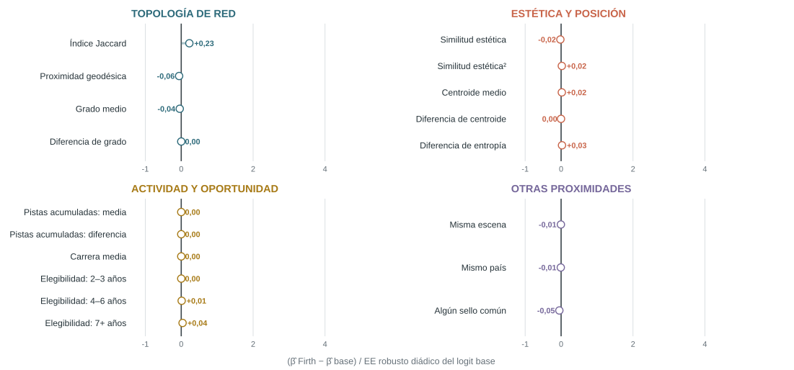
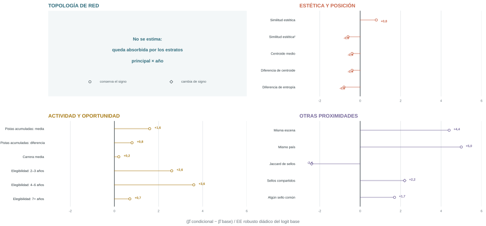
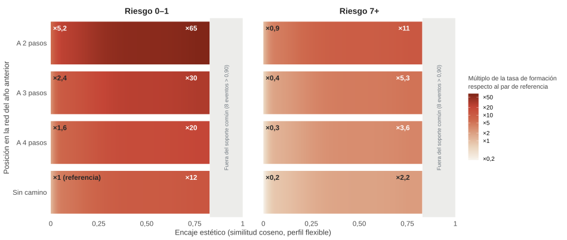
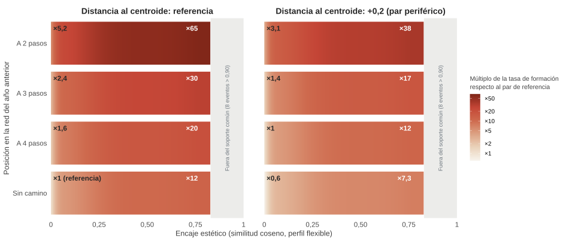
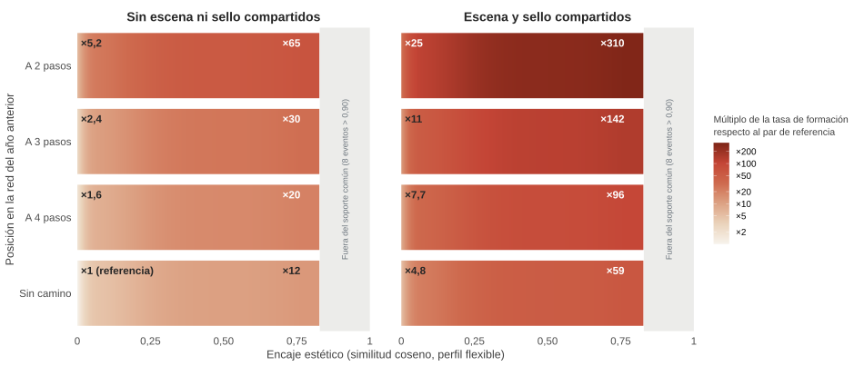
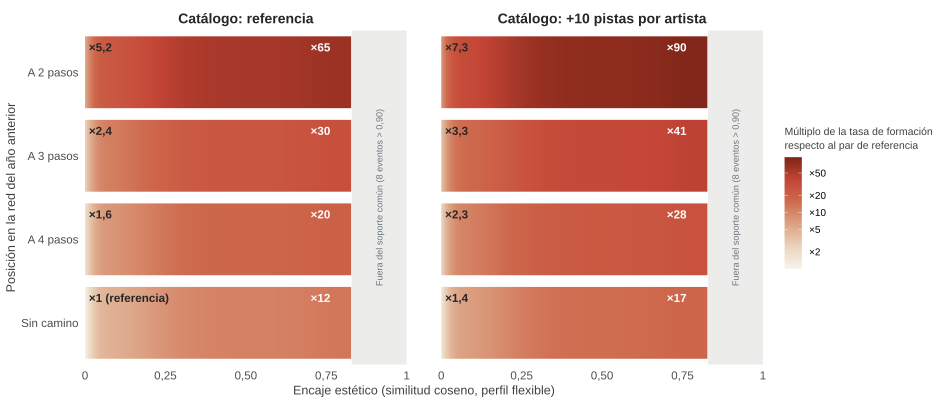

# Creative collaborations: Aesthetic Proximity and the Formation of Joint Production in Music {background-color="#2D6A7A"}

:::{.notes}

Cierro el ejercicio presentando la propuesta de investigación *Creative Collaborations*, que estudia la formación de colaboraciones entre artistas en la música grabada. La pregunta que organiza la exposición: en la producción en las industrias culturales ¿qué factores están asociados con la decisión de colaborar?

:::

## Esquema 

&nbsp;

- **Introducción**: motivación, pregunta de investigación, marco conceptual y contribución.
- **Datos y análisis exploratorio**: fuentes, medición de la proximidad estética y la red de colaboración.
- **Análisis empírico**: diseño de investigación, estrategia de estimación y resultados sobre la forma.
- **Enfoque predictivo**: descomposición por bloques fuera de muestra.
- **Sensibilidad** de los resultados.
- **Conclusiones**: resultados, alcance, síntesis y líneas futuras.

::: {.notes}

La exposición sigue seis bloques. Empiezo por la motivación, la pregunta y la contribución. A continuación presento los datos y, en particular, cómo medimos la proximidad estética entre dos artistas. El tercer bloque es el análisis empírico: el diseño, la estimación y  resultados. El cuarto pasa de la asociación dentro de la muestra a la capacidad para ordenar colaboraciones en un año que el modelo no ha visto. Siguen las comprobaciones de sensibilidad y cierra conclusiones, límites y extensiones.

:::

# Introducción {background-color="#2D6A7A"}

## ¿Se ha convertido la música en una actividad colaborativa?

&nbsp;

{width="92%" fig-alt="Proporción de colaboraciones en el Billboard Hot 100 por año y tramo de la lista, 1970-2025, con ajuste local"}

::: {.notes}

El gráfico muestra el porcentaje de colaboraciones en listas anuales de éxitos de música (Billboard Hot 100 y tramos de este) e ilustra la pregunta que se formula.

A comienzos de los setenta del siglo pasado, menos del 3% de las entradas anuales correspondían a colaboraciones. Entre 2016 y 2020 esa misma tasa asciende al 40%. La colaboración ha pasado de ser una anomalía entre los grandes éxitos a una práctica habitual. Lo que parece observarse es un cambio de régimen que emerge en paralelo a la digitalización de la música y que se asienta con la implantación de un modelo de negocio basado en el acceso, no en la propiedad (el streaming).

El fenómeno, más alla de lo anecdótico o de tratarse una cuestión de un sector específico, tiene un claro interés económico: supone investigar qué incentivos llevan a combinar temporalmente competencias o recursos, identidades estéticas, reputación y acceso a públicos. Por limitaciones de tiempo, soslayaré el sustrato teórico que subyace al ejercicio empírico.

No obstante introduzco un apunte: en la creación de equipos creativos se da una tensión entre la similitud entre los participantes, que puede facilitar coordinación o compatibilidad, y la distancia, que puede aportar novedad y complementariedad. Y este es uno de los ejes centrales de esta propuesta.

:::

## Colaboraciones: un emparejamiento multidimensional {.compact .shrink}

&nbsp;

**¿Qué distingue a los pares que llegan a colaborar por primera vez?** Tratamos la formación como un emparejamiento multidimensional entre artistas activos en las listas globales de Spotify:

- **Estética**: compatibilidad en un espacio de elevada 
dimensionalidad construido a partir de las percepciones de la audiencia .
- **Cultural, geográfica e institucional**: escena  común, coincidencia de país registrado e historia previa de sellos.
- **Actividad y trayectoria**: nivel de experiencia, simetría del par y tiempo de exposición a una oportunidad conjunta.
- **Topología relacional**: socios compartidos, centralidad, alcanzabilidad y distancia en la red previa de colaboraciones.

::: {.callout-note icon="false"}
# Proximidad estética: un aspecto recurrente en la literatura 

El trabajo propone dos hipótesis en competencia sobre la afinidad en mercados culturales:

- **Distancia óptima**: la compatibilidad facilita el trabajo conjunto y la diferencia aporta novedad; el perfil debería crecer y después disminuir.
- **Umbral de compatibilidad**: poca similitud constituye una barrera; alcanzado suficiente terreno común, el perfil debería crecer y aplanarse.
:::

::: {.notes}

Comienzo por definir la unidad de análisis: pares de artistas activos en un mismo año en las listas globales de Spotify. El evento modelizado es su primera colaboración como artista principal y artista invitado (lead y feature). El objetivo es distinguir a las parejas que forman una colaboración por primera vez de las muchas que podrían haberlo hecho y no lo hicieron.

Se interpreta esa formación como un emparejamiento en el que intervienen varias dimensiones: la estética, es decir, cuánto se parecen dos artistas en un espacio generado a partir de la percepción que tiene la audiencia; cultural (por escena o lengua), geográfica e institucional. Otros atributos son la actividad y trayectoria profesional de ambos; y la posición estructural en la red de colaboraciones.

El trabajo plantea dos hipótesis contrapuestas sobre la dimensión estética (central). La primera predice una distancia óptima: la colaboración aumenta con la similitud hasta cierto punto y después disminuye. La segunda plantea un umbral de compatibilidad: alcanzado cierto terreno común, la distancia deja de ser una barrera y la proximidad excesiva no se penaliza.

:::

## Marco conceptual {.compact .shrink}

&nbsp;

| Pregunta | Qué encuentra la literatura | Referencias |
|---|---|---|
| ¿Beneficios de colaborar? | Los *featurings* elevan la demanda de *streaming*; los duetos sobreviven más en las listas | McKenzie et al. (2021); Kaimann et al. (2021) |
| ¿Qué explica la formación de vínculos? | Mecanismos asortativos, relacionales y de proximidad geográfica e institucional operan a la vez; los lazos previos generan información, visibilidad y oportunidades para nuevos vínculos | Rivera, Soderstrom y Uzzi (2010); Gulati y Gargiulo (1999); Powell et al. (2005) |
| ¿Parecidos o complementarios? | Recursos similares facilitan coordinación y aprendizaje; los distintos aportan novedad si emerge complementariedad; el óptimo interior es una hipótesis extendida en alianzas, innovación y equipos científicos | Mitsuhashi y Greve (2009); Jones (2009); Nooteboom et al. (2007); Uzzi et al. (2013); Smith et al. (2021) |
| ¿Cómo se traduce en la música? | La diferenciación óptima  favorece el éxito; la distancia entre géneros permite potencialmente ampliar la demanda; la evidencia es sobre los resultados de las colaboraciones; pero ¿formación? | Askin y Mauskapf (2017); Ordanini, Nunes y Nanni (2018) |

: {tbl-colwidths="[22,48,30]"}

::: {.notes}

La idea de colaboración conecta la economía de la cultura con la formación de equipos y redes. Aquí convergen dos líneas. La primera estudia las consecuencias de colaborar, y en música la evidencia es clara: los *featurings* elevan la demanda de *streaming* y los duetos sobreviven más tiempo en listas.

La segunda estudia la formación de vínculos, que puede ordenarse en tres familias: basados en algún tipo de similitud; basados en conectividad por posición en la red; y finalmente por proximidad geográfica e institucional.

Una cuestión extensamente analizada es la tensión entre similitud y complementariedad: la literatura distingue compatibilidad de complementariedad, y el intercambio entre ambas suele resolverse en un óptimo interior.

En el caso de la música, la evidencia sobre distancia óptima es mayoritariamente sobre resultados. Los pocos trabajos que estudian la formación se ciñen a una escena o un género, sin medida explícita de similitud y sin considerar la población completa de pares en riesgo. Esa es la brecha que cubre este trabajo.

:::

## Contribución: medición y contraste de la afinidad estética

&nbsp;

- **Integración**: un único modelo combina homofilia estética, cultural-geográfica e institucional y por actividad  así como la  inercia de red.
- **Medición estética**: artistas en $t$ representados mediante vectores multidimensionales  de etiquetas de usuarios asociadas a lanzamientos anteriores a $t$ (evitamos predecir el resultado utilizando información que lo incorpora).
- **Contraste**: test de forma prespecificado (*spline* + reversión de signo) para analizar si la existencia de un máximo interior procede de los datos o de la propia especificación  paramétrica.
- **Diseño y validación**: 
  - Primera colaboración principal–invitado  
  - Conjunto de riesgo completo  
  - Inferencia robusta a dependencia diádica  
  - Descomposición dentro y fuera de muestra  

::: {.notes}

La aportación central del trabajo es el análisis de la afinidad estética, su medición y su relación no lineal con la colaboración. Esta aportación se articula en cuatro elementos.

Integración en un único modelo de las distintas formas de proximidad y la estructura de la red previa, lo que permite analizar la relación estética manteniendo constantes otras afinidades y oportunidades de colaboración.

Medición del espacio estético mediante un enfoque inspirado en el procesamiento del lenguaje natural: cada artista se representa con un vector de etiquetas aportadas por los usuarios en redes sociales.

Análisis de la forma de la relación entre proximidad estética y colaboración. Frente a la especificación cuadrática habitual,  un test prespecificado contrasta la existencia de reversión de signo.

Finalmente, estimación sobre el conjunto de riesgo completo, inferencia que admite dependencia entre díadas que comparten artista y evaluación de la aportación de cada bloque de variables dentro y fuera de muestra.

Para ello, combinamos fuentes sobre resultados, percepciones y relaciones.
:::

# Datos y análisis exploratorio {background-color="#2D6A7A"}

## Fuentes de datos

&nbsp;

:::: {.columns}

::: {.column width="30%"}
**Cifras básicas**

| | |
|---|---|
| Ventana de listas | 2013–2025 |
| Pistas × artista | 12.688 |
| Artistas en el ámbito | 2.878 |
| Con etiquetas fechadas | 2.402 |
| Filas de etiquetas | 794.309 |

: {tbl-colwidths="[58,42]"}
:::

::: {.column width="5%"}
:::

::: {.column width="65%"}
- **Listas globales semanales de Spotify** entre septiembre 2013 y diciembre 2025. Se incluyen metadatos de pista, álbum y artista (API Spotify).
- **Etiquetas de usuarios** de `Last.fm` y `MusicBrainz`, fechadas por lanzamiento. Capturan géneros, subgéneros y estilos, pero también estados de ánimo (*moods*) y otras percepciones de la audiencia.
- **Metadatos de `MusicBrainz`**. Se incluye tipo de entidad, país, género asignado, año de primer lanzamiento e historial de sellos.

::: {.callout-note icon="false"}
# Por qué etiquetas y no géneros de plataforma
Los géneros de Spotify solo cubren 981 de 2.878 artistas (aprox. 34%); las etiquetas reflejan la percepción de la audiencia y cubren el 83,5% de la muestra de artistas.
:::
:::

::::

::: {.notes}

El trabajo utiliza tres fuentes de datos.

Por un lado, las listas globales semanales de Spotify, de septiembre de 2013 a diciembre de 2025, enriquecidas con metadatos de su API. Estos permiten identificar, para cada pista colaborativa, al artista principal (lead) y al invitado (feature).

Además, las etiquetas que los usuarios asignan a temas y álbumes en Last.fm y MusicBrainz. Utilizamos las etiquetas fechadas por lanzamiento, que cubren el 83,5% de la muestra de artistas.

Finalmente los metadatos de MusicBrainz: tipo de entidad, país, género asignado y año del primer lanzamiento. A ellos se añade el historial de sellos, construido con los créditos de álbum observados en las listas hasta el año previo.

La cuestión decisiva es cómo convertir esas etiquetas en una medida de proximidad estética.

:::

## Proximidad estética

&nbsp;

:::: {.columns}

::: {.column width="30%"}

***
- Cada artista es un vector de etiquetas
- La proximidad entre dos artistas es la similitud coseno entre vectores
- Cobertura:  93% de pares con similitud observada en 2015; 67% en 2024

***

:::
::: {.column width="5%"}
:::
::: {.column width="65%"}

{fig-align="center" fig-alt="Proyección 2-D del espacio de etiquetas: Bad Bunny, J Balvin y Ed Sheeran como vectores rotulados con sus etiquetas top; el ángulo Bad Bunny-J Balvin es pequeño (coseno 0,82) y el ángulo Bad Bunny-Ed Sheeran es grande (coseno 0,07)"}
:::
:::

::: {.notes}

Cada artista se representa como un vector en el espacio de etiquetas: su perfil en el año t acumula las etiquetas de todos sus lanzamientos fechados estrictamente antes de t, de modo que es acumulativo y está retardado por construcción.

La proximidad entre dos artistas se mide mediante la similitud del coseno entre los vectores que los representan en el espacio estético definido por la audiencia.

La figura muestra una proyección ilustrativa en dos dimensiones, si bien las medidas de similitud son reales: Bad Bunny y J Balvin comparten buena parte del vocabulario y su coseno es 0,82; Bad Bunny y Ed Sheeran apenas comparten etiquetas y su similitud es 0,07.

Junto a la proximidad estética, la red de colaboraciones permite incorporar una dimensión adicional: la proximidad estructural, reflejada en variables como las colaboraciones previas o los vecinos comunes.

:::

::: {.content-hidden}

## La red previa amplía las oportunidades relacionales

&nbsp;

:::: {.columns}

::: {.column width="30%"}
**Densificación de la red**

---

- **Artistas activos**: 327 (2015) → 1.033 (2024).
- **Grado medio**: 1,63 → 6,22.
- **Aislados**: 33,3% → 16,1%.

---

Las cifras describen la red de cada año; la figura, la red **acumulada** (sin aislados). **Proximidad aquí significa cercanía relacional** en $G_{t-1}$, no distancia física.
:::

::: {.column width="5%"}
:::

::: {.column width="65%"}
{width="88%" fig-alt="Red de colaboración observada en 2017 y en 2024 con disposición fija de nodos"}
:::

::::

::: {.notes}

Utilizo el estado de la red en el año anterior como objeto sobre el que condicionar: Para cada par de artistas en riesgo de colaborar en t se calcula, para la red acumulada hasta t-1, medidas de centralidad y posición en el grafo (número de socios comunes, si existe camino que los conecte, a qué distancia y qué posición ocupa cada artista). 

Con estas variables podemos preguntar si la historia estructural aporta información propia una vez observamos estética, cultura, instituciones y actividad. En este caso hablamos de oportunidad relacional observada, esto es, de que dos artistas cercanos en la red tienen mayor propensión a colaborar.
:::
:::

## Composición de la red

&nbsp;

:::: {.columns}

::: {.column width="30%"}

---

**El núcleo de la red**

- **Subgrafo de mayor grado** de la red acumulada a 2024 (5% superior).
- **Dos escenas** en  núcleo denso con un número reducido de artistas puente entre ambas.

La formación y segmentación de vínculos justifica separar las medidas de proximidad de la topologia de red.

---

:::

::: {.column width="5%"}
:::

::: {.column width="65%"}
{width="88%" fig-alt="Subgrafo de mayor grado de la red acumulada de colaboraciones a 2024, con nodos coloreados por escena: comunidades latina y anglófona con artistas puente"}
:::

::::

::: {.notes}

Las colaboraciones se representan mediante un grafo que evoluciona entre 2015 y 2024. La figura muestra el 5 % de los artistas con mayor centralidad: un núcleo denso, dos escenas culturalmente diferenciadas, la latina y la anglófona, y unos pocos artistas que actúan como puente.

Esta estructura sugiere que la proximidad estética no agota la lógica de las colaboraciones: también pueden importar la pertenencia a una misma escena (la dimensión cultural) y la posición de cada artista en la red. El grafo es solo descriptivo, pero permite plantear la pregunta que guía el análisis: qué señal aporta cada forma de proximidad y qué añade la estructura de la red para explicar o predecir las colaboraciones.
:::

## El modelo de formación

&nbsp;

- **Resultado sensible al rol**: el evento es una colaboración del par como artista **principal** e **invitado** (*lead–feature*) en una pista del corpus lanzada en $t$.
- **Formación**: exige inexistencia de lazos previos; las repeticiones se estudian aparte (1.811 eventos agregados frente a 1.064 de formación).
- **Pares invitado–invitado**: no son eventos del resultado principal ni se codifican como negativos.
- **Un evento raro**: 1.064 formaciones entre 3.756.411 díadas-año (28,3 por cada 100.000).

::: {.callout-note icon="false"}

# Definición de la respuesta a modelizar
Para un par $(i,j)$ del conjunto de riesgo, $y^F_{ij,t}=1$ si en $t$ hay una colaboración principal–invitado en una pista del corpus y no existe ningún lazo previo entre ambos.
:::

::: {.notes}

Esta diapositiva define el resultado, que se etiqueta después de construir el conjunto de riesgo. Primero identificamos colaboraciones principal–invitado en pistas del corpus lanzadas en $t$; para la formación exigimos además ausencia de cualquier lazo previo. Los pares invitado–invitado no son eventos de este resultado ni se codifican como negativos, aunque sí cuentan en la red y en el historial de vínculos. Tras aplicar elegibilidad y filtros de estimación quedan 1.064 eventos en 3.756.411 díadas-año: 28,3 por cada 100.000. La rareza condiciona el diseño y la inferencia.
:::

## Diseño: conjunto de riesgo

&nbsp;

- **Todos los pares elegibles**: se incluyen todas las parejas no ordenadas de artistas elegibles; no se muestrean negativos.
- **Quién es elegible (aw3)**: cada artista tenía antes de $t$ algún lanzamiento incluido en el corpus y al menos uno fechado entre $t-3$ y $t-1$. Si uno no cumple, la colaboración observada queda fuera.
- **Cobertura (2016–2024)**: aw3 excluye 1.457 de 2.481 primeras colaboraciones *lead–feature* observadas (58,7%); aw0 elimina la ventana, pero mantiene la entrada antes de $t$ y todavía excluye 1.374 (55,4%). Recupera solo 83 casos (3,35 pp); aw5 se estima aparte.
- **Muestra estimada (2015–2024)**: 3.756.411 díadas-año, 1.064 formaciones y 2.256 artistas.

::: {.notes}

El conjunto se fija con información hasta $t-1$, antes de etiquetar el resultado. Se generan todos los pares elegibles, sin muestrear ceros. Si un artista no cumple, la colaboración observada queda fuera del panel, no se convierte en cero. El reloj es el año de lanzamiento de una pista del corpus.

En 2016–2024, aw3 excluye 1.457 de 2.481 primeras colaboraciones *lead–feature* (58,7%). aw0 elimina la ventana, pero mantiene la entrada anterior a $t$: todavía excluye 1.374 (55,4%) y recupera solo 83. La proporción anual de participantes que debuta en $t$ oscila entre 41,3% y 53,8%.
:::

# Análisis empírico {background-color="#2D6A7A"}

## Estimación {.compact}

&nbsp;

| | **Explicativo: logit** | **Predictivo: XGBoost** |
|---|---|---|
| Objetivo | Forma e inferencia del perfil similitud–formación | Referencia flexible: cuánta señal capturan las mismas familias de factores sin imponer una forma funcional |
| Qué se modeliza |  Media condicional de formación, $\Pr(y^F_{ij,t}=1 \mid G_{t-1}, X_{ij,t-1})$ | $\Pr(y^F_{ij,t}=1 \mid G_{t-1}, X_{ij,t-1})$ |
| Cómo | Índice lineal paramétrico con efectos fijos de año con función de vínculo *logit* | Conjuntos de árboles: interacciones y no linealidades sin especificarlas, hiperparámetros fijados a priori |
| Muestra | Panel completo 2015–2024 (inferencia); reestimado en 2015–2023 para el ejercicio predictivo | Entrenamiento 2015–2023; evaluación 2024; 2025 como año de reserva |
| Inferencia | EE cluster-robustos diádicos (Aronow–Samii); contrastes de Wald | Bootstrap sobre métricas de evaluación |
| Evaluación fuera de muestra | Solo ordenación: AUC-ROC, AUC-PR, *lift* | Solo ordenación: AUC-ROC, AUC-PR, *lift* |
| Elecciones basadas en datos | Ninguna tras la especificación paramétrica |   Parada temprana con validación en 2023 |

: {tbl-colwidths="[20,40,40]"}

&nbsp;

:::{.callout-note icon="false"}
# ¿Por qué no un ERGM?  $\to$ Almquist y Butts (2014)

1. Escalabilidad: con 2.256 actores y millones de díadas la estimación es computacionalmente exigente.

2. Objeto probabilístico diferente: distribución conjunta de la red (ERGM) frente a probabilidad diádica condicional (logit).

:::

::: {.notes}
Definida la respuesta binaria, colaboraciones realizadas y no realizadas, recurrimos a dos modelos de clasificación.

El primero es un logit con finalidad explicativa. Modeliza la probabilidad de formación del vínculo condicionada a la red del año anterior y a las características del par, incorpora efectos fijos de año y permite hacer inferencia sobre una forma funcional explícita. La inferencia utiliza los errores estándar diádicos de Aronow y Samii, de tipo sandwich, que admiten dependencia arbitraria entre díadas que comparten un artista.

El segundo es extreme gradient boosting, un conjunto de árboles potenciados que sirve como referencia predictiva. Captura interacciones y no linealidades sin especificarlas previamente y permite cuantificar la señal predictiva de las variables sin imponer una forma funcional.

Queda una última cuestión metodológica. Si los modelos exponenciales de grafos aleatorios son una opción natural para los datos relacionales, ¿por qué recurrir a modelos de clasificación? Por dos razones: la inviabilidad computacional del ERGM a esta escala y el distinto objeto de análisis. Mientras el ERGM modeliza la distribución conjunta de la red, aquí se modeliza cada díada condicionada a la red en $t-1$, bajo el supuesto de independencia condicional entre díadas.

:::

## Especificaciones: bloques de variables y modelos anidados

&nbsp;

| Bloque | Variables | Términos |
|------|---------------|---:|
| **Topología de red** | Vecinos comunes, índice de Jaccard, índice Adamic–Adar, conexión preferente, alcanzabilidad, proximidad geodésica y posición por grado | 8 |
| **Estética** | Similitud del coseno (y cuadrado), posición respecto al centroide y entropía; vocabulario y ausencia como controles de cobertura | 10 |
| **Actividad y oportunidad** | Producción acumulada y carrera (nivel medio y diferencia del par); duración de la elegibilidad conjunta | 7 |
| **Otras proximidades y atributos** | Escena, tipo de artista, identidad de género (si individuo), país registrado e historia de sellos  | 7 |

: {tbl-colwidths="[16,70,14]"}

&nbsp;

:::{.callout-note icon="false"}
**Tres modelos anidados**: Completo (los cuatro bloques) · Solo red (topología) · Sin red (estética, actividad y atributos). Las restricciones se contrastan con tests de Wald (errores estándar robustos).
:::

::: {.notes}

Se introducen cuatro bloques de variables explicativas.

El bloque de red recoge la posición estructural de los artistas en el grafo retardado. El estético incluye la proximidad, medida mediante la similitud del coseno y su cuadrado; la tipicidad de la identidad estética; y controles de cobertura de las etiquetas. El bloque de actividad incorpora el número de temas en listas, los años de actividad acumulados y la duración de la elegibilidad conjunta, que mide la exposición compartida al riesgo. El último bloque reúne otras proximidades y atributos.

Las variables de artista entran como media del par, que recoge el nivel, y como diferencia absoluta, que recoge la asimetría.

Se estiman tres modelos anidados: Completo, Solo red y Sin red.
:::

## Resultado base: especificación cuadrática {.tblfull .shrink}

**Logit de formación, tres modelos anidados; est. (EE diádicos Aronow–Samii)**

| Término | Completo | Solo red | Sin red |
|---|---|---|---|
| **Topología de red** | | | |
| Vecinos comunes | -0,134 (0,121) | 0,002 (0,122) | — |
| Índice Jaccard  | -1,839 (0,779)\* | -1,947 (0,879)\* | — |
| Adamic–Adar | 1,246 (0,335)\*\*\* | 1,228 (0,348)\*\*\* | — |
| *Preferential attachment* | -0,005 (0,001)\*\*\* | -0,004 (0,001)\*\*\* | — |
| Alcanzabilidad | -0,693 (0,188)\*\*\* | -1,127 (0,196)\*\*\* | — |
| Proximidad geodésica | 4,684 (0,596)\*\*\* | 6,955 (0,579)\*\*\* | — |
| Grado (media) | 0,207 (0,024)\*\*\* | 0,210 (0,024)\*\*\* | — |
| Grado (dif. abs.) | -0,057 (0,011)\*\*\* | -0,058 (0,009)\*\*\* | — |
| **Estética y posición** | | | |
| Similitud estética | 5,119 (0,589)\*\*\* | — | 6,428 (0,644)\*\*\* |
| Similitud estética² | -4,021 (0,712)\*\*\* | — | -4,941 (0,768)\*\*\* |
| Similitud al centroide (media) | -2,648 (0,606)\*\*\* | — | -3,526 (0,730)\*\*\* |
| Similitud al centroide (dif. abs.) | 1,522 (0,439)\*\*\* | — | 1,509 (0,463)\*\* |
| Entropía de etiquetas (media) | -0,192 (0,144) | — | -0,136 (0,161) |
| Entropía de etiquetas (dif. abs.) | -0,278 (0,080)\*\*\* | — | -0,221 (0,081)\*\* |
| Tamaño del vocabulario (media) | 0,014 (0,003)\*\*\* | — | 0,013 (0,003)\*\*\* |
| Tamaño del vocabulario (dif. abs.) | -0,006 (0,001)\*\*\* | — | -0,006 (0,001)\*\*\* |
| Sin etiquetas: un artista | -2,062 (0,918)\* | — | -1,966 (1,004) |
| Sin etiquetas: ambos | -1,414 (1,169) | — | -1,586 (1,242) |
| **Actividad y oportunidad** | | | |
| Pistas acumuladas (media) | 0,033 (0,011)\*\* | — | 0,051 (0,012)\*\*\* |
| Pistas acumuladas (dif. abs.) | -0,014 (0,005)\*\* | — | -0,013 (0,004)\*\* |
| Carrera (media) | -0,068 (0,016)\*\*\* | — | -0,053 (0,016)\*\* |
| Carrera (dif. abs.) | 0,000 (0,008) | — | -0,006 (0,008) |
| Elegibilidad conjunta 2–3 años | -0,554 (0,114)\*\*\* | — | -0,291 (0,110)\*\* |
| Elegibilidad conjunta 4–6 años | -0,936 (0,169)\*\*\* | — | -0,310 (0,197) |
| Elegibilidad conjunta 7+ años | -1,730 (0,292)\*\*\* | — | -1,586 (0,380)\*\*\* |
| **Otras proximidades y atributos** | | | |
| Misma escena | 1,043 (0,169)\*\*\* | — | 1,183 (0,193)\*\*\* |
| Mismo país | 0,055 (0,108) | — | 0,272 (0,133)\* |
| Mismo tipo de artista | 0,415 (0,141)\*\* | — | 0,576 (0,159)\*\*\* |
| Mismo género del artista | -0,010 (0,097) | — | 0,056 (0,107) |
| Jaccard de sellos (retardado) | 0,636 (0,368) | — | -0,997 (0,465)\* |
| Sellos compartidos (retardado) | -0,167 (0,112) | — | -0,015 (0,148) |
| Algún sello común (retardado) | 0,523 (0,184)\*\* | — | 1,435 (0,212)\*\*\* |
| Efectos fijos de año | sí | sí | sí |
| Díadas-año · eventos | 3.756.411 · 1.064 | ídem | ídem |

: {tbl-colwidths="[34,22,22,22]"}

::: {style="font-size:0.82em; color:#6c757d;"}
\* p<0,05; \*\* p<0,01; \*\*\* p<0,001.
:::

::: {.notes}

Comenzamos analizando los resultados de la estimación base para el modelo de formación. Huyo del exceso de detalle y paso a analizar un subconjunto de los coeficientes estimados.

:::

::: {.content-hidden}

## Resultado base: lectura gráfica {.compact}

&nbsp;

{width="84%" fig-align="center" fig-alt="Gráfico de puntos e intervalos del 95% para coeficientes seleccionados del logit de formación, modelo Completo: bloques de red, estética, actividad y atributos, cada uno con su color"}

::: {style="font-size:0.8em; color:#6c757d;"}
Coeficientes seleccionados del modelo de formación. Escalas no comparables entre variables.
:::

:::{.notes}
Los resultados muestran que el bloque de red es conjuntamente informativo (el contraste de wald rechaza el modelo restringido) y proximidad y centralidad se asocian a la formación de colaboraciones. 

La proximidad geodésica muestra como los pares que ya estaban cerca en la red previa tienen una propensión mucho mayor a conectar directamente. El grado medio (una medida de popularidad) también es positivo en línea con un mecanismo de formación vinculado a la visibilidad si bien la asimetría en la centralidad penaliza: es decir, la formación de vínculos favorece a pares con miembros más populares. 

La forma cuadrática en la proximidad estética reproduce un patrón de U-invertida: término lineal positivo y cuadrático negativo sitúan el máximo en una similitud de 0.637. No obstante el óptimo se ubica  en el percentil 94.8 del soporte,  una región con pocos pares y eventos lo que exige auditar el resultado. 

Compartir  escena  presenta una asociación positiva y precisa, y una actividad media mayor en listas se asocia positivamente con la formación si bien diferencias de actividad en el par penalizan:  pares activos con niveles de actividad similares se asocian a una mayor propensión a colaborar. El solapamiento de carreras en listas (las variables elegibilidad conjunta) muestran coeficientes negativos y crecientes en lo que podríamos denominar un **efecto oportunidad no realizada**: pares que llevan años coexistiendo sin colaborar tienen cada vez menos probabilidad de hacerlo.
:::

:::

## Resultado base: magnitudes comparables {.compact}

{width="89%" fig-align="center" fig-alt="Multiplicadores de la tasa de formación con intervalos de confianza del 95% para coeficientes seleccionados del logit completo: una desviación estándar en las variables continuas y presencia frente a ausencia en las binarias, sobre un eje logarítmico común y organizados en cuatro bloques"}

::: {style="font-size:0.76em; color:#526168; text-align:center; margin-top:0.15em;"}
**Multiplicador de la tasa de formación e IC 95%.** Continuas: +1 desviación estándar del predictor; binarias: 0→1. Con eventos raros, la *odds ratio* se lee como razón de tasas.
:::

::: {.notes}

Para comparar variables medidas en escalas distintas, expresamos cada coeficiente como un multiplicador de la tasa de formación: el cambio asociado a un aumento de una desviación estándar o, en las variables binarias, al paso de ausente a presente. Los resultados reflejan asociaciones estadísticas, no efectos causales.

En el bloque de red, una desviación estándar adicional de grado medio multiplica la tasa por 3,18 y la proximidad geodésica, por 1,92, mientras que la asimetría de grado la reduce a 0,60. La formación es más frecuente entre pares visibles y próximos, pero con niveles de popularidad similares. El índice de Jaccard ilustra la diferencia entre significación estadística y sustantiva: aunque su coeficiente se estima con precisión, una desviación estándar apenas modifica la tasa.

En el bloque estético, los términos lineal y cuadrático de la similitud definen un óptimo interior en 0,637. Sin embargo, este se sitúa en el percentil 94,8, una región con pocos pares y eventos, por lo que el resultado exige un análisis adicional. En términos de tasas, aproximarse una desviación estándar al centroide reduce la formación, mientras que una mayor diferencia de posición dentro del par la eleva.

Las proximidades cultural e institucional también presentan asociaciones positivas: compartir escena o historial de sello multiplica la tasa. Una mayor actividad media en listas también se asocia positivamente con la formación, mientras que su asimetría la reduce. Por último, la elegibilidad conjunta muestra una pauta clara: cuantos más años coexiste un par sin colaborar, menor es su tasa de formación, ya sea por una oportunidad no realizada o porque la colaboración resulta poco plausible.
:::

::: {.content-hidden}

## Resultado base: señal en errores estándar {.compact}

{width="89%" fig-align="center" fig-alt="Coeficientes seleccionados del logit completo divididos por su error estándar robusto diádico, organizados en cuatro bloques y representados sobre una escala común"}

::: {style="font-size:0.76em; color:#526168; text-align:center; margin-top:0.15em;"}
**Una unidad equivale a un error estándar del logit base.** La distancia compara señal respecto a incertidumbre, no el tamaño sustantivo de los efectos.
:::

::: {.notes}
Para situar coeficientes medidos en escalas distintas sobre un eje común, dividimos cada estimación por su propio error estándar robusto diádico. En el modelo base, este cociente es el estadístico de Wald con signo: indica cuántos errores estándar separan la estimación de cero y en qué dirección.

La figura se calcula con las estimaciones y los errores estándar redondeados que aparecen en la tabla anterior, por lo que debe leerse con la precisión gráfica mostrada.

La transformación permite comparar la fuerza de la señal estadística, pero no convierte los coeficientes en efectos sustantivamente equivalentes. Un valor de ocho en proximidad geodésica y otro de ocho en similitud estética no implican el mismo cambio en probabilidad. Tampoco sustituye a una estandarización de los predictores.

Las líneas discontinuas marcan más y menos 1,96 errores estándar como referencia inferencial aproximada para cada término del modelo base. Los términos lineal y cuadrático de la similitud deben leerse conjuntamente; sus posiciones aisladas no describen por sí solas la forma de la relación.

La figura hace visibles tres familias de resultados: oportunidades estructurales en la red previa; un encaje estético que combina proximidad y diferenciación; y una dimensión temporal en la que las carreras más largas y las oportunidades conjuntas no realizadas presentan señales negativas.
:::

:::

:::{.content-hidden }
## Robustez del óptimo interior {.compact}

&nbsp;

| Resultado | Riesgo | Similitud | Similitud² | Máximo [IC 95%] | Percentil del máximo | N | Eventos |
|---|---|---|---|---|------|---|---|
| Todos los pares | Sin salida | 5,106 | -3,698 | 0,690 [0,573; 0,807] | 96,9 | 12.726.387 | 1.503 |
| Sensible al rol | Sin salida | 5,283 | -4,161 | 0,635 [0,526; 0,743] | 95,4 | 12.726.037 | 1.153 |
| Todos los pares | Activos 3a | 4,891 | -3,509 | 0,697 [0,576; 0,818] | 96,6 | 3.756.740 | 1.393 |
| **Sensible al rol** | **Activos 3a** | **5,119** | **-4,021** | **0,637 [0,524; 0,749]** | **94,8** | **3.756.411** | **1.064** |

: {tbl-colwidths="[15,11,10,10,20,13,12,9]"}

::: {.notes}
A continuación se analiza la supervivencia de la distancia estética óptima cuando se modifica la muestra utilizada en la estimación o la definición de la respuesta. La pregunta clave es si ese máximo es un rasgo del comportamiento de los agentes a la hora de formar vínculos o un artefacto de los datos.

Para responderla cruzamos dos decisiones del diseño:
1. La definición de la respuesta: incluimos todos los pares o solo pares artista principal–artista invitado (sensible al rol)
2. El conjunto de riesgo: consideramos ventanas de tres y cinco años para determinar si un artista está activo, además del escenario sin salida, en el que un artista permanece en el conjunto de riesgo después de su primera entrada en listas.

El resultado muestra que la forma cuadrática se mantiene en los escenarios comparados. Para la definición sensible al rol, el máximo implícito apenas cambia al pasar de la ventana sin salida a tres y cinco años: 0,635, 0,637 y 0,630. No añadimos una fila completa para `aw5` porque este documento solo conserva su máximo; faltan el desglose de coeficientes, el intervalo, el percentil, el tamaño muestral y los eventos. En todas las especificaciones completas, el máximo continúa situado en la cola alta de la distribución de similitud.
:::
:::

## Versiones de la proximidad estética

&nbsp;

Alternativas a la especificación cuadrática:

- **Discretización**: tasas de formación observadas por tramo, e intervalos de confianza robustos, sin ajuste funcional alguno.
- **Curva flexible**: Spline cúbico natural con ubicación de los nudos especificada ex ante.
- **Contraste de reversión de signo**: se emplean dos submuestras independientes; en la primera se localiza el punto de ruptura y, en la segunda, se estiman las pendientes anterior y posterior. Se confirma la existencia de un óptimo interior si la pendiente anterior es positiva y la posterior es negativa.

::: {.notes}

El modelo base sugiere un óptimo interior. Sin embargo, al situarse en la cola superior de la distribución, puede reflejar tanto una reversión de la asociación como su saturación. Para distinguir entre ambas, analizamos la relación mediante tres especificaciones flexibles.

La primera discretiza la similitud estética y compara las tasas de formación observadas por tramos, sin imponer una forma funcional. La segunda ajusta un spline cúbico, que permite obtener una curva suave adaptada a los datos. La tercera aplica un test confirmatorio de reversión basado en el enfoque de las dos líneas de Simonsohn: una submuestra determina el punto de ruptura y otra estima las pendientes a ambos lados. El óptimo solo se confirma si la pendiente pasa de positiva a negativa.

> **RESERVAR**: Evaluamos las propiedades de este último  por simulación, con paneles calibrados al número de eventos y a la distribución de similitud de nuestra muestra. Para 200 replicas, cuando el perfil verdadero crece y se aplana, el test confirma falsamente un óptimo interior en el 0,5% de los casos; frente a un óptimo interior lo detecta en el 79% de las simulaciones.

:::

## Proximidad estética y colaboraciones: especificación flexible

&nbsp;

:::: {.columns}

::: {.column width="30%"}

---

**Contraste de reversión**

- **Punto de ruptura**: $b = 0{,}676$.
- **Comportamiento antes de $b$**: pendiente 1,73 (IC 95% [1,08; 2,37]).
- **Comportamiento después de $b$**:  pendiente 2,50 (IC 95% [-5,21; 10,20]).

**Evidencia**: crecimiento y aplanamiento; sin reversión confirmada.

---

:::

::: {.column width="5%"}
:::

::: {.column width="65%"}
{width="92%" fig-alt="Tasa de formación por tramo de similitud estética y spline g-computado con bandas de confianza; la curva sube y se aplana sin caer"}

::: {style="font-size:0.8em; color:#6c757d;"}
La curva es el *spline* sobre el modelo completo; los puntos, las tasas de colaboración observadas.
:::
:::

::::

::: {.notes}

La figura muestra la forma respaldada por los datos.

Los puntos y la curva apuntan en la misma dirección: la tasa de formación aumenta con fuerza desde niveles bajos de similitud hasta aproximadamente 0,3–0,4 y después se aplana. Ningún tramo presenta una tasa inferior a los anteriores, y el spline no desciende dentro del rango respaldado por los datos.

El contraste confirma el aumento inicial, pero no la caída posterior. Las pendientes estimadas después del punto de ruptura son positivas, aunque sus intervalos incluyen cero. La evidencia respalda, por tanto, un crecimiento seguido de saturación, no un óptimo interior.

:::

# Análisis predictivo {background-color="#2D6A7A"}

## Capacidad predictiva por bloques {.compact}

&nbsp;

| Modelo | AUC-ROC | AUC-PR (‰) | Precisión@10K (%) | Recall@10K (%) | Lift@10K | Lift@500 |
|---------|---:|---:|-----:|---:|---:|---:|
| Logit — Solo red | 0,821 | 1,238 | 0,200 | 31,25 | 15,31 | 0,00 |
| Logit — Sin red | 0,875 | 2,090 | 0,230 | 35,94 | 17,61 | 30,62 |
| Logit — Completo | 0,892 | 2,299 | 0,270 | 42,19 | 20,67 | 15,31 |
| XGBoost — Solo red | 0,745 | 0,679 | 0,140 | 21,88 | 11,51 | 0,00 |
| XGBoost — Sin red | 0,912 | 1,386 | 0,180 | 28,13 | 14,80 | 0,00 |
| XGBoost — Completo | 0,917 | 1,729 | 0,200 | 31,25 | 16,45 | 16,45 |
: {tbl-colwidths="[19,13,14,15,13,13,13]"}

&nbsp;

::: {.notes}

En el ejercicio predictivo, ambos modelos se entrenan con datos de 2015 a 2023 y se evalúan una sola vez en 2024, un año no observado durante la estimación. En 2024 se registran 64 eventos entre unas 490.000 díadas en el logit y 526.000 en XGBoost, lo que supone una tasa base de 0,12–0,13 por mil. La diferencia se debe a que el logit utiliza casos completos y XGBoost, todos los pares.

El área bajo la curva de precisión-recall del mejor modelo multiplica la tasa base por 18 en el logit y por 14 en XGBoost.

Entre las 10.000 díadas con mayor puntuación, el modelo completo recupera el 42 % de los eventos con el logit y el 31 % con XGBoost, con un lift de 20 y 16, respectivamente, frente a una clasificación aleatoria. Estos valores no son directamente comparables porque proceden de muestras distintas. El lift de las primeras 500 predicciones debe interpretarse con cautela, dado el reducido número de eventos.

El principal resultado es la limitada aportación adicional fuera de muestra de las variables de red: la mayor parte de la señal predictiva se concentra en los bloques estético, de actividad y de otros atributos.

:::

## Constraste no paramétrico de la forma funcional

&nbsp;

{width="90%" fig-align="center" fig-alt="Gráfico de dependencia SHAP para la similitud coseno en el modelo XGBoost completo"}

::: {style="font-size:0.72em; color:#6c757d;"}
Rótulos internos: `formation M1′` = **Completo** · `cosine_pooled` = **similitud estética** · D015 = contraste de especificación.
:::

::: {.notes}

Además, el ejercicio predictivo permite analizar el perfil estético sin imponer una forma funcional. Para ello, empleamos valores de Shapley, que descomponen la predicción entre los distintos predictores. El gráfico de dependencia muestra la aportación de la similitud estética al puntaje predicho, en escala de log-odds, para el conjunto de prueba de 2024.

El patrón coincide con la discretización y el spline: la aportación aumenta con fuerza hasta una similitud de 0,3, se aplana a partir de 0,4 y no muestra un descenso claro en la parte alta.

:::

# Sensibilidad de los resultados {background-color="#2D6A7A"}

:::{.notes}

Se ha evaluado la sensibilidad de las estimaciones a cambios en la definición del resultado, el remuestreo de nodos para calcular los errores estándar y distintas formas de proyectar a los artistas en el espacio de etiquetas. Aunque estos análisis no se muestran, los resultados centrales se mantienen.

Asimismo, se estimó un logit condicional para controlar la heterogeneidad no observada del artista principal. Dentro de cada estrato artista principal–año, se compara al colaborador elegido con todos los candidatos elegibles. Como cambian la muestra y el estimando, los desplazamientos respecto al modelo base solo se interpretan cualitativamente. Las asociaciones centrales conservan su dirección; únicamente las medidas derivadas del historial de sellos resultan imprecisas.

Aquí presento solo una comprobación adicional: una estimación con penalización de Firth, para evaluar la sensibilidad al posible sesgo asociado a la baja frecuencia del evento.

:::

::: {.content-hidden}

## Comprobaciones de los resultados {.compact}

&nbsp;

| Tipo | Ejercicios | Resultado (similitud y demás bloques) |
|---|---|---|
| **Inferencia** | *Bootstrap* de nodos | El *bootstrap* aumenta los EE (ratio mediano 1,60): mantiene significativos coeficientes a excepción de índice Jaccard, algún sello común y actividad en listas |
| **Definición del resultado** | Solo pistas de dos artistas (609 eventos)  Ponderación por tamaño de equipo   Inclusión *feat-feat* | El perfil queda esencialmente igual   Coeficientes estables para bloques de red, actividad y atributos   |
| **Ventana del conjunto de riesgo** | Ventanas de 0, 3 y 5 años | Máximos implícitos 0,635 / 0,637 / 0,630: la ventana decide qué ceros son oportunidades   Estabilidad de coeficientes en la ventana a 5 años (a excepción de elegibilidad)|
| **Medición de etiquetas** | Solo MB   Vectores binarios   Vocabularios mínimos ($k \geq 3$, $k \geq 5$)   Submuestra bien medida   Terciles de cobertura | El perfil sobrevive en todas;  bloques de red, actividad y atributos estbles; interacciones con cobertura conjuntamente no significativas ($p = 0{,}082$) |

: {tbl-colwidths="[15,32,53]"}

::: {.notes}
Esta tabla resume muestra distintas  comprobaciones. Todas son análisis descriptivos o de sensibilidad. Las presento brevemente.

La primera familia es la inferencia. El *bootstrap* de nodos (remuestrea artistas y arrastra también la composición del conjunto de riesgo) aumenta los errores estándar con una ratio mediana de 1,60. Bajo este análisis la mayor parte de los coeficientes se mantienen significativos (); el historial común de sello deja de distinguirse de cero, y por eso lo leemos como positivo pero impreciso. 

La segunda es la definición del resultado. Restringir los eventos a pistas de exactamente dos artistas (elección bilateral), deja 609 eventos y un perfil esencialmente igual; ponderar por tamaño de equipo o devolver los pares invitado–invitado como clase negativa tampoco lo cambia, y los bloques de red, actividad y atributos se mueven como máximo 0,37, 0,13 y 0,05 en cada variante. 

La tercera es la ventana del conjunto de riesgo: con cero, tres y cinco años los máximos implícitos son 0,635, 0,637 y 0,630.

La cuarta es la medición de etiquetas: solo MusicBrainz, vectores binarios, vocabularios mínimos de tres y de cinco etiquetas, submuestra bien medida y terciles de cobertura. El perfil sobrevive en todas, los demás bloques se mueven como máximo 0,26 y las interacciones con la cobertura no son conjuntamente significativas, p de 0,082.

La corrección de Firth, el enlace cloglog y la inclusión de efectos de artista con un logit condicional se discuten a continuación.
:::
:::

::: {.content-hidden}

## Corrección de sesgo de Firth {.tblfull .shrink}

| Término | Logit | Firth | Δ Firth-logit | Cloglog |
|---|---|---|---|---|
| **Topología de red** | | | | |
| Vecinos comunes | -0,134 | -0,142 | -0,008 | -0,131 |
| Índice Jaccard  | -1,839 | -1,663 | 0,176 | -1,835 |
| Adamic–Adar | 1,246 | 1,261 | 0,015 | 1,225 |
| *Preferential attachment* | -0,005 | -0,005 | 0,000 | -0,005 |
| Alcanzabilidad | -0,693 | -0,685 | 0,008 | -0,694 |
| Proximidad geodésica | 4,684 | 4,649 | -0,035 | 4,697 |
| Grado (media) | 0,207 | 0,207 | -0,001 | 0,206 |
| Grado (dif. abs.) | -0,057 | -0,057 | 0,000 | -0,057 |
| **Estética y posición** | | | | |
| Similitud estética | 5,119 | 5,108 | -0,012 | 5,083 |
| Similitud estética² | -4,021 | -4,007 | 0,014 | -3,985 |
| Similitud al centroide (media) | -2,648 | -2,637 | 0,012 | -2,626 |
| Similitud al centroide (dif. abs.) | 1,522 | 1,521 | -0,001 | 1,515 |
| Entropía de etiquetas (media) | -0,192 | -0,198 | -0,006 | -0,191 |
| Entropía de etiquetas (dif. abs.) | -0,278 | -0,276 | 0,002 | -0,279 |
| Tamaño del vocabulario (media) | 0,014 | 0,014 | 0,000 | 0,014 |
| Tamaño del vocabulario (dif. abs.) | -0,006 | -0,006 | 0,000 | -0,006 |
| Sin etiquetas: un artista | -2,062 | -2,092 | -0,030 | -2,056 |
| Sin etiquetas: ambos | -1,414 | -1,339 | 0,074 | -1,408 |
| **Actividad y oportunidad** | | | | |
| Pistas acumuladas (media) | 0,033 | 0,033 | 0,000 | 0,032 |
| Pistas acumuladas (dif. abs.) | -0,014 | -0,014 | 0,000 | -0,014 |
| Carrera (media) | -0,068 | -0,067 | 0,000 | -0,067 |
| Carrera (dif. abs.) | 0,000 | 0,000 | 0,000 | 0,000 |
| Elegibilidad conjunta 2–3 años | -0,554 | -0,554 | 0,000 | -0,552 |
| Elegibilidad conjunta 4–6 años | -0,936 | -0,934 | 0,002 | -0,926 |
| Elegibilidad conjunta 7+ años | -1,730 | -1,719 | 0,011 | -1,711 |
| **Otras proximidades y atributos** | | | | |
| Misma escena | 1,043 | 1,042 | -0,001 | 1,044 |
| Mismo país | 0,055 | 0,054 | -0,001 | 0,053 |
| Mismo tipo de artista | 0,415 | 0,414 | -0,001 | 0,413 |
| Mismo género del artista | -0,010 | -0,011 | -0,001 | -0,008 |
| Jaccard de sellos (retardado) | 0,636 | 0,667 | 0,031 | 0,634 |
| Sellos compartidos (retardado) | -0,167 | -0,162 | 0,006 | -0,167 |
| Algún sello común (retardado) | 0,523 | 0,513 | -0,009 | 0,521 |
| Efectos fijos de año | sí | sí | | sí |

: {tbl-colwidths="[36,16,16,16,16]"}

::: {.notes}
Dada la baja frecuencia del evento analizado, consideramos un modelo logit con corrección de Firth, basado en una verosimilitud penalizada que reduce el sesgo y mitiga posibles problemas de separación.
:::

:::

## Corrección de sesgo de Firth {.tblfull .shrink}

| Término | Logit | Firth | $\Delta$ Firth-logit |
|---|---|---|---|
| **Topología de red** | | | |
| Vecinos comunes | -0,134 | -0,142 | -0,008 |
| Índice Jaccard  | -1,839 | -1,663 | 0,176 |
| Adamic–Adar | 1,246 | 1,261 | 0,015 |
| *Preferential attachment* | -0,005 | -0,005 | 0,000 |
| Alcanzabilidad | -0,693 | -0,685 | 0,008 |
| Proximidad geodésica | 4,684 | 4,649 | -0,035 |
| Grado (media) | 0,207 | 0,207 | -0,001 |
| Grado (dif. abs.) | -0,057 | -0,057 | 0,000 |
| **Estética y posición** | | | |
| Similitud estética | 5,119 | 5,108 | -0,012 |
| Similitud estética² | -4,021 | -4,007 | 0,014 |
| Similitud al centroide (media) | -2,648 | -2,637 | 0,012 |
| Similitud al centroide (dif. abs.) | 1,522 | 1,521 | -0,001 |
| Entropía de etiquetas (media) | -0,192 | -0,198 | -0,006 |
| Entropía de etiquetas (dif. abs.) | -0,278 | -0,276 | 0,002 |
| Tamaño del vocabulario (media) | 0,014 | 0,014 | 0,000 |
| Tamaño del vocabulario (dif. abs.) | -0,006 | -0,006 | 0,000 |
| Sin etiquetas: un artista | -2,062 | -2,092 | -0,030 |
| Sin etiquetas: ambos | -1,414 | -1,339 | 0,074 |
| **Actividad y oportunidad** | | | |
| Pistas acumuladas (media) | 0,033 | 0,033 | 0,000 |
| Pistas acumuladas (dif. abs.) | -0,014 | -0,014 | 0,000 |
| Carrera (media) | -0,068 | -0,067 | 0,000 |
| Carrera (dif. abs.) | 0,000 | 0,000 | 0,000 |
| Elegibilidad conjunta 2–3 años | -0,554 | -0,554 | 0,000 |
| Elegibilidad conjunta 4–6 años | -0,936 | -0,934 | 0,002 |
| Elegibilidad conjunta 7+ años | -1,730 | -1,719 | 0,011 |
| **Otras proximidades y atributos** | | | |
| Misma escena | 1,043 | 1,042 | -0,001 |
| Mismo país | 0,055 | 0,054 | -0,001 |
| Mismo tipo de artista | 0,415 | 0,414 | -0,001 |
| Mismo género del artista | -0,010 | -0,011 | -0,001 |
| Jaccard de sellos (retardado) | 0,636 | 0,667 | 0,031 |
| Sellos compartidos (retardado) | -0,167 | -0,162 | 0,006 |
| Algún sello común (retardado) | 0,523 | 0,513 | -0,009 |
| Efectos fijos de año | sí | sí | |

: {tbl-colwidths="[40,20,20,20]"}

::: {.notes}

La escasa diferencia entre las estimaciones puntuales del logit convencional y del modelo de Firth indica que los resultados no están condicionados por el posible sesgo asociado a la rareza del evento.
:::

## Modelo logit con corrección Firth {.compact}

{width="89%" fig-align="center" fig-alt="Diferencia entre las estimaciones de Firth y del logit base dividida por el error estándar robusto diádico del logit base, para coeficientes seleccionados y en una escala común"}

::: {style="font-size:0.78em; color:#526168; text-align:center; margin-top:0.15em;"}
**○ conserva el signo · ◇ cambia de signo.** En Firth, todos los coeficientes conservan el signo; el mayor desplazamiento es **0,23 errores estándar del logit base**.
:::

::: {.notes}

Representamos la diferencia entre Firth y el logit base, dividida por el error estándar robusto diádico del logit base: una unidad significa que la estimación se ha desplazado tanto como un error estándar del modelo de referencia. Los cocientes se calculan con los valores redondeados de las tablas.

La escala muestra una superposición casi total. El mayor movimiento corresponde al índice de Jaccard: 0,176 unidades del coeficiente, equivalentes a aproximadamente 0,23 errores estándar del logit base. Ninguna variable cambia de signo.

La escasa diferencia entre el logit convencional y el modelo de Firth no aporta evidencia de un sesgo relevante asociado a la rareza del evento.
:::

:::{.content-hidden}
## Logit condicional  {.tblfull .shrink}

| Término | Estimación | EE |
|---|---|---|
| **Estética y posición** | | |
| Similitud estética | 5,561\*\*\* | 0,485 |
| Similitud estética² | -4,414\*\*\* | 0,587 |
| Similitud al centroide (media) | -2,920\*\*\* | 0,425 |
| Similitud al centroide (dif. abs.) | 1,350\*\*\* | 0,273 |
| Entropía de etiquetas (media) | -0,075 | 0,074 |
| Entropía de etiquetas (dif. abs.) | -0,345\*\*\* | 0,077 |
| Tamaño del vocabulario (media) | 0,012\*\*\* | 0,002 |
| Tamaño del vocabulario (dif. abs.) | -0,005\*\*\* | 0,001 |
| Sin etiquetas: un artista | -1,917\*\*\* | 0,507 |
| Sin etiquetas: ambos | -2,345\*\* | 0,763 |
| **Actividad y oportunidad** | | |
| Pistas acumuladas (media) | 0,051\*\*\* | 0,005 |
| Pistas acumuladas (dif. abs.) | -0,010\*\*\* | 0,002 |
| Carrera (media) | -0,065\*\*\* | 0,013 |
| Carrera (dif. abs.) | -0,007 | 0,007 |
| Elegibilidad conjunta 2–3 años | -0,262\*\* | 0,094 |
| Elegibilidad conjunta 4–6 años | -0,336\* | 0,134 |
| Elegibilidad conjunta 7+ años | -1,525\*\*\* | 0,260 |
| **Otras proximidades y atributos** | | |
| Misma escena | 1,788\*\*\* | 0,102 |
| Mismo país | 0,599\*\*\* | 0,084 |
| Mismo tipo de artista | 0,659\*\*\* | 0,112 |
| Mismo género del artista | -0,030 | 0,081 |
| Jaccard de sellos (retardado) | -0,240 | 0,414 |
| Sellos compartidos (retardado) | 0,084 | 0,094 |
| Algún sello común (retardado) | 0,828\*\*\* | 0,147 |
| Estratos principal $\times$ año | absorbidos | |
| Pares-año · eventos · estratos | 545.149 · 1.064 · 641 | |

: {tbl-colwidths="[44,34,22]"}

::: {.notes}

Para controlar la posible heterogeneidad no observada debida a artistas principales, aplicamos un diseño de elección emparejada que, en cada estrato artista principal–año, compara los colaboradores elegidos con todos los candidatos elegibles. Las variables de red se omiten porque no varían dentro del estrato. Dado que la muestra solo incluye artistas con alguna colaboración, los coeficientes se interpretan por su dirección y no se comparan en magnitud con los de los modelos anteriores.

:::

## Logit condicional: un patrón estable {.compact}

{width="89%" fig-align="center" fig-alt="Diferencia entre las estimaciones del logit condicional y del logit base dividida por el error estándar robusto diádico del logit base. Los círculos indican que el coeficiente conserva su signo; los diamantes muestran cambios de signo en Jaccard de sellos y sellos compartidos. La topología queda absorbida por los estratos."}

::: {style="font-size:0.72em; color:#526168; text-align:center; margin-top:0.12em;"}
**○ conserva el signo · ◇ cambia de signo.** Los diamantes corresponden a **Jaccard de sellos** y **sellos compartidos**. La posición horizontal indica el desplazamiento respecto al logit base, no el signo de la asociación.
:::

::: {.notes}

La figura aplica la misma unidad a las diferencias entre el logit condicional y el modelo base. Un valor positivo indica que el coeficiente condicional es mayor; no implica necesariamente una asociación positiva, porque puede representar un coeficiente negativo que se acerca a cero.

Hay dos diamantes: el Jaccard de sellos pasa de 0,636 a -0,240 y los sellos compartidos pasan de -0,167 a 0,084. Son términos imprecisos en ambos modelos, por lo que estos cambios señalan inestabilidad de las medidas institucionales, no una reversión sustantiva concluyente. La forma estética, la actividad, la carrera y la elegibilidad conservan su dirección, aunque algunos coeficientes se desplazan varios errores estándar del modelo base.

Esos desplazamientos no deben interpretarse como evidencia de que los efectos aumentan o disminuyen: el logit condicional compara al socio elegido con los candidatos de un mismo artista principal y año, usa otra muestra y responde a otro estimando.

Con esta cautela, la comprobación respalda una consistencia cualitativa de las asociaciones centrales, pero no de todos los términos institucionales, al controlar la heterogeneidad no observada del artista principal.

:::
:::

# Conclusiones {background-color="#2D6A7A"}

## Proximidad, posición y oportunidad en la formación  {.compact}

::: {layout-ncol="2"}

:::

::: {.notes}

Los resultados se resumen en un mismo mapa de calor. El eje horizontal representa la afinidad estética y el vertical, la cercanía en la red retardada. Cada casilla muestra un múltiplo respecto al par de referencia: dos artistas sin conexión previa, sin afinidad y con una oportunidad recién abierta.

Alcanzar el punto de saturación de la afinidad multiplica la tasa por doce; encontrarse a dos pasos en la red, por cinco; y la combinación de ambos factores, por sesenta y cinco. Una oportunidad no realizada durante siete años o más reduce estas tasas en un 82 %.

Los otros tres mapas modifican una tercera dimensión. Acercar al par dos décimas al centroide estético, hacia un perfil más mainstream, reduce la tasa a poco más de la mitad. Compartir escena idiomática e historial de sello la multiplica casi por cinco. Diez pistas adicionales de catálogo la elevan un 40 %, pero no alteran sustancialmente la ordenación.

En conjunto, los resultados muestran que la colaboración se asocia con la proximidad estética, cultural e institucional y con las oportunidades creadas por la red previa. La afinidad estética actúa como condición de compatibilidad; la cultura, las instituciones, la actividad y la red determinan qué emparejamientos llegan a materializarse.
:::

## Limitaciones y extensiones {.compact}

&nbsp;

<!-- Reveal: cuatro filas de columnas (rótulo / limitación / flecha / extensión)
     en lugar de cuatro columnas completas: cada fila adopta la altura de su
     celda más alta y los bloques quedan alineados aunque un rótulo ocupe dos
     líneas. Beamer no admite esta estructura (las columnas [T] consecutivas se
     solapan), así que conserva la estructura por columnas al final del bloque:
     cualquier cambio de texto debe replicarse en ambas ramas. -->

::::::: {.content-visible when-format="revealjs"}

:::::: {.columns}
::::: {.column width="23.5%"}
::: {style="text-align:center; color:#C44536; letter-spacing:0.05em; font-size:1.02em;"}
**Interpretación**
:::
:::::
::::: {.column width="2%"}
:::::
::::: {.column width="23.5%"}
::: {style="text-align:center; color:#C44536; letter-spacing:0.05em; font-size:1.02em;"}
**Ausencia de colaboraciones entre *clones***
:::
:::::
::::: {.column width="2%"}
:::::
::::: {.column width="23.5%"}
::: {style="text-align:center; color:#C44536; letter-spacing:0.05em; font-size:1.02em;"}
**Qué queda fuera**
:::
:::::
::::: {.column width="2%"}
:::::
::::: {.column width="23.5%"}
::: {style="text-align:center; color:#C44536; letter-spacing:0.05em; font-size:1.02em;"}
**Adecuación del modelo**
:::
:::::
::::::

:::::: {.columns}
::::: {.column width="23.5%"}
::: {style="text-align:center;"}
Asociaciones condicionales a la red -- imposibilidad de interpretación causal.
:::
:::::
::::: {.column width="2%"}
:::::
::::: {.column width="23.5%"}
::: {style="text-align:center;"}
8 eventos por encima de 0,90: no puede descartarse una penalización en la similitud extrema.
:::
:::::
::::: {.column width="2%"}
:::::
::::: {.column width="23.5%"}
::: {style="text-align:center;"}
Artistas activos en listas globales; el acceso a las listas no se modeliza y la colaboración fuera de ellas se recoge parcialmente. Etiquetas y escena con ruido; el sello, un solo canal institucional.
:::
:::::
::::: {.column width="2%"}
:::::
::::: {.column width="23.5%"}
::: {style="text-align:center;"}
Simulaciones preliminares del modelo reproducen el volumen de nuevos vínculos, no su concentración: dependencia residual entre díadas.
:::
:::::
::::::

:::::: {.columns}
::::: {.column width="23.5%"}
::: {style="text-align:center; color:#2D6A7A; font-size:1.35em; line-height:1;"}
$\boldsymbol{\downarrow}$
:::
:::::
::::: {.column width="2%"}
:::::
::::: {.column width="23.5%"}
::: {style="text-align:center; color:#2D6A7A; font-size:1.35em; line-height:1;"}
$\boldsymbol{\downarrow}$
:::
:::::
::::: {.column width="2%"}
:::::
::::: {.column width="23.5%"}
::: {style="text-align:center; color:#2D6A7A; font-size:1.35em; line-height:1;"}
$\boldsymbol{\downarrow}$
:::
:::::
::::: {.column width="2%"}
:::::
::::: {.column width="23.5%"}
::: {style="text-align:center; color:#2D6A7A; font-size:1.35em; line-height:1;"}
$\boldsymbol{\downarrow}$
:::
:::::
::::::

:::::: {.columns}
::::: {.column width="23.5%"}
::: {style="text-align:center;"}
La identificación de efecto causal es compleja: posibilidad de estimación y calibración
:::
:::::
::::: {.column width="2%"}
:::::
::::: {.column width="23.5%"}
::: {style="text-align:center;"}
Incorporar información: horizontes más largos y vocabularios de etiquetas más densos.
:::
:::::
::::: {.column width="2%"}
:::::
::::: {.column width="23.5%"}
::: {style="text-align:center;"}
Resultados fechados fuera de las listas y mejorar medidas institucionales.
:::
:::::
::::: {.column width="2%"}
:::::
::::: {.column width="23.5%"}
::: {style="text-align:center;"}
Auditar la simulación y evaluar la verosimilitud de la independencia condicional (Almquist y Butts, 2014).
:::
:::::
::::::

:::::::

::::::: {.content-visible when-format="beamer"}

:::::: {.columns}

::::: {.column width="23.5%"}
**Interpretación**

Asociaciones condicionales a la red -- imposibilidad de interpretación causal.

$\boldsymbol{\downarrow}$

La identificación de efecto causal es compleja: posibilidad de estimación y calibración
:::::

::::: {.column width="2%"}
:::::

::::: {.column width="23.5%"}
**Ausencia de colaboraciones entre *clones***

8 eventos por encima de 0,90: no puede descartarse una penalización en la similitud extrema.

$\boldsymbol{\downarrow}$

Incorporar información: horizontes más largos y vocabularios de etiquetas más densos.
:::::

::::: {.column width="2%"}
:::::

::::: {.column width="23.5%"}
**Qué queda fuera**

Artistas activos en listas globales; el acceso a las listas no se modeliza y la colaboración fuera de ellas se recoge parcialmente. Etiquetas y escena con ruido; el sello, un solo canal institucional.

$\boldsymbol{\downarrow}$

Resultados fechados fuera de las listas y mejorar medidas institucionales.
:::::

::::: {.column width="2%"}
:::::

::::: {.column width="23.5%"}
**Adecuación del modelo**

Simulaciones preliminares del modelo reproducen el volumen de nuevos vínculos, no su concentración: dependencia residual entre díadas.

$\boldsymbol{\downarrow}$

Auditar la simulación y evaluar la verosimilitud de la independencia condicional (Almquist y Butts, 2014).
:::::

::::::

:::::::

::: {.notes}

Cierro con cuatro limitaciones.

La primera es de interpretación: todo lo mostrado son asociaciones condicionales a la red del año anterior, no efectos causales. La identificación del efecto causal aquí es compleja.

La segunda es la ausencia de colaboraciones entre pares con elevada similitud: con solo ocho eventos por encima de una similitud de 0,90, no puedo descartar una penalización en la similitud extrema.

La tercera es lo que queda fuera: la población se limita a artistas activos en listas globales, el acceso a las listas no se modeliza y la colaboración fuera de ellas se recoge solo en parte; además, etiquetas y escena incorporan ruido, y el sello es un único canal institucional.

Finalmente, la adecuación del modelo: simulaciones preliminares reproducen el volumen de nuevos vínculos, pero no su concentración en determinados nodos, quedando dependencia residual entre díadas. En este punto es necesario auditar la simulación y evaluar la independencia condicional, en la línea de Almquist y Butts.

:::

::: {.content-hidden}

## La formación es multidimensional {.compact}

&nbsp;

- **Compatibilidad estética**: dentro del soporte común, la proximidad estética presenta una asociación positiva que se aplana, sin evidencia de un óptimo interior. Este solo aparece al imponer una forma cuadrática y no se reproduce con especificaciones más flexibles.
- **Compatibilidad en otras dimensiones**: compartir escena y tener una historia previa de sello presentan asociaciones positivas, mientras que la coincidencia en el país de registro no muestra un efecto medio preciso. Una mayor actividad media y una menor diferencia de actividad también se asocian con la formación del vínculo.
- **Topología**: las variables de red son conjuntamente informativas dentro de la muestra, pero en 2024 apenas mejoran el *ranking* obtenido con las características ajenas a la red, con intervalos que incluyen cero.

::: {.notes}
El trabajo destaca tres resultados. 

El primero es la hipótesis focal: dentro del soporte común, la proximidad estética tiene una asociación positiva que se aplana. La evidencia no apoya el declive en ningún punto del soporte observado, lo que es coherente con un umbral de compatibilidad: la escasa compatibilidad estética es una barrera para trabajar juntos pero los datos no apoyan una penalización por un exceso de similitud entre los pares que observamos. En definitiva, en este diseño el máximo interior emerge al imponer una forma cuadrática y no se reproduce utilizando formas  flexibles.

El segundo es la relevancia de otras medidas de proximidad. Importan la escena compartida, el historial común de sellos, o la actividad, donde pares más activos y  similares en actividad tienen una propensión a colaboran más.

El tercero es la topología. El bloque de red es claramente informativo dentro de muestra, aunque en el ejercicio predictivo añade poca mejora marginal a las características no-red. Este hallazgo sugiere que los estadísticos de la red, más que variables explicativas originales,  son el resultado de un proceso de preferencias y oportunidades que las características observables ya capturan.

En conjunto, los datos son consistentes con un modelo de  colaboración que se asocia a la operativa conjunta de  proximidad y oportunidades: la estética funciona como condición de compatibilidad dentro del soporte observado; mientras cultura, instituciones, actividad y red estructuran qué emparejamientos llegan a materializarse. 
:::

## Limitaciones y extensiones {.compact}

&nbsp;

**Limitaciones**

- **Asociaciones condicionales**: las estimaciones lo son condicionadas a la red en $t-1$; no permiten extraer conclusiones
causales.
- **Medidas parciales**: las etiquetas y la escena incorporan ruido en su construcción; el historial de sellos es solo uno de los posibles canales institucionales.
- **Cola alta con pocos positivos**: con solo 8 eventos por encima de similitud 0,90 no se puede descartar una penalización para la similitud extrema.
- **Población y resultado condicionados**: artistas activos en listas globales con metadatos; llegar a las listas no se modeliza y la colaboración fuera de listas se incorpora parcialmente.

**Extensiones**

- **Metodológica**: Almquist y Butts(2014) proponen evaluar la adecuación del modelo *logit* para el grafo. Simulaciones dinámicas del modelo estimado reproducen el volumen de nuevos vínculos pero muestran capacidad limitada para capturar la concentración en determinados nodos (dependencia residual no capturada). Refinar la estrategia de simulación para evaluar la incertidumbre del modelo y la adecuación de la independencia condicional entre díadas.
- **Sobre los resultados**: ampliar el horizonte temporal  y/o densificar vocabularios de etiquetas para aumentra observaciones en cola superior.

::: {.notes}
Cierro con limitaciones y extensiones.

Respecto a la primeras, es importante señalar que las estimaciones reflejan asociaciones condicionadas a la red retardada, no efectos causales. A ello se añade el carácter parcial de las medidas: las etiquetas y la escena incorporan ruido, y el historial de sellos no agota los canales institucionales. La escasa presencia de observaciones en la cola superior, con solo ocho eventos por encima de una similitud de 0,90, tampoco permite descartar una penalización por falta de complementariedad en niveles extremos. Por último, tanto la población como el resultado están condicionados: el análisis se limita a artistas activos en listas globales, no modeliza el acceso a ellas y solo recoge parcialmente las colaboraciones producidas fuera de estas.

Además en este momento trabajo en un diagnóstico de adecuación para evaluar la  hipótesis de independencia condicional de los pares que   se implementa construyendo simulaciones de la red a partir del modelo estimado. El objeto es determinar si la simulaciones reproducen la topografía de la red (particularmente volumen de nuevos vínculos y concentración de los mismos), que hasta el momento  muestran limitaciones para capturar la concentración de vínculos en determinados nodos lo que revela dependencia residual no capturada. (No demuestra sesgo en los coeficientes, ni señala un mecanismo concreto, ni dice que otro modelo de red la resolvería). Pero sí marca una dirección de trabajo: refinar la estrategia de simulación para evaluar la incertidumbre que rodea al modelo y la adecuación del supuesto de independencia condicional entre díadas.

Las demás extensiones siguen de los resultados obtenidos. En concreto señalo dos: poblar la cola de alta similitud, con horizontes más largos, o mejorar las etiquetas con vocabularios más densos. La infraestructura construida para este trabajo (listas, etiquetas fechadas y panel diádico versionados y documentados) permite desarrollar esas extensiones dentro de la línea de industrias creativas del grupo de investigación CREAMARKT.

:::

:::

::: {.content-hidden}

## Tres líneas extienden el programa de investigación {background-color="#2D6A7A"}

&nbsp;

::: {style="color:#fafafa; font-size:1.15em; line-height:1.45;"}
**Las colaboraciones se forman en un entorno multidimensional. Dentro de él, la baja similitud estética se asocia con menor formación y el perfil crece y se aplana, sin caída respaldada en el soporte común.** En este diseño, el máximo interior de la cuadrática refleja la forma funcional; dirimirlo exigía escala completa, medición fechada y un test prespecificado.
:::

&nbsp;

::: {style="color:#fafafa; font-size:0.92em; line-height:1.5;"}
El programa continúa en tres direcciones. Primera, poblar la cola de alta similitud — horizontes más largos, resultados fechados fuera de las listas y vocabularios más densos — para poder pronunciarse más allá del soporte común. Segunda, modelar conjuntamente formación y éxito: qué configuraciones, además de formarse, funcionan comercial y creativamente. Tercera, estudiar la formación dirigida — quién recluta a quién — y su interacción con la estrategia de los sellos.

La agenda conecta economía cultural, formación de equipos y redes, y se integra en la línea de *big data* aplicado a las industrias creativas de CREAMARKT. El soporte de datos — listas, etiquetas fechadas y panel diádico — queda versionado y documentado para réplica y extensión por terceros y doctorandos.
:::

&nbsp;

::: {style="color:#fafafa; font-size:1.05em;"}
Gracias.
:::

::: {.notes}
La formación combina proximidades y oportunidades. Dentro de ese entorno, la asociación estética crece y se aplana sin caída respaldada en el soporte observado. La lección transportable es metodológica: formación y éxito son preguntas distintas y la forma debe contrastarse sin imponerla. El programa amplía la cola de similitud, une formación y rendimiento y estudia quién recluta a quién. La infraestructura versionada permite desarrollar estas extensiones en CREAMARKT. Gracias; quedo a disposición de la comisión.

[Sources] paper §Conclusions (further research); paquete de réplica: 2026_jcr/output/empirical_walkthrough_v2/; líneas del grupo CREAMARKT: web UV (grups-investigacio/creamarkt), línea "big data aplicado a las industrias creativas" verificada 2026-08-15.
:::

<!-- Archivo de posibles reservas. Se excluye deliberadamente de Reveal y PDF;
     la exposición no promete estas slides y sus respuestas breves se trasladan
     a las notas de las slides principales relacionadas. -->

## Reserva · Calibración de los modelos predictivos

&nbsp;

:::: {.columns}

::: {.column width="47.5%"}
{width="100%" fig-alt="Diagrama de fiabilidad del logit completo en 2024"}
:::

::: {.column width="5%"}
:::

::: {.column width="47.5%"}
{width="100%" fig-alt="Diagrama de fiabilidad del XGBoost completo en 2024"}
:::

::::

- **Uso declarado**: las puntuaciones ordenan; no se emplean como probabilidades calibradas. Los diagramas son descriptivos.

::: {.notes}
Las puntuaciones se emplean para ordenar, no como probabilidades. Los diagramas muestran desviaciones descriptivas de calibración y no modifican la lectura predictiva principal.

[Sources] output/fig_calibration_logit.pdf y fig_calibration_xgb.pdf (códigos 25_logit_predict.R, 20_fit_xgboost.py).
:::

## Reserva · Aciertos en el top-k (2024)

&nbsp;

- **Con 64 eventos y $\approx$490.000–526.000 díadas puntuadas**, el mejor modelo captura **2 eventos** en el top-500 (logit Sin red); los modelos Completos logit y XGBoost capturan 1 (IC bootstrap [0; 6]).
- **Lectura**: la ordenación es informativa (AUC alto) pero la utilidad operativa de una lista corta es limitada con eventos tan raros; se declara como tal en el artículo.

::: {.notes}
Con eventos tan raros, un AUC alto no garantiza una lista corta operativamente útil: el top-500 contiene entre cero y dos eventos según el modelo.

[Sources] output/pred_topk_ci.csv; denominadores output/tbl_pred_comparison.csv (489.912 logit; 526.319 XGBoost).
:::

## Reserva · Estabilidad temporal del perfil

&nbsp;

{width="70%" fig-alt="Evolución de los coeficientes lineal y cuadrático del coseno al restringir la muestra por año inicial"}

- **Restricción a 2017–2024**: coseno 5,131 (EE 0,615) y coseno² -4,045 (EE 0,745), prácticamente idénticos a la base.

::: {.notes}
Restringir el inicio a 2017 apenas cambia los términos estéticos; es una comprobación descriptiva de estabilidad temporal de la cuadrática, no del punto flexible.

[Sources] output/fig_coef_evolution_fullscale.pdf (código 43_coef_evolution.R); cifras 2017+: paper §Results (fig-evolution).
:::

## Reserva · Detalle del test de forma

&nbsp;

- **Partición**: 50/50 estratificada por resultado con semilla fija; el punto de ruptura se localiza como argmax del spline g-computado en la mitad de exploración.
- **Bootstrap de nodos** (200 réplicas re-localizando $b$): media de la pendiente posterior 2,50 (IC normal [-5,21; 10,20]); dispersión del punto de ruptura SD 0,12, percentiles [0,37; 0,76]: ningún pico interior estable.
- **Reproducibilidad declarada**: la partición depende del orden de las filas; los estadísticos dependientes de la partición se reproducen en distribución y los veredictos son invariantes (nota al pie en el artículo, decisión D024).

::: {.notes}
La semilla está fijada, pero la asignación depende del orden de las filas. El punto y las pendientes se reproducen en distribución y el veredicto permanece invariante.

[Sources] output/shape_hinge_bootstrap_summary.csv; DECISIONS.md D024; paper §sec-shapetest (nota).
:::

## Reserva · Cobertura de etiquetas por año

&nbsp;

{width="70%" fig-alt="Fracción de díadas con similitud coseno observada por año, 2015-2024"}

- **De 0,93 (2015) a 0,67 (2024)**: la caída refleja la entrada de artistas nuevos aún sin etiquetas fechadas; las filas imputadas se excluyen del análisis de forma y la medición tiene familia propia de robustez.

::: {.notes}
La cobertura cae al entrar artistas nuevos sin suficientes lanzamientos etiquetados previos; por eso la medición se audita por separado y el *spline* excluye los pares sin coseno observado.

[Sources] output/fig_coverage_per_year.pdf; output/tbl_panel_composition.csv (columna coverage).
:::

## Reserva · Importancia de variables (SHAP)

&nbsp;

{width="63%" fig-alt="Beeswarm SHAP del modelo XGBoost Completo: contribuciones por variable"}

- **Encabezan la ordenación** las variables estéticas y de actividad junto a la proximidad geodésica, en línea con la descomposición por bloques.

::: {.notes}
El beeswarm sitúa estética, actividad y proximidad geodésica entre las variables con mayor contribución al *score*; no permite comparar efectos causales ni sustituye los contrastes por bloques.

[Sources] output/fig_shap_beeswarm_m1.pdf (código 20_fit_xgboost.py); lectura: paper §Results (fig-shap-bees).
:::

:::

<!-- Generado por scripts/sync_partes.py desde propuesta_investigacion.qmd — NO EDITAR;
     editar el deck fuente y re-sincronizar. -->
