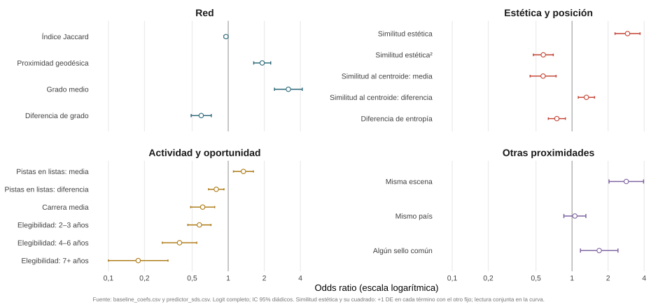

## De qué trata esta investigación

&nbsp;

| | |
|---|---|
| **Colaborar** | Dos artistas graban juntos una canción, el fenómeno *feat.*: **Bad Bunny y J Balvin**, **Taylor Swift y Kendrick Lamar**. Hoy es una práctica frecuente. |
| **Elección** | Cada artista podría colaborar con cientos de otros y solo lo hace con unos pocos. ¿Qué distingue a los pares que llegan a trabajar juntos? |
| **Proximidad estética** | En redes sociales el público describe a cada artista con etiquetas (palabras): géneros, estilos, estados de ánimo. **Bad Bunny y J Balvin** son etiquetados con un vocabulario similar (*cercanos*). **Taylor Swift y kendrick Lamar** apenas comparten (*distantes*). |
| **La hipótesis** | Estar cerca facilita el encaje: Bad Bunny y J Balvin han grabado juntos en varias ocasiones. Pero también colaboran artistas lejanos: Taylor Swift y Kendrick Lamar. ¿Hay un punto a partir del cual parecerse más ya no suma, o incluso resta? |

: {tbl-colwidths="[22,78]"}

::: {.callout-note icon="false"}
# Y no solo la dimensión estética
Contactos previos en la red de colaboraciones, escena cultural e institucional y trayectoria de cada artista. Datos: quién colabora con quién en las listas globales de Spotify, 2013–2025.
:::

::: {.notes}
Antes del esquema, la propuesta en cuatro ideas. Colaborar es grabar juntos una canción, como Bad Bunny y J Balvin o Taylor Swift y Kendrick Lamar, y hoy es práctica habitual. 

Pero cada artista podría colaborar con muchos y solo lo hace con pocos: la pregunta es qué distingue a los pares que llegan a trabajar juntos. 

Para responderla sitúo a cada artista en un mapa construido a partir de la descripción de su público. Bad Bunny y J Balvin reciben un vocabulario casi idéntico y están cerca; Bad Bunny y Ed Sheeran apenas comparten palabras y están lejos. 

La hipótesis central es que estar cerca ayuda: Bad Bunny y J Balvin han grabado juntos varias veces. Pero Taylor Swift y Kendrick Lamar, que están lejos, también lo han hecho. La cuestión abierta es si hay un punto en que parecerse más ya no aporta. Todo ello junto a la red de contactos, la escena y la trayectoria.
:::

:::{.content-hidden}
## Esquema

&nbsp;

- **Motivación y pregunta económica**: selección de socios y el rol de la compatibilidad estética.
- **Datos y diseño**: cómo observar colaboraciones y oportunidades.
- **Resultados**: forma de la asociación, predicción y sensibilidad.
- **Conclusiones**: aportación, límites y programa de investigación.

::: {.notes}
La presentación se estructura en cuatro partes. 

- Comienzo por la motivación, la definición del problema económico y por una hipótesis sobre afinidad en un espacio estético. 

- Después presento  medición y  diseño. 

- Los resultados combinan inferencia y evaluación predictiva, seguidas de sus comprobaciones. 

- Cierro con la aportación, sus límites y las preguntas que abre.
:::
:::

# Motivación y pregunta económica {background-color="#2D6A7A" .roadmap-slide}

::: {.roadmap}
[Motivación y contexto]{.step .active} · [Datos y diseño]{.step} · [Resultados]{.step} · [Conclusiones]{.step}
:::

:::{.notes}
La presentación se estructura en cuatro partes. 

- Comienzo por la motivación, la definición del problema económico y por una hipótesis sobre afinidad en un espacio estético. 

- Después presento  medición y  diseño. 

- Los resultados combinan inferencia y evaluación predictiva, seguidas de sus comprobaciones. 

- Cierro con la aportación, sus límites y las preguntas que abre.

:::

## La colaboración en la industria de la música

&nbsp;

{width="92%" fig-alt="Proporción de colaboraciones en el Billboard Hot 100 por año y tramo de la lista, 1970-2025, con ajuste local"}

::: {.notes}

La figura muestra la evolución del porcentaje de colaboraciones en listas anuales del Billboard 100 (además de en subtramos de la misma) y sirve como punto de partida para ilustrar la pregunta.

A comienzos de los setenta, menos del 3% de las entradas anuales del Billboard correspondían a colaboraciones. Entre 2016 y 2020 esa tasa se sitúa en torno al 40%: la colaboración ha pasado de ser una anomalía entre los éxitos comerciales a la práctica habitual. La evolución sugiere un cambio estructural que emerge en paralelo a la digitalización de la música y se asienta con la implantación de un modelo de negocio basado en el acceso, y no en la propiedad: el streaming.

El interés económico de la pregunta de investigación radica en el análisis de los incentivos en la selección de colaboradores en industrias culturales. Colaborar permite combinar temporalmente capacidades y recursos, identidades estéticas, reputación y acceso a públicos.

:::

## Marco conceptual {.compact .shrink}

&nbsp;

| Pregunta | Qué encuentra la literatura | Referencias |
|---|---|---|
| ¿Beneficios de colaborar? | Los *featurings* elevan la demanda de *streaming*; los duetos sobreviven más en las listas | McKenzie et al. (2021); Kaimann et al. (2021) |
| ¿Qué explica la formación de vínculos? | Mecanismos asortativos, relacionales y de proximidad geográfica e institucional operan a la vez; los lazos previos generan información, visibilidad y oportunidades para nuevos vínculos | Rivera, Soderstrom y Uzzi (2010); Gulati y Gargiulo (1999); Powell et al. (2005) |
| ¿Similares o potencialmente complementarios? | Recursos similares facilitan coordinación y aprendizaje; los distintos aportan novedad si emerge complementariedad; el óptimo interior es una hipótesis extendida en alianzas, innovación y equipos científicos | Mitsuhashi y Greve (2009); Jones (2009); Nooteboom et al. (2007); Uzzi et al. (2013); Smith et al. (2021) |
| ¿Cómo se traduce en la música? | La diferenciación óptima  favorece el éxito; la distancia entre géneros permite potencialmente ampliar la demanda; la evidencia es sobre los resultados de las colaboraciones; pero ¿formación? | Askin y Mauskapf (2017); Ordanini, Nunes y Nanni (2018) |

: {tbl-colwidths="[22,48,30]"}

::: {.notes}

La revisión de la literatura conecta la economía de la cultura con la formación de equipos y redes, en un campo en el que convergen dos líneas de investigación.   

1. La primera estudia los resultados de las colaboraciones. En música la evidencia es clara: las colaboraciones elevan la demanda de *streaming* y alargan la supervivencia en listas.  

2. La segunda estudia la formación de vínculos, con tres familias de mecanismos: similitud, conectividad por posición en la red, y proximidad geográfica e institucional. 

3. Un tema recurrente en  literatura es la existencia de una distancia óptima entre los miembros de una colaboración. Parecerse puede facilitar coordinación y compatibilidad; por otro lado  la diferenciación puede aportar novedad o permitir complementariedades. 

4. En la industria de la música se ha estudiado sobre todo el éxito de las colaboraciones ya realizadas. La evidencia sobre formación es más limitada y se concentran en escenas o géneros concretos y, metodológicamente, se recurre al muestreo de negativos. Este es el principal hueco que se cubre en este papel. 
:::

:::{.content-hidden}
## Afinidad estética: ¿óptimo interior o saturación?

&nbsp;

**¿Qué distingue a los pares que llegan a colaborar por primera vez?** 

| Hipótesis | Argumento | Perfil esperado de formación |
|---|---------|------|
| **Distancia óptima**| Una afinidad intermedia combina terreno común para coordinarse y diferenciación potencialmente valiosa | La propensión crece y después disminuye |
| **Compatibilidad con saturación**| Un mayor terreno común facilita el encaje, con ganancias decrecientes de afinidad. | La propensión crece y después se aplana |

: {tbl-colwidths="[62,38]"}

&nbsp;

::: {.callout-note icon="false"}
# Formación multidimensional

La afinidad estética se estudia junto a la proximidad **cultural** e **institucional**, **actividad y trayectoria** y **posición estructural en la red de colaboraciones**.
:::

::: {.notes}
Un tema recurrente en la literatura es la existencia de una distancia óptima entre los miembros de una colaboración, que en el caso que se estudia llevamos al terreno estético. Parecerse puede facilitar coordinación y compatibilidad;  la diferenciación puede aportar novedad o permitir complementariedades (aunque la distancia estética no mide esos beneficios). La investigación analiza cómo se manifiesta esa tensión en las primeras colaboraciones observadas. 

Sobre estas ideas se formulan las dos hipótesis de la tabla. Si existe una distancia óptima para formar el vínculo, tanto ausencia como exceso de similitud penalizan. Por contra, si opera una saturación, la propensión aumenta con la similitud, pero ese crecimiento se atenúa una vez alcanzado suficiente terreno común. Distinguir ambos perfiles es uno de los objetivos de la propuesta.

Cabe señalar que, además de la similitud entre socios, el trabajo incorpora relaciones previas y proximidad cultural, geográfica e institucional, entre otros atributos. 
:::
:::

## Contribución: medición y contraste de la afinidad estética

&nbsp;

- **Selección de colaboradores**: primeras colaboraciones frente al conjunto completo de pares elegibles.
- **Medición**: perfiles de etiquetas de audiencia asociados a lanzamientos anteriores a cada año.
- **Contraste de forma**: se contrasta un óptimo interior con especificaciones flexibles y una prueba prespecificada de reversión de signo.
- **Validación**: inferencia con dependencia diádica, sensibilidad y evaluación temporal de la ordenación.

::: {.notes}
La contribución combina una pregunta sobre formación de colaboraciones en industrias culturales con un diseño de la investigación que permite contrastarla a escala amplia. El conjunto de riesgo incluye todos los pares elegibles: así, las colaboraciones realizadas se comparan con oportunidades definidas de forma explícita.

Además, la identidad estética se representa usando un enfoque basado en procesamiento del lenguaje natural de las etiquetas generadas por usuarios en dos redes sociales de música. 

La forma de la asociación entre similitud estética y formación de colaboraciones se contrasta: se parte de una  especificación cuadrática que resume una asociación cóncava y posteriormente se comprueba si los datos apoyan el tramo decendente tras el óptimo interior. 

Finalmente, la inferencia incorpora dependencia entre pares que comparten artista y la evaluación predictiva se usa  para analizar la asociación que los diferentes bloques de variables capturan fuera de muestra. 
:::

# Datos y diseño {background-color="#2D6A7A" .roadmap-slide}

::: {.roadmap}
[Motivación y pregunta económica]{.step} · [Datos y diseño]{.step .active} · [Resultados]{.step} · [Conclusiones]{.step}
:::

## Fuentes de datos

&nbsp;

:::: {.columns}

::: {.column width="30%"}
**Cifras básicas**

| | |
|---|---|
| Ventana de listas | 2013–2025 |
| Pistas × artista | 12.688 |
| Artistas en el ámbito | 2.878 |
| Con etiquetas fechadas | 2.402 |

: {tbl-colwidths="[58,42]"}
:::

::: {.column width="5%"}
:::

::: {.column width="65%"}
- **`Spotify`**: listas globales semanales y créditos de pista, álbum y artista (metadatos del API).
- **`Last.fm` y `MusicBrainz`**: etiquetas de audiencia sobre géneros, estilos y otras percepciones (p.e. estados de ánimo).
- **`MusicBrainz` y créditos de álbum**: atributos de artistas e historial de sellos.

::: {.callout-note icon="false"}
# Por qué etiquetas y no géneros de plataforma
Las etiquetas por lanzamiento cubren el **83,5% de los artistas**. Los géneros de Spotify cubren aproximadamente el **34%**.
:::
:::

::::

::: {.notes}
El trabajo integra tres fuentes. Las listas globales semanales de Spotify, desde septiembre de 2013 hasta diciembre de 2025, proporcionan las pistas y los créditos de colaboración. Los metadatos (extraidos del API web) permiten distinguir al artista principal de los invitados.

Las etiquetas de Last.fm y MusicBrainz aportan una descripción de la identidad estética desde la audiencia. Cubren el 83,5% de los artistas del ámbito inicial pero conviene señalar que medidas alternativas, p.e. los géneros del API de Spotify, tienen una menor cobertura, aproximadamente un tercio, y proporciona una lista editorial seleccionada.

En tercer lugar, los metadatos de MusicBrainz añaden atributos como tipo de artista, país registrado, año del primer lanzamiento o historial de sellos (construido con los créditos de álbum observados hasta el año anterior). 

¿Cómo convertir etiquetas textuales de artistas en una medida numérica comparable de su posición estética? Se propone a continuación una aproximación novedosa para abordar este problema.
:::

## Proximidad estética

&nbsp;

:::: {.columns}

::: {.column width="30%"}

***
- Cada artista es un vector de etiquetas
- La proximidad es la similitud coseno entre vectores
- Cobertura de pares:  93% de pares con similitud observada en 2015; 67% en 2024

***

:::
::: {.column width="5%"}
:::
::: {.column width="65%"}

{fig-align="center" fig-alt="Proyección 2-D del espacio de etiquetas: Bad Bunny, J Balvin y Ed Sheeran como vectores rotulados con sus etiquetas top; el ángulo Bad Bunny-J Balvin es pequeño (coseno 0,82) y el ángulo Bad Bunny-Ed Sheeran es grande (coseno 0,07)"}
:::
:::

::: {.notes}

Cada artista se representa mediante un vector de etiquetas de forma que **su perfil en el año t acumula las etiquetas asociadas a lanzamientos anteriores a t**. 

Dos artistas se comparan por la dirección en la que apuntan sus vectores, que se articula a través del coseno de ambos (medida denominada similitud del coseno): cuanto más vocabulario comparten, mayor es su afinidad en el espacio de etiquetas de usuarios.

La figura muestra una proyección ilustrativa en dos dimensiones, aunque las similitudes son reales (calculadas con los vectores completos).  
- Los usuarios etiquetan a Bad Bunny y J Balvin usando un vocabulario similar de ahí su proximidad en el espacio de etiquetas (con un coseno igual a 0,82).   
- Bad Bunny y Ed Sheeran por contra apenas comparten etiquetas y muestran una baja similitud (0,07).

Además de la proximidad estética, el trabajo incorpora la proximidad estructural que emerge de la red de colaboraciones, reflejada en distancia entre nodos o existencia de vecinos comunes.

:::

## Composición de la red

&nbsp;

:::: {.columns}

::: {.column width="30%"}

---

**El núcleo de la red**

- Subgrafo del **5% de artistas con mayor grado** en la red acumulada a 2024.
- **Dos escenas** en  núcleo denso con un número reducido de artistas puente entre ambas.

La figura ilustra por qué **afinidad cultural y cercanía relacional** deben medirse por separado.

---

:::

::: {.column width="5%"}
:::

::: {.column width="65%"}
{width="88%" fig-alt="Subgrafo de mayor grado de la red acumulada de colaboraciones a 2024, con nodos coloreados por escena: comunidades latina y anglófona con artistas puente"}
:::

::::

::: {.notes}
Visualizamos esta proximidad estructural con la representación del conjunto de datos relacionales en un grafo. La figura muestra solo el núcleo de la red acumulada hasta el 2024, el 5% de artistas con mayor grado, y ofrece una ilustración descriptiva.

El grafo segmenta una escena latina y otra anglófona, con algunos artistas que conectan ambas. Esto sugiere la necesidad de separar afinidad (estética o de otro tipo) de posición en la red. Dos artistas pueden, por ejemplo, compartir espacio cultural  y, sin embargo, tener oportunidades relacionales distintas.
:::

## Qué cuenta como primera colaboración

&nbsp;

- **Evento**: primera colaboración principal–invitado en una pista que entra en listas.
- **Formación**: exige ausencia de lazos previos entre ambos artistas (también los observados fuera de listas).
- **Pares invitado–invitado**: no cuentan como evento; tampoco como negativos.

::: {.notes}

La definición del evento fija el objeto que vamos a estudiar. En el trabajo se **considera una primera colaboración cuando un artista aparece como principal y otro como invitado en una pista que entra en listas, siempre que no hubiera un lazo previo entre ambos** (se miden eventos de formación que responden a decisiones distintas de los de repetición). Los créditos entre dos invitados de una misma pista no cuentan como formación principal–invitado, pero tampoco son ceros de colaboración.
:::

## Diseño: el conjunto de oportunidades

&nbsp;

- **Elegibilidad anual**: ambos artistas debutaron antes de $t$ y publicaron una pista en listas en los tres años anteriores.
- **Conjunto completo de riesgo**: todos los pares no ordenados elegibles para una primera colaboración, sin muestreo de negativos.
- **Muestra de estimación**: 2.256 artistas, 3.756.411 pares-año observados en el periodo 2015--2024.
- **Sensibilidad**: ventana de cinco años y permanencia sin salida tras el debut.

::: {.callout-note icon="false"}
# Evento raro
Se identifican con 1.064 eventos de formación elegibles sobre 3.756.411 pares-año: **28,3 formaciones por cada 100.000 pares-año de estimación**.
:::

::: {.notes}
El número total de colaboraciones potenciales no es cualquier combinación imaginable. 

**La investigación define una oportunidad observable**: los dos artistas deben haber debutado  antes del año analizado y tener un tema que aparece en listas publicado en una ventana que incluye los tres años anteriores. Además, el par debe seguir siendo elegible para una primera colaboración (no han colaborado antes).

La ventana de actividad de tres años reduce la presencia de pares con oportunidades poco plausibles si bien se compara con una ventana de cinco años y con una variante sin salida tras el debut en listas.

Se utiliza el conjunto de riesgo completo lo que devuelve una muestra de estimación con 1.064 eventos sobre 3.756.411 pares-año: aproximadamente 28,3 por cada 100.000. La rareza del evento condiciona la inferencia y la interpretación predictiva.

:::

# Resultados · Forma de la asociación {background-color="#2D6A7A" .roadmap-slide}

::: {.roadmap}
[Motivación y pregunta económica]{.step} · [Datos y diseño]{.step} · [Resultados]{.step .active} · [Conclusiones]{.step}
:::

::: {.roadmap .sub}
[Forma de la asociación]{.step .active} · [Predicción]{.step} · [Sensibilidad]{.step}
:::

## Estimación

&nbsp;

| | **Logit** | **XGBoost** |
|---|---|---|
| Objetivo | Forma e inferencia de las asociaciones condicionales | Referencia flexible para ordenar pares; asociaciones fuera de muestra; forma similitud estética (no paramétrica)  |
| Especificación | Red retardada, características del par y efectos de año | Árboles con interacciones y no linealidades |
| Diseño temporal | Inferencia 2015–2024; predicción reestimada hasta 2023 | Entrenamiento hasta 2022, validación 2023 y reajuste hasta 2023 |
| Evaluación | Ordenación en 2024 | Ordenación en 2024 |
| Incertidumbre | Errores estándar robustos diádicos | Bootstrap de métricas |

: {tbl-colwidths="[20,40,40]"}

&nbsp;

:::{.callout-note icon="false"}
# ¿Por qué no un ERGM?

1. Escalabilidad: con 2.256 actores y millones de díadas la estimación es computacionalmente exigente.

2. Objeto probabilístico diferente: distribución conjunta de la red (ERGM) frente a probabilidad diádica condicional (logit).

Seguimos enfoque de Almquist y Butts (2014).
:::

::: {.notes}
La formación se modeliza a través de dos modelos de clasificación.

1. El logit estima la probabilidad de formación condicionada a la red del año anterior y a las características del par. Incluye efectos de año y permite hacer inferencia sobre una forma especificada explícitamente. Se estiman errores estándar diádicos de Aronow y Samii que admiten dependencia entre pares que comparten un artista.

2. XGBoost se utiliza como referencia predictiva flexible que además aporta evidencia sobre la forma funcional de la proximidad estética-propensión a colaborar (sin asumirla). El número de árboles se selecciona con parada anticipada (validando en 2023) y después se reajusta con datos hasta ese año. 

La rama predictiva del trabajo evalúa ambos modelos en el año 2024 y sus puntuaciones se emplean para ordenar pares y determinar capacidad predictiva más allá de un mecanismo aleatorio.

Una alternativa sería recurrir a modelos de grafos aleatorias exponenciales pero su uso en esta aplicación plantea dos problemas:  
1. falta de escalabilidad (computacionalmente inviable);  
2. responde a una pregunta distinta. 
:::

## Bloques de variables y modelos anidados

&nbsp;

<!-- Columna «Términos»: especificación completa del modelo (33 términos más
     efectos de año), con los nombres usados en las figuras del deck
     (fig_coef_magnitude_deck y fig_coef_delta_*_sebase). -->

| Bloque | Qué recoge | Términos |
|---|---|---|
| **Red** | Socios comunes, conexiones y posición en el grafo previo | Vecinos comunes · Índice Jaccard · Índice Adamic--Adar · Conexión preferencial · Alcanzabilidad · Proximidad geodésica · Grado medio · Diferencia de grado |
| **Estética** | Similitud, tipicidad respecto al centroide, amplitud y cobertura de etiquetas | Similitud estética · Similitud estética^2^ · Similitud al centroide: media · Similitud al centroide: diferencia · Entropía media · Diferencia de entropía · Tamaño del vocabulario: media · Tamaño del vocabulario: diferencia · Sin etiquetas: un artista · Sin etiquetas: ambos |
| **Actividad y oportunidad** | Producción en listas, carrera y duración de la elegibilidad conjunta | Pistas en listas: media · Pistas en listas: diferencia · Carrera media · Diferencia de carrera · Elegibilidad: 2–3 años · Elegibilidad: 4–6 años · Elegibilidad: 7+ años |
| **Otras proximidades** | Escena, país, atributos del artista e historia de sellos | Misma escena · Mismo país · Mismo tipo de artista · Mismo género del artista · Índice Jaccard de sellos · Sellos compartidos · Algún sello común |

: {tbl-colwidths="[16,30,54]"}

&nbsp;

:::{.callout-note icon="false"}
**Tres modelos anidados**: Completo (los cuatro bloques) · Solo red (topología) · Sin red (estética, actividad y atributos). Las restricciones se contrastan con tests de Wald (errores estándar robustos).
:::

::: {.notes}

Los predictores se organizan en cuatro bloques. La red resume la historia relacional. La estética recoge la similitud del par y la posición de cada artista en el espacio de etiquetas. Actividad y oportunidad describen producción, trayectoria y tiempo de elegibilidad conjunta. El último bloque incorpora escena, país, historia de sellos y otros atributos.

Los atributos de nodo (es decir, de artistas) entran como media del par y diferencia absoluta: así se distingue nivel y asimetría. 

Se estima un modelo completo y dos restricciones: solo red y sin red. 
:::

:::{.content-hidden}
## Resultado base: especificación cuadrática {.tblfull .shrink}

**Logit de formación, tres modelos anidados; est. (EE diádicos Aronow–Samii)**

| Término | Completo | Solo red | Sin red |
|---|---|---|---|
| **Topología de red** | | | |
| Vecinos comunes | -0,134 (0,121) | 0,002 (0,122) | — |
| Índice Jaccard  | -1,839 (0,779)\* | -1,947 (0,879)\* | — |
| Adamic–Adar | 1,246 (0,335)\*\*\* | 1,228 (0,348)\*\*\* | — |
| *Preferential attachment* | -0,005 (0,001)\*\*\* | -0,004 (0,001)\*\*\* | — |
| Alcanzabilidad | -0,693 (0,188)\*\*\* | -1,127 (0,196)\*\*\* | — |
| Proximidad geodésica | 4,684 (0,596)\*\*\* | 6,955 (0,579)\*\*\* | — |
| Grado (media) | 0,207 (0,024)\*\*\* | 0,210 (0,024)\*\*\* | — |
| Grado (dif. abs.) | -0,057 (0,011)\*\*\* | -0,058 (0,009)\*\*\* | — |
| **Estética y posición** | | | |
| Similitud estética | 5,119 (0,589)\*\*\* | — | 6,428 (0,644)\*\*\* |
| Similitud estética² | -4,021 (0,712)\*\*\* | — | -4,941 (0,768)\*\*\* |
| Similitud al centroide (media) | -2,648 (0,606)\*\*\* | — | -3,526 (0,730)\*\*\* |
| Similitud al centroide (dif. abs.) | 1,522 (0,439)\*\*\* | — | 1,509 (0,463)\*\* |
| Entropía de etiquetas (media) | -0,192 (0,144) | — | -0,136 (0,161) |
| Entropía de etiquetas (dif. abs.) | -0,278 (0,080)\*\*\* | — | -0,221 (0,081)\*\* |
| Tamaño del vocabulario (media) | 0,014 (0,003)\*\*\* | — | 0,013 (0,003)\*\*\* |
| Tamaño del vocabulario (dif. abs.) | -0,006 (0,001)\*\*\* | — | -0,006 (0,001)\*\*\* |
| Sin etiquetas: un artista | -2,062 (0,918)\* | — | -1,966 (1,004) |
| Sin etiquetas: ambos | -1,414 (1,169) | — | -1,586 (1,242) |
| **Actividad y oportunidad** | | | |
| Pistas acumuladas (media) | 0,033 (0,011)\*\* | — | 0,051 (0,012)\*\*\* |
| Pistas acumuladas (dif. abs.) | -0,014 (0,005)\*\* | — | -0,013 (0,004)\*\* |
| Carrera (media) | -0,068 (0,016)\*\*\* | — | -0,053 (0,016)\*\* |
| Carrera (dif. abs.) | 0,000 (0,008) | — | -0,006 (0,008) |
| Elegibilidad conjunta 2–3 años | -0,554 (0,114)\*\*\* | — | -0,291 (0,110)\*\* |
| Elegibilidad conjunta 4–6 años | -0,936 (0,169)\*\*\* | — | -0,310 (0,197) |
| Elegibilidad conjunta 7+ años | -1,730 (0,292)\*\*\* | — | -1,586 (0,380)\*\*\* |
| **Otras proximidades y atributos** | | | |
| Misma escena | 1,043 (0,169)\*\*\* | — | 1,183 (0,193)\*\*\* |
| Mismo país | 0,055 (0,108) | — | 0,272 (0,133)\* |
| Mismo tipo de artista | 0,415 (0,141)\*\* | — | 0,576 (0,159)\*\*\* |
| Mismo género del artista | -0,010 (0,097) | — | 0,056 (0,107) |
| Jaccard de sellos (retardado) | 0,636 (0,368) | — | -0,997 (0,465)\* |
| Sellos compartidos (retardado) | -0,167 (0,112) | — | -0,015 (0,148) |
| Algún sello común (retardado) | 0,523 (0,184)\*\* | — | 1,435 (0,212)\*\*\* |
| Efectos fijos de año | sí | sí | sí |
| Díadas-año · eventos | 3.756.411 · 1.064 | ídem | ídem |

: {tbl-colwidths="[34,22,22,22]"}

::: {style="font-size:0.82em; color:#6c757d;"}
\* p<0,05; \*\* p<0,01; \*\*\* p<0,001.
:::

::: {.notes}

Esta es la estimación base del modelo de formación con sus tres variantes anidadas. La tabla completa queda como referencia; la figura siguiente resume los coeficientes relevantes en una escala comparable.

:::

## Resultado base: lectura gráfica {.compact}

&nbsp;

{width="84%" fig-align="center" fig-alt="Gráfico de puntos e intervalos del 95% para coeficientes seleccionados del logit de formación, modelo Completo: bloques de red, estética, actividad y atributos, cada uno con su color"}

::: {style="font-size:0.8em; color:#6c757d;"}
Coeficientes seleccionados del modelo de formación. Escalas no comparables entre variables.
:::

:::{.notes}
Los resultados muestran que el bloque de red es conjuntamente informativo (el contraste de wald rechaza el modelo restringido) y proximidad y centralidad se asocian a la formación de colaboraciones. 

La proximidad geodésica muestra como los pares que ya estaban cerca en la red previa tienen una propensión mucho mayor a conectar directamente. El grado medio (una medida de popularidad) también es positivo en línea con un mecanismo de formación vinculado a la visibilidad si bien la asimetría en la centralidad penaliza: es decir, la formación de vínculos favorece a pares con miembros más populares. 

La forma cuadrática en la proximidad estética reproduce un patrón de U-invertida: término lineal positivo y cuadrático negativo sitúan el máximo en una similitud de 0.637. No obstante el óptimo se ubica  en el percentil 94.8 del soporte,  una región con pocos pares y eventos lo que exige auditar el resultado. 

Compartir  escena  presenta una asociación positiva. Por otro lado actividad media y su asimetría sugieren que pares activos y con niveles de actividad similares se asocian a una mayor propensión a colaborar. El solapamiento de carreras en listas (las variables elegibilidad conjunta) muestran coeficientes negativos y crecientes en lo que podríamos denominar un **efecto oportunidad no realizada**: pares que llevan años coexistiendo sin colaborar tienen cada vez menos probabilidad de hacerlo.
:::

:::

## Asociaciones del modelo completo {.compact}

{width="89%" fig-align="center" fig-alt="Multiplicadores de la tasa de formación con intervalos de confianza del 95% para coeficientes seleccionados del logit completo, incluidos la similitud estética y su cuadrado: una desviación estándar en las variables continuas y presencia frente a ausencia en las binarias, sobre un eje logarítmico común y organizados en cuatro bloques"}

**Odds ratios e IC 95%.** Continuas: +1 desviación estándar; binarias: presencia frente a ausencia. Similitud estética y su cuadrado: contrastes separados (el otro término fijo); su lectura conjunta es la curva.

::: {.notes}
La figura compara las asociaciones del modelo completo para variables seleccionadas. Cada punto es el cambio en la ratio de odds ante un aumento de una desviación estándar en las variables continuas, o presencia frente a ausencia en las binarias. ¿Qué perfil de par dibuja cada bloque?

En la red, la posición estructural importa: pares más conectados, más cercanos en la red y menos asimétricos son más propensos a colaborar. 

En el espacio estético, hay un óptimo interior en la similitud del par. Además, pares que ocupan posiciones alejadas del centro del espacio de etiquetas se distinguen más que los pares situados en el centro.

Las proximidades cultural e institucional suman: compartir escena y haber pasado por un mismo sello se asocian con mayor formación.

En actividad y oportunidad, el perfil favorable es el de pares activos y de actividad parecida. Por contra, la exposición reduce la propensión: es una asociación que puede capturar oportunidades no realizadas o emparejamientos poco plausibles.
:::

## ¿Máximo o punto de saturación?

&nbsp;

La forma cuadrática de la similitud estética sitúa el máximo implícito en **0,637**, en el **percentil 94,8** de la similitud observada. La evidencia es compatible con un máximo o un crecimiento que se estabiliza.

Las distinguimos mediante tres procedimientos:  

- **Intervalos de similitud**: tasas ajustadas sin imponer una curva cuadrática.  
- **Spline cúbico natural**: perfil flexible con regla de nudos prespecificada.  
- **Reversión de signo**: localizar el punto de ruptura y estimar las pendientes en mitades separadas de la muestra. **Criterio confirmatorio**: subida anterior y caída posterior.  

::: {.notes}
La especificación cuadrática sitúa un máximo implícito en 0,64, aproximadamente en el percentil 95 de la similitud observada: una zona con pocos eventos. La parábola impone un descenso después de ese máximo; debemos comprobar si los datos respaldan esa caída o un crecimiento que se aplana.

Para distinguir ambas hipótesis, utilizamos:  

1. Un análisis exploratorio con dos logit alternativos: uno con similitud por tramos y otro con un spline flexible.
2. Una prueba prespecificada con división de la muestra: una mitad localiza el posible máximo y la otra estima pendientes anterior y posterior. Un máximo interior se confirma si pendientes cambian de signo. El procedimiento se validó previamente mediante simulaciones.
:::

## Proximidad estética y colaboraciones: especificación flexible

&nbsp;

:::: {.columns}

::: {.column width="30%"}

---

**Contraste de reversión**

- **Punto de ruptura**: $b = 0{,}676$.
- **Comportamiento antes de $b$**: pendiente 1,73 (IC 95% [1,08; 2,37]).
- **Comportamiento después de $b$**:  pendiente 2,50 (IC 95% [-5,21; 10,20]).

**Evidencia**: subida anterior y pendiente posterior imprecisa. No se confirma la reversión

---

:::

::: {.column width="5%"}
:::

::: {.column width="65%"}
{width="92%" fig-alt="Tasa de formación por tramo de similitud estética y spline g-computado con bandas de confianza; la curva sube y se aplana sin caer"}

::: {style="font-size:0.8em; color:#6c757d;"}
Curva: predicciones medias del logit con spline. Puntos: tasas ajustadas del logit con similitud por tramos (intervalos de confianza diádicos).
:::
:::

::::

::: {.notes}

SPLINE: la curva suavizada muestra predicciones del logit con spline con un crecimiento marcado de la tasa de formación desde niveles bajos de similitud y una moderación posterior. 
PUNTOS: representan tasas ajustadas por intervalos; no hay descenso claro y mayor imprecisión en la parte alta.

El contraste identifica un pendiente positiva antes del punto de ruptura con un intervalo que excluye cero. Después, la pendiente es positiva, pero su intervalo incluye cero.

**No se confirma el patrón de subida y caída requerido para identificar un máximo interior. Los resultados son compatibles con un crecimiento que se modera, aunque la incertidumbre no permite descartar una caída en la cola.**
:::

# Resultados · Predicción {background-color="#2D6A7A" .roadmap-slide}

::: {.roadmap}
[Motivación y pregunta económica]{.step} · [Datos y diseño]{.step} · [Resultados]{.step .active} · [Conclusiones]{.step}
:::

::: {.roadmap .sub}
[Forma de la asociación]{.step} · [Predicción]{.step .active} · [Sensibilidad]{.step}
:::

## Capacidad predictiva por bloques de variables

&nbsp;

<!-- Celdas: Precisión@10K (%) / Recall@10K (%) / Lift@10K, evaluación 2024.
     Cifras idénticas a la tabla anterior (AUC-ROC, AUC-PR y Lift@500 pasan a
     las notas). Reveal colorea con las clases .pA/.pB/.pC del encabezado;
     Beamer con \textcolor: cualquier cambio de cifra debe replicarse en ambas
     ramas. -->

:::: {.content-visible when-format="revealjs"}

::: {.predwrap}

| Especificación | Logit | XGBoost |
|---|:---:|:---:|
| Solo red | [0,200]{.pA} [/]{.psep} [31,25]{.pB} [/]{.psep} [15,31]{.pC} | [0,140]{.pA} [/]{.psep} [21,88]{.pB} [/]{.psep} [11,51]{.pC} |
| Sin red | [0,230]{.pA} [/]{.psep} [35,94]{.pB} [/]{.psep} [17,61]{.pC} | [0,180]{.pA} [/]{.psep} [28,13]{.pB} [/]{.psep} [14,80]{.pC} |
| Completo | [0,270]{.pA} [/]{.psep} [42,19]{.pB} [/]{.psep} [20,67]{.pC} | [0,200]{.pA} [/]{.psep} [31,25]{.pB} [/]{.psep} [16,45]{.pC} |

: {tbl-colwidths="[28,36,36]"}

::: {.predlegend}
**Celdas**: [Precisión@10K (%)]{.pA} [/]{.psep} [Recall@10K (%)]{.pB} [/]{.psep} [Lift@10K]{.pC}. Ordenación en 2024 (64 eventos) sobre las 10.000 díadas mejor puntuadas.
:::

:::

::::

::: {.content-visible when-format="beamer"}

| Especificación | Logit | XGBoost |
|---|:---:|:---:|
| Solo red | \textcolor[HTML]{2D6A7A}{\textbf{0,200}} / \textcolor[HTML]{C44536}{\textbf{31,25}} / \textcolor[HTML]{AE7B18}{\textbf{15,31}} | \textcolor[HTML]{2D6A7A}{\textbf{0,140}} / \textcolor[HTML]{C44536}{\textbf{21,88}} / \textcolor[HTML]{AE7B18}{\textbf{11,51}} |
| Sin red | \textcolor[HTML]{2D6A7A}{\textbf{0,230}} / \textcolor[HTML]{C44536}{\textbf{35,94}} / \textcolor[HTML]{AE7B18}{\textbf{17,61}} | \textcolor[HTML]{2D6A7A}{\textbf{0,180}} / \textcolor[HTML]{C44536}{\textbf{28,13}} / \textcolor[HTML]{AE7B18}{\textbf{14,80}} |
| Completo | \textcolor[HTML]{2D6A7A}{\textbf{0,270}} / \textcolor[HTML]{C44536}{\textbf{42,19}} / \textcolor[HTML]{AE7B18}{\textbf{20,67}} | \textcolor[HTML]{2D6A7A}{\textbf{0,200}} / \textcolor[HTML]{C44536}{\textbf{31,25}} / \textcolor[HTML]{AE7B18}{\textbf{16,45}} |

: {tbl-colwidths="[28,36,36]"}

**Celdas**: \textcolor[HTML]{2D6A7A}{Precisión@10K (\%)} / \textcolor[HTML]{C44536}{Recall@10K (\%)} / \textcolor[HTML]{AE7B18}{Lift@10K}. Ordenación en 2024 (64 eventos) sobre las 10.000 díadas mejor puntuadas.

:::

&nbsp;

::: {.notes}

El ejercicio predictivo ordena las observaciones en 2024, con tan solo 64 eventos de formación. El logit predice 489.912 pares y XGBoost 526.319, (difieren en el tratamiento de los valores faltantes lo que limita las comparaciones). En cualquier caso el área bajo la curva de precisión-recall del modelo completo multiplica la tasa base por 18 en el logit y por 14 en XGBoost.

La rareza del evento obliga a mirar aciertos concretos: si se seleccionan los 10.000 pares mejor puntuados, el modelo completo recupera el 42% de los eventos con el logit y el 31% con XGBoost, un lift de 20 y 16 frente al azar. 

Además, el bloque sin red retiene buena parte de la capacidad de ordenación del modelo completo. Añadir la red mejora las métricas marginalmente lo que sugiere que **la señal predictiva que proporciona la posición estructural ya está incorporada en variables de proximidad**.  

Reserva (cifras retiradas de la tabla, 2026-09-07). AUC-ROC · AUC-PR (‰) · Lift@500 — Logit: Solo red 0,821 · 1,238 · 0,00; Sin red 0,875 · 2,090 · 30,62; Completo 0,892 · 2,299 · 15,31. XGBoost: Solo red 0,745 · 0,679 · 0,00; Sin red 0,912 · 1,386 · 0,00; Completo 0,917 · 1,729 · 16,45.

:::

## Contraste no paramétrico de la forma funcional

&nbsp;

{width="90%" fig-align="center" fig-alt="Gráfico de dependencia SHAP para la similitud coseno en el modelo XGBoost completo"}

::: {.notes}

El ejercicio predictivo permite analizar el perfil estético sin imponer una forma funcional. Para ello, recurrimos a los valores de Shapley, que descomponen la predicción del XGBoost en las contribuciones de los distintos predictores. El gráfico representa la contribución de la similitud estética, en escala de log-odds, para los pares evaluados en 2024.

El patrón sube con fuerza desde similitudes bajas y después se modera. Es consistente con el estancamiento del crecimiento del ejercicio exploratorio y constituye una comprobación descriptiva de lo aprendido por este modelo. Su utilidad aquí es mostrar que la **compatibilidad estética sigue asociada a la formación en un modelo donde no se fija de antemano una forma funcional.**

:::

# Resultados · Sensibilidad {background-color="#2D6A7A" .roadmap-slide}

::: {.roadmap}
[Motivación y contexto]{.step} · [Datos y diseño]{.step} · [Resultados]{.step .active} · [Conclusiones]{.step}
:::

::: {.roadmap .sub}
[Forma de la asociación]{.step} · [Predicción]{.step} · [Sensibilidad]{.step .active}
:::

:::{.notes}

Se ha evaluado la sensibilidad de las estimaciones  a la definición de la respuesta, a diferentes ventanas de actividad, medición de etiquetas e inferencia. El patrón central sobre afinidad se mantiene. Me detengo brevemente en la corrección de sesgo debido a  la rareza del evento.
:::

:::{.content-hidden}
## Comprobaciones de los resultados {.compact}

&nbsp;

| Tipo | Ejercicios | Resultado (similitud y demás bloques) |
|---|---|---|
| **Inferencia** | *Bootstrap* de nodos | El *bootstrap* aumenta los EE (ratio mediano 1,60): mantiene significativos coeficientes a excepción de índice Jaccard, algún sello común y actividad en listas |
| **Definición del resultado** | Solo pistas de dos artistas (609 eventos)  Ponderación por tamaño de equipo   Inclusión *feat-feat* | El perfil queda esencialmente igual   Coeficientes estables para bloques de red, actividad y atributos   |
| **Ventana del conjunto de riesgo** | Ventanas de 0, 3 y 5 años | Máximos implícitos 0,635 / 0,637 / 0,630: la ventana decide qué ceros son oportunidades   Estabilidad de coeficientes en la ventana a 5 años (a excepción de elegibilidad)|
| **Medición de etiquetas** | Solo MB   Vectores binarios   Vocabularios mínimos ($k \geq 3$, $k \geq 5$)   Submuestra bien medida   Terciles de cobertura | El perfil sobrevive en todas; bloques de red, actividad y atributos estables; interacciones con cobertura conjuntamente no significativas ($p = 0{,}082$) |
| **Eventos raros** | Logit con penalización de Firth | Ningún coeficiente cambia de signo; desplazamiento máximo de 0,23 EE del logit base |

: {tbl-colwidths="[15,32,53]"}

::: {.notes}
Cinco familias de comprobaciones.

Inferencia: el *bootstrap* de nodos, que remuestrea artistas y arrastra la composición del conjunto de riesgo, aumenta los errores estándar con una ratio mediana de 1,60; la mayor parte de los coeficientes se mantiene y el historial común de sello queda positivo pero impreciso.

Definición del resultado: restringir a pistas de exactamente dos artistas, ponderar por tamaño de equipo o tratar los pares invitado–invitado como negativos deja el perfil esencialmente igual.

Ventana del conjunto de riesgo: con cero, tres y cinco años los máximos implícitos son 0,635, 0,637 y 0,630.

Medición de etiquetas: el perfil sobrevive a cinco formas alternativas de construir los vectores, y las interacciones con la cobertura no son conjuntamente significativas.

La última fila, la rareza del evento, merece una figura.
:::

## Corrección de sesgo de Firth {.tblfull .shrink}

| Término | Logit | Firth | Δ Firth-logit | Cloglog |
|---|---|---|---|---|
| **Topología de red** | | | | |
| Vecinos comunes | -0,134 | -0,142 | -0,008 | -0,131 |
| Índice Jaccard  | -1,839 | -1,663 | 0,176 | -1,835 |
| Adamic–Adar | 1,246 | 1,261 | 0,015 | 1,225 |
| *Preferential attachment* | -0,005 | -0,005 | 0,000 | -0,005 |
| Alcanzabilidad | -0,693 | -0,685 | 0,008 | -0,694 |
| Proximidad geodésica | 4,684 | 4,649 | -0,035 | 4,697 |
| Grado (media) | 0,207 | 0,207 | -0,001 | 0,206 |
| Grado (dif. abs.) | -0,057 | -0,057 | 0,000 | -0,057 |
| **Estética y posición** | | | | |
| Similitud estética | 5,119 | 5,108 | -0,012 | 5,083 |
| Similitud estética² | -4,021 | -4,007 | 0,014 | -3,985 |
| Similitud al centroide (media) | -2,648 | -2,637 | 0,012 | -2,626 |
| Similitud al centroide (dif. abs.) | 1,522 | 1,521 | -0,001 | 1,515 |
| Entropía de etiquetas (media) | -0,192 | -0,198 | -0,006 | -0,191 |
| Entropía de etiquetas (dif. abs.) | -0,278 | -0,276 | 0,002 | -0,279 |
| Tamaño del vocabulario (media) | 0,014 | 0,014 | 0,000 | 0,014 |
| Tamaño del vocabulario (dif. abs.) | -0,006 | -0,006 | 0,000 | -0,006 |
| Sin etiquetas: un artista | -2,062 | -2,092 | -0,030 | -2,056 |
| Sin etiquetas: ambos | -1,414 | -1,339 | 0,074 | -1,408 |
| **Actividad y oportunidad** | | | | |
| Pistas acumuladas (media) | 0,033 | 0,033 | 0,000 | 0,032 |
| Pistas acumuladas (dif. abs.) | -0,014 | -0,014 | 0,000 | -0,014 |
| Carrera (media) | -0,068 | -0,067 | 0,000 | -0,067 |
| Carrera (dif. abs.) | 0,000 | 0,000 | 0,000 | 0,000 |
| Elegibilidad conjunta 2–3 años | -0,554 | -0,554 | 0,000 | -0,552 |
| Elegibilidad conjunta 4–6 años | -0,936 | -0,934 | 0,002 | -0,926 |
| Elegibilidad conjunta 7+ años | -1,730 | -1,719 | 0,011 | -1,711 |
| **Otras proximidades y atributos** | | | | |
| Misma escena | 1,043 | 1,042 | -0,001 | 1,044 |
| Mismo país | 0,055 | 0,054 | -0,001 | 0,053 |
| Mismo tipo de artista | 0,415 | 0,414 | -0,001 | 0,413 |
| Mismo género del artista | -0,010 | -0,011 | -0,001 | -0,008 |
| Jaccard de sellos (retardado) | 0,636 | 0,667 | 0,031 | 0,634 |
| Sellos compartidos (retardado) | -0,167 | -0,162 | 0,006 | -0,167 |
| Algún sello común (retardado) | 0,523 | 0,513 | -0,009 | 0,521 |
| Efectos fijos de año | sí | sí | | sí |

: {tbl-colwidths="[36,16,16,16,16]"}

::: {.notes}
Dada la baja frecuencia del evento analizado, consideramos un modelo logit con corrección de Firth, basado en una verosimilitud penalizada que reduce el sesgo y mitiga posibles problemas de separación.
:::

## Corrección de sesgo de Firth {.tblfull .shrink}

| Término | Logit | Firth | $\Delta$ Firth-logit |
|---|---|---|---|
| **Topología de red** | | | |
| Vecinos comunes | -0,134 | -0,142 | -0,008 |
| Índice Jaccard  | -1,839 | -1,663 | 0,176 |
| Adamic–Adar | 1,246 | 1,261 | 0,015 |
| *Preferential attachment* | -0,005 | -0,005 | 0,000 |
| Alcanzabilidad | -0,693 | -0,685 | 0,008 |
| Proximidad geodésica | 4,684 | 4,649 | -0,035 |
| Grado (media) | 0,207 | 0,207 | -0,001 |
| Grado (dif. abs.) | -0,057 | -0,057 | 0,000 |
| **Estética y posición** | | | |
| Similitud estética | 5,119 | 5,108 | -0,012 |
| Similitud estética² | -4,021 | -4,007 | 0,014 |
| Similitud al centroide (media) | -2,648 | -2,637 | 0,012 |
| Similitud al centroide (dif. abs.) | 1,522 | 1,521 | -0,001 |
| Entropía de etiquetas (media) | -0,192 | -0,198 | -0,006 |
| Entropía de etiquetas (dif. abs.) | -0,278 | -0,276 | 0,002 |
| Tamaño del vocabulario (media) | 0,014 | 0,014 | 0,000 |
| Tamaño del vocabulario (dif. abs.) | -0,006 | -0,006 | 0,000 |
| Sin etiquetas: un artista | -2,062 | -2,092 | -0,030 |
| Sin etiquetas: ambos | -1,414 | -1,339 | 0,074 |
| **Actividad y oportunidad** | | | |
| Pistas acumuladas (media) | 0,033 | 0,033 | 0,000 |
| Pistas acumuladas (dif. abs.) | -0,014 | -0,014 | 0,000 |
| Carrera (media) | -0,068 | -0,067 | 0,000 |
| Carrera (dif. abs.) | 0,000 | 0,000 | 0,000 |
| Elegibilidad conjunta 2–3 años | -0,554 | -0,554 | 0,000 |
| Elegibilidad conjunta 4–6 años | -0,936 | -0,934 | 0,002 |
| Elegibilidad conjunta 7+ años | -1,730 | -1,719 | 0,011 |
| **Otras proximidades y atributos** | | | |
| Misma escena | 1,043 | 1,042 | -0,001 |
| Mismo país | 0,055 | 0,054 | -0,001 |
| Mismo tipo de artista | 0,415 | 0,414 | -0,001 |
| Mismo género del artista | -0,010 | -0,011 | -0,001 |
| Jaccard de sellos (retardado) | 0,636 | 0,667 | 0,031 |
| Sellos compartidos (retardado) | -0,167 | -0,162 | 0,006 |
| Algún sello común (retardado) | 0,523 | 0,513 | -0,009 |
| Efectos fijos de año | sí | sí | |

: {tbl-colwidths="[40,20,20,20]"}

::: {.notes}

La escasa diferencia entre las estimaciones puntuales del logit convencional y del modelo de Firth indica que los resultados no están condicionados por el posible sesgo asociado a la rareza del evento.
:::
:::

## Firth: estabilidad de las estimaciones {.compact}

{width="89%" fig-align="center" fig-alt="Diferencia entre las estimaciones de Firth y del logit base dividida por el error estándar robusto diádico del logit base, para coeficientes seleccionados y en una escala común"}

**Mayor desplazamiento: 0,23 errores estándar del modelo base.** Comparación descriptiva de estimaciones puntuales. Todos los coeficinetes mantienen el signo.

::: {.notes}
Para ello utilizo el **modelo logit de Firth** que incorpora una verosimilitud penalizada para reducir sesgo y mitigar problemas de separación (que en este caso no se dan). El objeto es comprobar cuánto cambia el patrón estimado en una muestra con un evento tan infrecuente.

La figura divide la diferencia entre estimaciones por el error estándar robusto del logit base. Se observa como los desplazamientos son marginales (el mayor desplazamiento corresponde al índice de Jaccard que equivale aproximadamente a 0,23 errores estándar en un predictor de escasa significación sustantiva); además todos los términos conservan su signo.

Este ejercicio muestra estabilidad de estimaciones puntuales: La escasa diferencia entre el logit convencional y el modelo de Firth no aporta evidencia de un sesgo relevante asociado a la rareza del evento.

:::

# Conclusiones {background-color="#2D6A7A" .roadmap-slide}

::: {.roadmap}
[Motivación y pregunta económica]{.step} · [Datos y diseño]{.step} · [Resultados]{.step} · [Conclusiones]{.step .active}
:::

## Síntesis: afinidad, red y oportunidad {.compact}

&nbsp;

{width="94%" fig-alt="Síntesis ilustrativa: índice que combina el perfil estético flexible con asociaciones de cercanía relacional y duración de la oportunidad; dos paneles, misma escala"}

::: {.notes}
Antes de concluir, reúno el análisis de los resultados en este mapa. En horizontal aparece la afinidad estética y en vertical la cercanía en la red previa. Los paneles comparan una oportunidad conjunta reciente y una exposición prolongada sin colaboración.

La figura muestra el índice que multiplica la tasa de formación sobre un **par de referencia: sin conexión previa, sin afinidad y con una exposición reciente**. 

La interpretación conjunta sugiere que  afinidad, distancia relacional y oportunidad temporal caracterizan configuraciones de formación distintas. 

- Dada una oportunidad reciente, la cercanía en la red multiplica la tasa de formación x5; la proximidad estética  multiplica x12; combinando ambas el factor multiplicativo es x65. 

- Un aumento de la exposición al riesgo reduce la tasa de formación. 

El mapa sintetiza esas asociaciones pero deja abiertas las explicaciones: puede haber compatibilidad, conexiones o efectos exposición. Con esta distinción entre evidencia e interpretación paso a las conclusiones. 

:::

## Qué aporta estudiar la formación de colaboraciones

&nbsp;

- **La formación como etapa económica propia**: determina qué combinaciones creativas llegan a materializarse.
- **La hipótesis de distancia óptima exige precisar la etapa y contrastar la forma**: los resultados sobre éxito no se trasladan automáticamente a la selección de socios.
- **La siguiente pregunta relaciona selección y rendimiento**: quién colabora y qué consigue esa colaboración.

::: {.notes}
Más allá de su aportación metodológica, basada en el conjunto de riesgo completo y en el uso de técnicas de procesamiento del lenguaje natural para medir la afinidad entre artistas, el trabajo concibe la formación de colaboraciones como una etapa diferenciada de la producción cultural e identifica los factores asociados a su realización.

En los pares analizados, la evidencia es compatible con un requisito de compatibilidad estética dentro de un conjunto de oportunidades culturales y relacionales. El contraste flexible evita atribuir una distancia óptima a lo que podría depender de la especificación del modelo.

Un resultado generalizable es que el efecto de la afinidad debe analizarse en una etapa concreta. Aunque la literatura ha identificado una distancia óptima entre artistas para el éxito de sus colaboraciones, esta no tiene por qué coincidir con la que favorece su formación. Estudiar conjuntamente el emparejamiento y el rendimiento posterior permitiría relacionar la compatibilidad para formar el equipo con la complementariedad necesaria para obtener buenos resultados.

:::

## Alcance y límites de la evidencia {.compact}

&nbsp;

| Límite | Consecuencia para la interpretación |
|---|---|
| **Asociaciones** | No se identifican efectos causales  |
| **Similitud extrema** | Ocho eventos por encima de 0,90: una penalización sigue siendo una cuestión abierta |
| **Población y cobertura** | Artistas activos en listas con metadatos; medidas culturales e institucionales incompletas |
| **Adecuación de la red simulada** | Reproducir el volumen de vínculos no garantiza reproducir su concentración; la causa de la discrepancia permanece abierta |

: {tbl-colwidths="[30,70]"}

::: {.notes}
La interpretación está sujeta a cuatro límites. 

Primero, las estimaciones identifican asociaciones, no efectos causales. 

Segundo, la escasez de eventos en la cola de similitud extrema impide descartar una penalización en esa región. 

Tercero, la población está delimitada por la actividad en listas y la cobertura de metadatos; además, las etiquetas y la definición de la escena incorporan ruido, y los sellos reflejan solo un canal institucional. 

Finalmente, la adecuación de la red es clave para justificar la independencia condicional del modelo diádico. El modelo base reproduce el volumen de vínculos, pero no tanto su concentración, lo que requiere reevaluar con especificación flexibles. Su diagnóstico continua junto con las extensiones sustantiva

:::

<!--

## Conclusiones {.compact}

&nbsp;

- **Umbral de compatibilidad, no distancia óptima**: en el soporte observado, la afinidad estética se asocia positivamente con la formación y después se aplana. El máximo interior aparece solo al imponer la forma cuadrática y no sobrevive a las especificaciones flexibles.
- **La formación es multidimensional**: la estética actúa como condición de compatibilidad; la escena, los sellos, la actividad y la posición en la red determinan qué emparejamientos llegan a materializarse. La red es informativa dentro de muestra pero añade poco fuera de ella: sus estadísticos recogen preferencias y oportunidades que las demás características ya capturan.
- **Lección transportable**: formación y éxito son preguntas distintas, y la forma de una relación debe contrastarse sin imponerla. Hacerlo exigió el conjunto de riesgo completo, una medición fechada y un test prespecificado.

::: {.notes}

Tres conclusiones.

La primera responde a las dos hipótesis iniciales. Dentro del soporte observado, la proximidad estética tiene una asociación positiva que se aplana, sin declive en ningún punto. Es coherente con un umbral de compatibilidad: la escasa afinidad es una barrera, pero el exceso de similitud no se penaliza. El máximo interior emerge al imponer la cuadrática y no se reproduce con formas flexibles.

La segunda: la formación es multidimensional. La estética es condición de compatibilidad, y escena, sellos, actividad y red estructuran qué emparejamientos se materializan. La red informa dentro de muestra pero añade poco fuera: sus estadísticos recogen preferencias y oportunidades que las características observables ya capturan.

La tercera es metodológica y viaja más allá de la música: formación y éxito son preguntas distintas, y la forma de una relación se contrasta, no se impone.
:::

## Limitaciones y extensiones {.compact}

&nbsp;

<!-- Reveal: cuatro filas de columnas (rótulo / limitación / flecha / extensión)
     en lugar de cuatro columnas completas: cada fila adopta la altura de su
     celda más alta y los bloques quedan alineados aunque un rótulo ocupe dos
     líneas. Beamer no admite esta estructura (las columnas [T] consecutivas se
     solapan), así que conserva la estructura por columnas al final del bloque:
     cualquier cambio de texto debe replicarse en ambas ramas. -->
<!--

::::::: {.content-visible when-format="revealjs"}

:::::: {.columns}
::::: {.column width="23.5%"}
::: {style="text-align:center; color:#C44536; letter-spacing:0.05em; font-size:1.02em;"}
**Interpretación**
:::
:::::
::::: {.column width="2%"}
:::::
::::: {.column width="23.5%"}
::: {style="text-align:center; color:#C44536; letter-spacing:0.05em; font-size:1.02em;"}
**Ausencia de colaboraciones entre *clones***
:::
:::::
::::: {.column width="2%"}
:::::
::::: {.column width="23.5%"}
::: {style="text-align:center; color:#C44536; letter-spacing:0.05em; font-size:1.02em;"}
**Qué queda fuera**
:::
:::::
::::: {.column width="2%"}
:::::
::::: {.column width="23.5%"}
::: {style="text-align:center; color:#C44536; letter-spacing:0.05em; font-size:1.02em;"}
**Adecuación del modelo**
:::
:::::
::::::

:::::: {.columns}
::::: {.column width="23.5%"}
::: {style="text-align:center;"}
Asociaciones condicionales a la red -- imposibilidad de interpretación causal.
:::
:::::
::::: {.column width="2%"}
:::::
::::: {.column width="23.5%"}
::: {style="text-align:center;"}
8 eventos por encima de 0,90: no puede descartarse una penalización en la similitud extrema.
:::
:::::
::::: {.column width="2%"}
:::::
::::: {.column width="23.5%"}
::: {style="text-align:center;"}
Artistas activos en listas globales; el acceso a las listas no se modeliza y la colaboración fuera de ellas se recoge parcialmente. Etiquetas y escena con ruido; el sello, un solo canal institucional.
:::
:::::
::::: {.column width="2%"}
:::::
::::: {.column width="23.5%"}
::: {style="text-align:center;"}
Simulaciones preliminares del modelo reproducen el volumen de nuevos vínculos, no su concentración: dependencia residual entre díadas.
:::
:::::
::::::

:::::: {.columns}
::::: {.column width="23.5%"}
::: {style="text-align:center; color:#2D6A7A; font-size:1.35em; line-height:1;"}
$\boldsymbol{\downarrow}$
:::
:::::
::::: {.column width="2%"}
:::::
::::: {.column width="23.5%"}
::: {style="text-align:center; color:#2D6A7A; font-size:1.35em; line-height:1;"}
$\boldsymbol{\downarrow}$
:::
:::::
::::: {.column width="2%"}
:::::
::::: {.column width="23.5%"}
::: {style="text-align:center; color:#2D6A7A; font-size:1.35em; line-height:1;"}
$\boldsymbol{\downarrow}$
:::
:::::
::::: {.column width="2%"}
:::::
::::: {.column width="23.5%"}
::: {style="text-align:center; color:#2D6A7A; font-size:1.35em; line-height:1;"}
$\boldsymbol{\downarrow}$
:::
:::::
::::::

:::::: {.columns}
::::: {.column width="23.5%"}
::: {style="text-align:center;"}
La identificación de efecto causal es compleja: posibilidad de estimación y calibración
:::
:::::
::::: {.column width="2%"}
:::::
::::: {.column width="23.5%"}
::: {style="text-align:center;"}
Incorporar información: horizontes más largos y vocabularios de etiquetas más densos.
:::
:::::
::::: {.column width="2%"}
:::::
::::: {.column width="23.5%"}
::: {style="text-align:center;"}
Resultados fechados fuera de las listas y mejorar medidas institucionales.
:::
:::::
::::: {.column width="2%"}
:::::
::::: {.column width="23.5%"}
::: {style="text-align:center;"}
Auditar la simulación y evaluar la verosimilitud de la independencia condicional (Almquist y Butts, 2014).
:::
:::::
::::::

:::::::

::::::: {.content-visible when-format="beamer"}

:::::: {.columns}

::::: {.column width="23.5%"}
**Interpretación**

Asociaciones condicionales a la red -- imposibilidad de interpretación causal.

$\boldsymbol{\downarrow}$

La identificación de efecto causal es compleja: posibilidad de estimación y calibración
:::::

::::: {.column width="2%"}
:::::

::::: {.column width="23.5%"}
**Ausencia de colaboraciones entre *clones***

8 eventos por encima de 0,90: no puede descartarse una penalización en la similitud extrema.

$\boldsymbol{\downarrow}$

Incorporar información: horizontes más largos y vocabularios de etiquetas más densos.
:::::

::::: {.column width="2%"}
:::::

::::: {.column width="23.5%"}
**Qué queda fuera**

Artistas activos en listas globales; el acceso a las listas no se modeliza y la colaboración fuera de ellas se recoge parcialmente. Etiquetas y escena con ruido; el sello, un solo canal institucional.

$\boldsymbol{\downarrow}$

Resultados fechados fuera de las listas y mejorar medidas institucionales.
:::::

::::: {.column width="2%"}
:::::

::::: {.column width="23.5%"}
**Adecuación del modelo**

Simulaciones preliminares del modelo reproducen el volumen de nuevos vínculos, no su concentración: dependencia residual entre díadas.

$\boldsymbol{\downarrow}$

Auditar la simulación y evaluar la verosimilitud de la independencia condicional (Almquist y Butts, 2014).
:::::

::::::

:::::::

::: {.notes}

Cuatro limitaciones, cada una con su extensión.

Interpretación: son asociaciones condicionales a la red del año anterior, no efectos causales, y la identificación causal aquí es compleja.

Colaboraciones entre pares muy similares: con solo ocho eventos por encima de 0,90, no puedo descartar una penalización en la similitud extrema. Poblar esa cola exige horizontes más largos y vocabularios más densos.

Lo que queda fuera: artistas activos en listas globales, sin modelizar el acceso a ellas y con la colaboración fuera de listas recogida solo en parte; etiquetas y escena con ruido, y el sello como único canal institucional.

Adecuación del modelo: simulaciones preliminares reproducen el volumen de nuevos vínculos, pero no su concentración en determinados nodos, señal de dependencia residual entre díadas. Toca auditar la simulación y evaluar la independencia condicional, en la línea de Almquist y Butts.

:::

## Agenda {background-color="#2D6A7A"}

&nbsp;

::: {style="color:#fafafa; font-size:1.15em; line-height:1.45;"}
**Las colaboraciones se forman en un entorno multidimensional. Dentro de él, la afinidad estética actúa como umbral de compatibilidad, no como distancia óptima.**
:::

&nbsp;

::: {style="color:#fafafa; font-size:0.92em; line-height:1.5;"}
El programa continúa en tres direcciones. Primera, poblar la cola de alta similitud, con horizontes más largos, resultados fechados fuera de las listas y vocabularios más densos. Segunda, modelar conjuntamente formación y éxito: qué configuraciones, además de formarse, funcionan comercial y creativamente. Tercera, estudiar la formación dirigida, quién recluta a quién, y su interacción con la estrategia de los sellos.

La infraestructura construida (listas, etiquetas fechadas y panel diádico, versionados y documentados) permite desarrollar estas extensiones, y por terceros y doctorandos, dentro de la línea de *big data* aplicado a las industrias creativas del grupo CREAMARKT.
:::

&nbsp;

::: {style="color:#fafafa; font-size:1.05em;"}
Gracias.
:::

::: {.notes}

La formación de colaboraciones combina proximidades y oportunidades, y dentro de ese entorno la afinidad estética funciona como umbral, no como óptimo.

El programa sigue en tres direcciones: poblar la cola de alta similitud, unir formación y éxito, y estudiar quién recluta a quién y cómo interviene la estrategia de los sellos. La infraestructura de datos queda versionada y documentada, lo que permite desarrollar estas extensiones con doctorandos dentro de la línea de industrias creativas de CREAMARKT.

Gracias; quedo a disposición de la comisión.

:::

## La formación es multidimensional {.compact}

&nbsp;

- **Compatibilidad estética**: dentro del soporte común, la proximidad estética presenta una asociación positiva que se aplana, sin evidencia de un óptimo interior. Este solo aparece al imponer una forma cuadrática y no se reproduce con especificaciones más flexibles.
- **Compatibilidad en otras dimensiones**: compartir escena y tener una historia previa de sello presentan asociaciones positivas, mientras que la coincidencia en el país de registro no muestra un efecto medio preciso. Una mayor actividad media y una menor diferencia de actividad también se asocian con la formación del vínculo.
- **Topología**: las variables de red son conjuntamente informativas dentro de la muestra, pero en 2024 apenas mejoran el *ranking* obtenido con las características ajenas a la red, con intervalos que incluyen cero.

::: {.notes}
El trabajo destaca tres resultados. 

El primero es la hipótesis focal: dentro del soporte común, la proximidad estética tiene una asociación positiva que se aplana. La evidencia no apoya el declive en ningún punto del soporte observado, lo que es coherente con un umbral de compatibilidad: la escasa compatibilidad estética es una barrera para trabajar juntos pero los datos no apoyan una penalización por un exceso de similitud entre los pares que observamos. En definitiva, en este diseño el máximo interior emerge al imponer una forma cuadrática y no se reproduce utilizando formas  flexibles.

El segundo es la relevancia de otras medidas de proximidad. Importan la escena compartida, el historial común de sellos, o la actividad, donde pares más activos y  similares en actividad tienen una propensión a colaboran más.

El tercero es la topología. El bloque de red es claramente informativo dentro de muestra, aunque en el ejercicio predictivo añade poca mejora marginal a las características no-red. Este hallazgo sugiere que los estadísticos de la red, más que variables explicativas originales,  son el resultado de un proceso de preferencias y oportunidades que las características observables ya capturan.

En conjunto, los datos son consistentes con un modelo de  colaboración que se asocia a la operativa conjunta de  proximidad y oportunidades: la estética funciona como condición de compatibilidad dentro del soporte observado; mientras cultura, instituciones, actividad y red estructuran qué emparejamientos llegan a materializarse. 
:::

## Limitaciones y extensiones {.compact}

&nbsp;

**Limitaciones**

- **Asociaciones condicionales**: las estimaciones lo son condicionadas a la red en $t-1$; no permiten extraer conclusiones
causales.
- **Medidas parciales**: las etiquetas y la escena incorporan ruido en su construcción; el historial de sellos es solo uno de los posibles canales institucionales.
- **Cola alta con pocos positivos**: con solo 8 eventos por encima de similitud 0,90 no se puede descartar una penalización para la similitud extrema.
- **Población y resultado condicionados**: artistas activos en listas globales con metadatos; llegar a las listas no se modeliza y la colaboración fuera de listas se incorpora parcialmente.

**Extensiones**

- **Metodológica**: Almquist y Butts(2014) proponen evaluar la adecuación del modelo *logit* para el grafo. Simulaciones dinámicas del modelo estimado reproducen el volumen de nuevos vínculos pero muestran capacidad limitada para capturar la concentración en determinados nodos (dependencia residual no capturada). Refinar la estrategia de simulación para evaluar la incertidumbre del modelo y la adecuación de la independencia condicional entre díadas.
- **Sobre los resultados**: ampliar el horizonte temporal  y/o densificar vocabularios de etiquetas para aumentar observaciones en cola superior.

::: {.notes}
Cierro con limitaciones y extensiones.

Respecto a la primeras, es importante señalar que las estimaciones reflejan asociaciones condicionadas a la red retardada, no efectos causales. A ello se añade el carácter parcial de las medidas: las etiquetas y la escena incorporan ruido, y el historial de sellos no agota los canales institucionales. La escasa presencia de observaciones en la cola superior, con solo ocho eventos por encima de una similitud de 0,90, tampoco permite descartar una penalización por falta de complementariedad en niveles extremos. Por último, tanto la población como el resultado están condicionados: el análisis se limita a artistas activos en listas globales, no modeliza el acceso a ellas y solo recoge parcialmente las colaboraciones producidas fuera de estas.

Además en este momento trabajo en un diagnóstico de adecuación para evaluar la  hipótesis de independencia condicional de los pares que   se implementa construyendo simulaciones de la red a partir del modelo estimado. El objeto es determinar si la simulaciones reproducen la topografía de la red (particularmente volumen de nuevos vínculos y concentración de los mismos), que hasta el momento  muestran limitaciones para capturar la concentración de vínculos en determinados nodos lo que revela dependencia residual no capturada. (No demuestra sesgo en los coeficientes, ni señala un mecanismo concreto, ni dice que otro modelo de red la resolvería). Pero sí marca una dirección de trabajo: refinar la estrategia de simulación para evaluar la incertidumbre que rodea al modelo y la adecuación del supuesto de independencia condicional entre díadas.

Las demás extensiones siguen de los resultados obtenidos. En concreto señalo dos: poblar la cola de alta similitud, con horizontes más largos, o mejorar las etiquetas con vocabularios más densos. La infraestructura construida para este trabajo (listas, etiquetas fechadas y panel diádico versionados y documentados) permite desarrollar esas extensiones dentro de la línea de industrias creativas del grupo de investigación CREAMARKT.

:::

-->

<!--

## Tres líneas extienden el programa de investigación {background-color="#2D6A7A"}

&nbsp;

::: {style="color:#fafafa; font-size:1.15em; line-height:1.45;"}
**Las colaboraciones se forman en un entorno multidimensional. Dentro de él, la baja similitud estética se asocia con menor formación y el perfil crece y se aplana, sin caída respaldada en el soporte común.** En este diseño, el máximo interior de la cuadrática refleja la forma funcional; dirimirlo exigía escala completa, medición fechada y un test prespecificado.
:::

&nbsp;

::: {style="color:#fafafa; font-size:0.92em; line-height:1.5;"}
El programa continúa en tres direcciones. Primera, poblar la cola de alta similitud — horizontes más largos, resultados fechados fuera de las listas y vocabularios más densos — para poder pronunciarse más allá del soporte común. Segunda, modelar conjuntamente formación y éxito: qué configuraciones, además de formarse, funcionan comercial y creativamente. Tercera, estudiar la formación dirigida — quién recluta a quién — y su interacción con la estrategia de los sellos.

La agenda conecta economía cultural, formación de equipos y redes, y se integra en la línea de *big data* aplicado a las industrias creativas de CREAMARKT. El soporte de datos — listas, etiquetas fechadas y panel diádico — queda versionado y documentado para réplica y extensión por terceros y doctorandos.
:::

&nbsp;

::: {style="color:#fafafa; font-size:1.05em;"}
Gracias.
:::

::: {.notes}
La formación combina proximidades y oportunidades. Dentro de ese entorno, la asociación estética crece y se aplana sin caída respaldada en el soporte observado. La lección transportable es metodológica: formación y éxito son preguntas distintas y la forma debe contrastarse sin imponerla. El programa amplía la cola de similitud, une formación y rendimiento y estudia quién recluta a quién. La infraestructura versionada permite desarrollar estas extensiones en CREAMARKT. Gracias; quedo a disposición de la comisión.

[Sources] paper §Conclusions (further research); paquete de réplica: 2026_jcr/output/empirical_walkthrough_v2/; líneas del grupo CREAMARKT: web UV (grups-investigacio/creamarkt), línea "big data aplicado a las industrias creativas" verificada 2026-08-15.
:::

<!-- Archivo de posibles reservas. Se excluye deliberadamente de Reveal y PDF;
     la exposición no promete estas slides y sus respuestas breves se trasladan
     a las notas de las slides principales relacionadas. -->
<!--

## Reserva · Calibración de los modelos predictivos

&nbsp;

:::: {.columns}

::: {.column width="47.5%"}
{width="100%" fig-alt="Diagrama de fiabilidad del logit completo en 2024"}
:::

::: {.column width="5%"}
:::

::: {.column width="47.5%"}
{width="100%" fig-alt="Diagrama de fiabilidad del XGBoost completo en 2024"}
:::

::::

- **Uso declarado**: las puntuaciones ordenan; no se emplean como probabilidades calibradas. Los diagramas son descriptivos.

::: {.notes}
Las puntuaciones se emplean para ordenar, no como probabilidades. Los diagramas muestran desviaciones descriptivas de calibración y no modifican la lectura predictiva principal.

[Sources] output/fig_calibration_logit.pdf y fig_calibration_xgb.pdf (códigos 25_logit_predict.R, 20_fit_xgboost.py).
:::

## Reserva · Aciertos en el top-k (2024)

&nbsp;

- **Con 64 eventos y $\approx$490.000–526.000 díadas puntuadas**, el mejor modelo captura **2 eventos** en el top-500 (logit Sin red); los modelos Completos logit y XGBoost capturan 1 (IC bootstrap [0; 6]).
- **Lectura**: la ordenación es informativa (AUC alto) pero la utilidad operativa de una lista corta es limitada con eventos tan raros; se declara como tal en el artículo.

::: {.notes}
Con eventos tan raros, un AUC alto no garantiza una lista corta operativamente útil: el top-500 contiene entre cero y dos eventos según el modelo.

[Sources] output/pred_topk_ci.csv; denominadores output/tbl_pred_comparison.csv (489.912 logit; 526.319 XGBoost).
:::

## Reserva · Estabilidad temporal del perfil

&nbsp;

{width="70%" fig-alt="Evolución de los coeficientes lineal y cuadrático del coseno al restringir la muestra por año inicial"}

- **Restricción a 2017–2024**: coseno 5,131 (EE 0,615) y coseno² -4,045 (EE 0,745), prácticamente idénticos a la base.

::: {.notes}
Restringir el inicio a 2017 apenas cambia los términos estéticos; es una comprobación descriptiva de estabilidad temporal de la cuadrática, no del punto flexible.

[Sources] output/fig_coef_evolution_fullscale.pdf (código 43_coef_evolution.R); cifras 2017+: paper §Results (fig-evolution).
:::

## Reserva · Detalle del test de forma

&nbsp;

- **Partición**: 50/50 estratificada por resultado con semilla fija; el punto de ruptura se localiza como argmax del spline g-computado en la mitad de exploración.
- **Bootstrap de nodos** (200 réplicas re-localizando $b$): media de la pendiente posterior 2,50 (IC normal [-5,21; 10,20]); dispersión del punto de ruptura SD 0,12, percentiles [0,37; 0,76]: ningún pico interior estable.
- **Reproducibilidad declarada**: la partición depende del orden de las filas; los estadísticos dependientes de la partición se reproducen en distribución y los veredictos son invariantes (nota al pie en el artículo, decisión D024).

::: {.notes}
La semilla está fijada, pero la asignación depende del orden de las filas. El punto y las pendientes se reproducen en distribución y el veredicto permanece invariante.

[Sources] output/shape_hinge_bootstrap_summary.csv; DECISIONS.md D024; paper §sec-shapetest (nota).
:::

## Reserva · Cobertura de etiquetas por año

&nbsp;

{width="70%" fig-alt="Fracción de díadas con similitud coseno observada por año, 2015-2024"}

- **De 0,93 (2015) a 0,67 (2024)**: la caída refleja la entrada de artistas nuevos aún sin etiquetas fechadas; las filas imputadas se excluyen del análisis de forma y la medición tiene familia propia de robustez.

::: {.notes}
La cobertura cae al entrar artistas nuevos sin suficientes lanzamientos etiquetados previos; por eso la medición se audita por separado y el *spline* excluye los pares sin coseno observado.

[Sources] output/fig_coverage_per_year.pdf; output/tbl_panel_composition.csv (columna coverage).
:::

## Reserva · Importancia de variables (SHAP)

&nbsp;

{width="63%" fig-alt="Beeswarm SHAP del modelo XGBoost Completo: contribuciones por variable"}

- **Encabezan la ordenación** las variables estéticas y de actividad junto a la proximidad geodésica, en línea con la descomposición por bloques.

::: {.notes}
El beeswarm sitúa estética, actividad y proximidad geodésica entre las variables con mayor contribución al *score*; no permite comparar efectos causales ni sustituye los contrastes por bloques.

[Sources] output/fig_shap_beeswarm_m1.pdf (código 20_fit_xgboost.py); lectura: paper §Results (fig-shap-bees).
:::

## Reserva · Ventanas de elegibilidad del conjunto de riesgo

&nbsp;

- **Regla base (aw3)**: cada artista tenía antes de $t$ algún lanzamiento incluido en el corpus y al menos uno fechado entre $t-3$ y $t-1$.
- **Cobertura (2016–2024)**: aw3 excluye 1.457 de 2.481 primeras colaboraciones *lead–feature* observadas (58,7%); aw0 elimina la ventana, pero mantiene la entrada antes de $t$ y todavía excluye 1.374 (55,4%). Recupera solo 83 casos (3,35 pp); aw5 se estima aparte.
- **Debutantes**: la proporción anual de participantes que debuta en $t$ oscila entre 41,3% y 53,8%.

::: {.notes}
La exclusión responde a la entrada de artistas nuevos sin historial previo en el corpus, no a la anchura de la ventana de actividad: aw0 mantiene la condición de entrada y recupera solo 83 casos.

[Sources] texto trasladado desde la slide "Diseño: conjunto de riesgo" (2026-09-05); máximos implícitos por ventana en la tabla "Comprobaciones de los resultados".
:::

-->

<!-- Generado por scripts/sync_partes.py desde propuesta_investigacion.qmd — NO EDITAR;
     editar el deck fuente y re-sincronizar. -->
